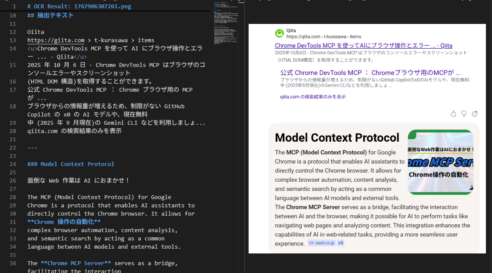

# Agent Skills

A collection of Agent Skills for GitHub Copilot and Claude.

GitHub Copilot と Claude 向けの Agent Skills コレクションです。

## Demo

### OCR Super Surya



## Skills

| Skill | Description / 説明 |
| ----- | ------------------ |
| [agentic-workflow-guide](agentic-workflow-guide/) | Design agentic workflows (5 patterns) / エージェントワークフロー設計ガイド |
| [azure-env-builder](azure-env-builder/) | ⚠️ **Alpha** - Azure environment builder with Bicep / Azure 環境構築支援 |
| [biz-ops-setup](biz-ops-setup/) | Business operations workspace setup / 業務管理ワークスペース構築 |
| [book-writing-workspace](book-writing-workspace/) | Book writing workspace / 書籍執筆ワークスペース |
| [browser-max-automation](browser-max-automation/) | Browser automation via Playwright MCP / ブラウザ自動操作 |
| [chrome-extension-dev](chrome-extension-dev/) | Chrome extension development guide / Chrome 拡張機能開発ガイド |
| [code-simplifier](code-simplifier/) | Simplify and refactor complex code / コード簡略化・リファクタリング |
| [customer-workspace](customer-workspace/) | Customer workspace initialization / 顧客ワークスペース初期化 |
| [drawio-diagram-forge](drawio-diagram-forge/) | Create draw.io diagrams from text / テキストから draw.io 図を生成 |
| [ocr-super-surya](ocr-super-surya/) | GPU-optimized OCR using Surya (90+ languages) / GPU 最適化 OCR |
| [powerpoint-automation](powerpoint-automation/) | Create PPTX from web articles / Web記事からPowerPoint自動生成 |
| [receipt-ocr-sorter](receipt-ocr-sorter/) | OCR receipt auto-sort & rename / OCR領収書自動仕分け・リネーム・集計 |
| [skill-creator-plus](skill-creator-plus/) | Create and optimize Agent Skills / スキル作成・最適化 |
| [skill-finder](skill-finder/) | Search, install, and manage Agent Skills / スキル検索・管理 |
| [vscode-custom-agents](vscode-custom-agents/) | VS Code custom agent design guide / カスタムエージェント設計ガイド |
| [vscode-extension-guide](vscode-extension-guide/) | VS Code extension development guide / VS Code 拡張機能開発ガイド |

## Usage / 使い方

### 🚀 Recommended: Agent Skill Ninja (VS Code Extension)

Install the **Agent Skill Ninja** extension for easy skill management:

**Agent Skill Ninja** 拡張機能でスキル管理が簡単に：

**[📦 Agent Skill Ninja - VS Code Marketplace](https://marketplace.visualstudio.com/items?itemName=yamapan.agent-skill-ninja)**

- 🔍 Browse and search skills / スキルの検索・閲覧
- 📥 One-click install to your project / ワンクリックでプロジェクトにインストール
- 🔄 Auto-update installed skills / インストール済みスキルの自動更新
- 📋 View skill details and documentation / スキル詳細とドキュメントの表示

### Manual Installation / 手動インストール

Copy the desired skill folder to your project's `.github/skills/` or `.claude/skills/` directory.

使いたいスキルフォルダをプロジェクトの `.github/skills/` または `.claude/skills/` にコピーしてください。

```bash
# Example / 例
cp -r skill-finder /path/to/your/project/.github/skills/
```

## Structure / 構成

Each skill follows this structure / 各スキルは以下の構成です：

```
skill-name/
├── SKILL.md          # Skill definition / スキル定義
├── LICENSE.txt       # License / ライセンス
├── references/       # Reference files / 参照ファイル
└── scripts/          # Helper scripts / ヘルパースクリプト
```

## License / ライセンス

Each skill has its own license in `LICENSE.txt`. Please refer to the license file in each skill folder.

各スキルは個別のライセンスを持ちます。各スキルフォルダ内の `LICENSE.txt` を参照してください。

- **Self-created skills / 自作スキル**: CC BY-NC-SA 4.0
- **External skills / 外部由来**: Original license retained (MIT, Apache 2.0, etc.)

## Author / 作者

yamapan ([@aktsmm](https://github.com/aktsmm))
