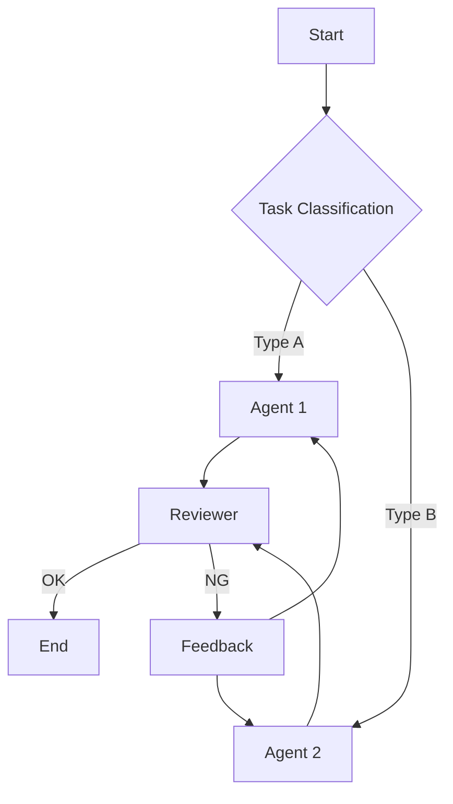

# Agentic Workflow Guide

A comprehensive guide for designing, reviewing, and improving agent workflows based on proven design principles.

## When to Use

Use this skill when creating, reviewing, or updating agents and workflows:

### Create

- **New agent design** - Define responsibilities, tools, and prompts for `.agent.md` files
- **Workflow architecture** - Choose from 5 patterns (Prompt Chaining, Routing, Parallelization, Orchestrator-Workers, Evaluator-Optimizer)
- **Scaffolding** - Generate `.github/agents/*.agent.md` structure with `scaffold_workflow.py`

### Review

- **Orchestrator not delegating** - Agent says "I'll use sub-agents" but does work directly
- **Design principle check** - Validate against SSOT, SRP, Fail Fast, Feedback Loop
- **Context overflow diagnosis** - Long-running agents hitting limits

### Update

- **Adding Handoffs** - Implement Plan → Implement → Review phase transitions
- **Improving delegation** - Fix vague instructions with MUST/MANDATORY language
- **Tool configuration** - Configure `tools:` property and `#tool:` references

## Core Principles

→ See **[references/design-principles.md](references/design-principles.md)** for details

| Tier                  | Principles                                                                  | Focus                      |
| --------------------- | --------------------------------------------------------------------------- | -------------------------- |
| **Tier 1: Essential** | SSOT, SRP, Simplicity First, Fail Fast, Iterative Refinement, Feedback Loop | Must-have for any workflow |
| **Tier 2: Quality**   | Transparency, Gate/Checkpoint, DRY, ISP, Idempotency                        | Recommended for production |
| **Tier 3: Scale**     | Human-in-the-Loop, KISS, Loose Coupling, Graceful Degradation               | Advanced patterns          |

**Anthropic's Key Insight:**

> "Start with simple prompts, optimize them with comprehensive evaluation, and add multi-step agentic systems only when simpler solutions fall short."

## Workflow Patterns

→ See **[references/workflow-patterns.md](references/workflow-patterns.md)** for details

### Pattern Selection Guide

```
What's the nature of the task?
├─ Sequential processing needed ──→ Prompt Chaining
├─ Multiple independent tasks ────→ Parallelization
├─ Dynamic task decomposition ────→ Orchestrator-Workers
├─ Until quality criteria met ────→ Evaluator-Optimizer
└─ Processing varies by input ────→ Routing
```

### Pattern Overview

| Pattern                  | Use Case                           | Iterative Level |
| ------------------------ | ---------------------------------- | --------------- |
| **Prompt Chaining**      | Sequential with validation         | ⭐⭐⭐          |
| **Routing**              | Classify → route to specialists    | ⭐⭐            |
| **Parallelization**      | Execute independent tasks together | ⭐⭐            |
| **Orchestrator-Workers** | Dynamic decomposition → workers    | ⭐⭐⭐          |
| **Evaluator-Optimizer**  | Generate → evaluate → improve loop | ⭐⭐⭐⭐⭐      |

## Design Workflow

### Step 1: Requirements Gathering

```markdown
## Workflow Design Interview

1. **Goal**: What do you want to achieve?
2. **Task Decomposition**: What subtasks can this be broken into?
3. **Dependencies**: Are there ordering dependencies between tasks?
4. **Parallelism**: Which tasks can run independently?
5. **Quality Criteria**: What defines success/failure?
6. **Error Handling**: How should failures be handled?
```

### Step 2: Pattern Selection

Choose the optimal pattern based on requirements:

| Condition                         | Recommended Pattern  |
| --------------------------------- | -------------------- |
| Tasks have clear ordering         | Prompt Chaining      |
| Tasks are independent             | Parallelization      |
| Number of tasks is dynamic        | Orchestrator-Workers |
| Repeat until quality criteria met | Evaluator-Optimizer  |
| Processing varies by input type   | Routing              |

### Step 3: Create Design Diagram

Visualize with Mermaid:



### Step 4: Principle Check

Validate design against principles (use review checklist)

### Step 5: Implement & Iterate

Build small → verify → get feedback → improve

## Review Checklist

→ See **[references/review-checklist.md](references/review-checklist.md)** for complete checklist (includes anti-patterns)

### Quick Check (5 items)

```markdown
- [ ] Is each agent focused on a single responsibility? (SRP)
- [ ] Can errors be detected and stopped immediately? (Fail Fast)
- [ ] Is it divided into small steps? (Iterative)
- [ ] Can results be verified at each step? (Feedback Loop)
- [ ] Are related files (references, scripts) simple and minimal? (DRY)
```

## Context Engineering

→ See **[references/context-engineering.md](references/context-engineering.md)** for details

For long-running agents, manage context as a finite resource:

| Technique                   | When to Use                            |
| --------------------------- | -------------------------------------- |
| **Compaction**              | Context window 70%+ full               |
| **Structured Note-taking**  | Multi-hour tasks with milestones       |
| **Sub-agent Architectures** | Complex research, parallel exploration |
| **Just-in-Time Retrieval**  | Large codebases, dynamic data          |

**Key Insight:**

> "Context must be treated as a finite resource with diminishing marginal returns." — Anthropic

## runSubagent Implementation

→ See **[references/runSubagent-guide.md](references/runSubagent-guide.md)** for complete guide

### Common Problem: Orchestrator Doesn't Spawn Sub-agents

**Symptoms:** Agent says "I'll delegate to sub-agents" but does work directly.

**Root Cause:** Instructions are too vague or permissive.

**Solution:** Use imperative, mandatory language:

```yaml
---
name: Review Orchestrator
# Use Primary Aliases
tools: ["agent", "read"]
---

## MANDATORY: Sub-agent Delegation

You MUST use #tool:agent for each file review.
Do NOT read file contents directly in main context.

For EACH file:
1. Call agent with prompt:
   "Read {filepath}. Return: {issues: [], suggestions: []}"
2. Wait for summary response
3. Aggregate into final report
```

### Sub-agent Prompt Template

Each runSubagent call needs a **complete, self-contained prompt**:

```markdown
# Task

[Clear, specific objective]

# Input

[What data/files to process]

# Output Format

[Exact structure expected - JSON/Markdown/etc.]

# Constraints

[Scope limits, max length, focus areas]
```

### Quick Checklist

```markdown
- [ ] Agent definition includes `tools: ["agent"]` (Primary Alias)
- [ ] Instructions use MUST/MANDATORY (not "can" or "may")
- [ ] Sub-agent prompt template is defined with output format
- [ ] Orchestrator explicitly told NOT to do sub-agent work itself
```

## Handoffs (Agent Transitions)

Handoffs enable guided sequential workflows between agents with suggested next steps.

### When to Use

- **Plan → Implementation**: Generate plan, then hand off to implementation agent
- **Implementation → Review**: Complete coding, then switch to code review agent
- **Write Failing Tests → Pass Tests**: Generate failing tests first, then implement code

### Configuration

```yaml
---
name: Planner
description: Generate an implementation plan
tools: ["search", "fetch", "read_file"]
handoffs:
  - label: Start Implementation
    agent: implementation
    prompt: Implement the plan outlined above.
    send: false
---
```

| Property | Description                         |
| -------- | ----------------------------------- |
| `label`  | Button text shown to user           |
| `agent`  | Target agent identifier             |
| `prompt` | Pre-filled prompt for next agent    |
| `send`   | Auto-submit prompt (default: false) |

### Benefits

- **Human control**: User reviews each phase before proceeding
- **Context preservation**: Relevant context passed via prompt
- **Workflow orchestration**: Multi-step tasks with clear boundaries

## Available Tools

Built-in tools for custom agents. Use **Primary Alias** in the `tools:` property.

| Primary Alias | Compatible Aliases                                | Description                 |
| ------------- | ------------------------------------------------- | --------------------------- |
| `execute`     | `shell`, `Bash`, `powershell`, `run_in_terminal`  | Shell command execution     |
| `read`        | `Read`, `NotebookRead`, `read_file`               | Read file contents          |
| `edit`        | `Edit`, `MultiEdit`, `Write`, `NotebookEdit`      | Edit/create files           |
| `search`      | `Grep`, `Glob`, `grep_search`, `file_search`      | Search files/text           |
| `agent`       | `custom-agent`, `Task`, `runSubagent`             | Spawn sub-agent             |
| `web`         | `WebSearch`, `WebFetch`, `fetch`, `fetch_webpage` | Fetch web content           |
| `todo`        | `TodoWrite`                                       | Task list management        |
| `githubRepo`  | -                                                 | Search GitHub repositories  |
| `usages`      | -                                                 | Find code usages/references |

### Tool Definition Examples

```yaml
# Orchestrator with sub-agent delegation
tools: ["agent", "execute", "read", "search"]

# Code reviewer
tools: ["read", "search", "web", "execute"]

# Translator/Editor
tools: ["read", "edit", "agent"]
```

### Common Mistakes

⚠️ **Wrong**: Using non-primary aliases in `tools:` property

```yaml
# ❌ Bad - may not be recognized
tools: ["run_in_terminal", "read_file", "runSubagent"]

# ✅ Good - use Primary Alias
tools: ["execute", "read", "agent"]
```

**MCP Server Tools**: Use `<server-name>/*` format to include all tools from an MCP server.

**Tool Reference Syntax**: Use `#tool:<tool-name>` in prompts (e.g., `#tool:agent`).

## Scaffold Workflow

Automatically generate workflow directory structures.

### Usage

```bash
# Basic workflow
python scripts/scaffold_workflow.py my-workflow

# Specify pattern
python scripts/scaffold_workflow.py code-review --pattern evaluator-optimizer

# Specify output path
python scripts/scaffold_workflow.py data-pipeline --pattern orchestrator-workers --path ./projects

# List available patterns
python scripts/scaffold_workflow.py --list-patterns
```

### Available Patterns

| Pattern                | Description                    |
| ---------------------- | ------------------------------ |
| `basic`                | Basic workflow structure       |
| `prompt-chaining`      | Sequential processing pattern  |
| `parallelization`      | Parallel processing pattern    |
| `orchestrator-workers` | Orchestrator + workers pattern |
| `evaluator-optimizer`  | Evaluation-improvement loop    |
| `routing`              | Routing pattern                |

### Generated Structure

```
my-workflow/
├── README.md                       # Usage guide
├── .github/
│   ├── copilot-instructions.md    # GitHub Copilot instructions
│   ├── agents/                     # Custom agent definitions (NEW standard)
│   │   ├── orchestrator.agent.md  # Main orchestrator agent
│   │   ├── planner.agent.md       # Planning specialist
│   │   ├── implementer.agent.md   # Implementation agent
│   │   └── reviewer.agent.md      # Code review agent
│   └── instructions/               # File-pattern-specific rules
│       └── workflow.instructions.md
├── prompts/                        # Prompt templates (optional)
│   └── system_prompt.md
└── docs/                           # Design documentation
    └── design.md
```

**Note**: Custom agents use `.agent.md` extension in `.github/agents/` directory (VS Code 1.106+).

## Resources

| File                                                        | Content                             |
| ----------------------------------------------------------- | ----------------------------------- |
| [design-principles.md](references/design-principles.md)     | Design principles (Tier 1-3) + ACI  |
| [workflow-patterns.md](references/workflow-patterns.md)     | 5 workflow patterns with examples   |
| [review-checklist.md](references/review-checklist.md)       | Full checklist + anti-patterns      |
| [context-engineering.md](references/context-engineering.md) | Context management for long tasks   |
| [runSubagent-guide.md](references/runSubagent-guide.md)     | runSubagent usage & common pitfalls |
| [scaffold_workflow.py](scripts/scaffold_workflow.py)        | Directory structure generator       |

## References

### Official Documentation

- [Chat in IDE - GitHub Docs](https://docs.github.com/en/copilot/how-tos/chat-with-copilot/chat-in-ide) - Chat modes, subagents, plan mode
- [Custom Agents in VS Code](https://code.visualstudio.com/docs/copilot/customization/custom-agents) - Agent file structure, handoffs
- [Create Custom Agents - GitHub Docs](https://docs.github.com/en/copilot/how-tos/use-copilot-agents/coding-agent/create-custom-agents) - Agent configuration
- [Custom Agents Configuration - GitHub Docs](https://docs.github.com/en/copilot/reference/custom-agents-configuration) - YAML properties reference

### Design Principles

- [Building Effective Agents - Anthropic](https://www.anthropic.com/engineering/building-effective-agents)
- [Effective Context Engineering - Anthropic](https://www.anthropic.com/engineering/effective-context-engineering-for-ai-agents)
- [Writing Tools for Agents - Anthropic](https://www.anthropic.com/engineering/writing-tools-for-agents)

### Community Resources

- [runSubagent 検証記事 - Zenn](https://zenn.dev/openjny/articles/2619050ec7f167)
- [subagent-driven-development - obra/superpowers](https://github.com/obra/superpowers/tree/main/skills/subagent-driven-development)
- [awesome-copilot agents - GitHub](https://github.com/github/awesome-copilot/tree/main/agents)
