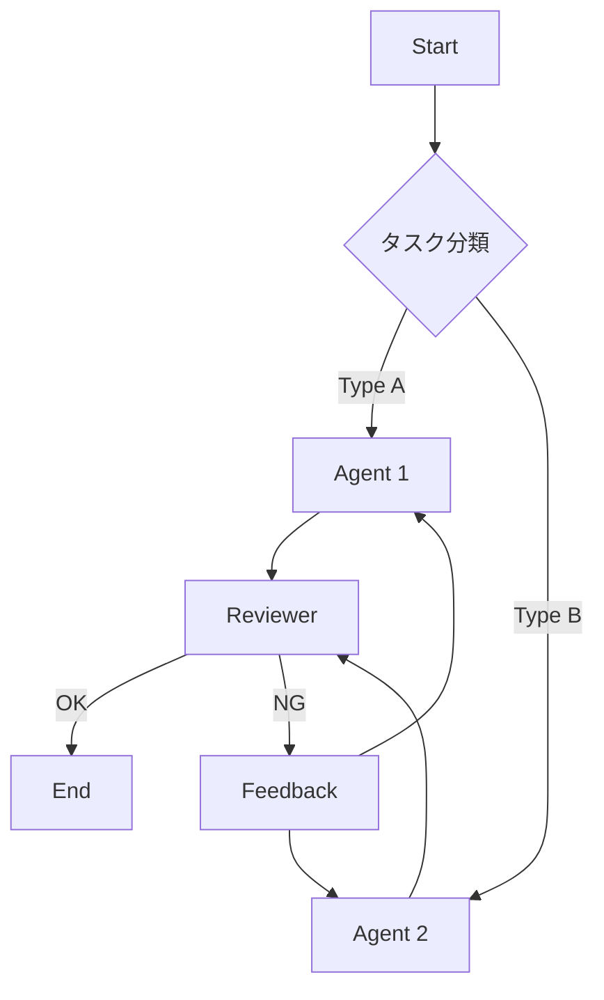

# Agentic Workflow Guide

エージェントワークフローを設計原則に基づいて設計・レビュー・改善するためのガイド。

## When to Use

- **新規ワークフロー設計** - エージェントの役割分担・実行順序を決める
- **既存ワークフローのレビュー** - 設計原則に照らして問題を検出
- **パターン選択** - タスク特性に合ったワークフローパターンを選ぶ
- **品質改善** - Iterative Refinement でワークフローを段階的に改善

## Core Principles

→ 詳細は **[references/design-principles.md](references/design-principles.md)** 参照

### Tier 1: 必須原則

| 原則                     | 説明                        | チェック観点                                   |
| ------------------------ | --------------------------- | ---------------------------------------------- |
| **SSOT**                 | 情報は一箇所で管理          | 同じ情報が複数箇所で定義されていないか？       |
| **SRP**                  | 1 エージェント = 1 責務     | 1 つのエージェントが複数責務を持っていないか？ |
| **Simplicity First**     | 最もシンプルな解から始める  | 過剰に複雑な設計になっていないか？             |
| **Fail Fast**            | 早期検知・早期修正          | エラー時に即座に検知・停止できるか？           |
| **Iterative Refinement** | 小さく作って繰り返し改善    | 小さなステップに分割されているか？             |
| **Feedback Loop**        | 各ステップで成果確認 → 調整 | 各ステップで成果を確認できるか？               |

### Tier 2: 品質原則

| 原則                | 説明                       | チェック観点                       |
| ------------------- | -------------------------- | ---------------------------------- |
| **Transparency**    | 計画・進捗を明示的に見せる | 何をしているか可視化されているか？ |
| **Gate/Checkpoint** | 各ステップで検証ゲート     | 次に進む前に検証しているか？       |
| **DRY**             | 重複排除、再利用           | 共通処理は再利用されているか？     |
| **ISP**             | 必要最小限のコンテキスト   | 不要な情報を渡していないか？       |
| **Idempotency**     | 冪等性（リトライ安全）     | リトライしても安全か？             |

## Workflow Patterns

→ 詳細は **[references/workflow-patterns.md](references/workflow-patterns.md)** 参照

### パターン選択ガイド

```
タスクの性質は？
├─ 順次処理が必要 ────────→ Prompt Chaining
├─ 独立タスクが複数 ──────→ Parallelization
├─ 動的にタスク分割 ──────→ Orchestrator-Workers
├─ 品質基準を満たすまで ──→ Evaluator-Optimizer
└─ 入力で処理が変わる ────→ Routing
```

### パターン一覧

| パターン                 | 用途                            | 「小さく回す」度 |
| ------------------------ | ------------------------------- | ---------------- |
| **Prompt Chaining**      | 順次処理、各ステップで検証      | ⭐⭐⭐           |
| **Routing**              | 入力を分類 → 専門処理へ振り分け | ⭐⭐             |
| **Parallelization**      | 独立タスクを同時実行            | ⭐⭐             |
| **Orchestrator-Workers** | 動的にタスク分割 → ワーカーへ   | ⭐⭐⭐           |
| **Evaluator-Optimizer**  | 生成 → 評価 → 改善ループ        | ⭐⭐⭐⭐⭐       |

## Design Workflow

### Step 1: ヒアリング

```markdown
## ワークフロー設計ヒアリング

1. **目的**: 何を達成したいか？
2. **タスク分解**: どんなサブタスクに分けられるか？
3. **依存関係**: タスク間に順序依存はあるか？
4. **並列可能性**: 独立して実行できるタスクはあるか？
5. **品質基準**: 成功/失敗の判断基準は何か？
6. **エラー処理**: 失敗時にどう対応するか？
```

### Step 2: パターン選択

ヒアリング結果から最適なパターンを選択：

| 条件                         | 推奨パターン         |
| ---------------------------- | -------------------- |
| タスクに明確な順序がある     | Prompt Chaining      |
| タスクが独立している         | Parallelization      |
| タスク数が動的に変わる       | Orchestrator-Workers |
| 品質基準を満たすまで繰り返す | Evaluator-Optimizer  |
| 入力によって処理が分岐       | Routing              |

### Step 3: 設計図作成

Mermaid で可視化：



### Step 4: 原則チェック

設計を原則に照らして検証（レビューチェックリスト使用）

### Step 5: 実装 & Iterate

小さく実装 → 動作確認 → フィードバック → 改善

## Review Checklist

→ 詳細は **[references/review-checklist.md](references/review-checklist.md)** 参照

### クイックチェック

```markdown
## ワークフローレビューチェックリスト

### コア原則

- [ ] **SSOT**: 同じ情報が複数箇所で定義されていないか？
- [ ] **SRP**: 各エージェントは 1 つの責務に集中しているか？
- [ ] **Simplicity**: 最もシンプルな解になっているか？
- [ ] **Fail Fast**: エラー時に即座に検知・停止できるか？
- [ ] **Iterative**: 小さなステップに分割されているか？
- [ ] **Feedback Loop**: 各ステップで成果を確認できるか？

### 品質原則

- [ ] **Transparency**: 計画・進捗が可視化されているか？
- [ ] **Gate/Checkpoint**: 各ステップで検証しているか？
- [ ] **DRY**: 共通処理は再利用されているか？
- [ ] **ISP**: 必要最小限の情報だけ渡しているか？
- [ ] **Idempotency**: リトライしても安全か？

### アンチパターン検出

- [ ] 1 つのエージェントに責務を詰め込みすぎていないか？
- [ ] コンテキストを過剰に渡していないか？
- [ ] エラー処理が欠落していないか？
- [ ] 無限ループの可能性はないか？
- [ ] Human-in-the-Loop が必要な箇所はあるか？
```

## Anti-Patterns

→ 詳細は **[references/anti-patterns.md](references/anti-patterns.md)** 参照

| アンチパターン       | 問題                   | 対策                   |
| -------------------- | ---------------------- | ---------------------- |
| **God Agent**        | 1 エージェントに全責務 | SRP で分割             |
| **Context Overload** | 不要な情報を大量に渡す | ISP で最小化           |
| **Silent Failure**   | エラーを無視して続行   | Fail Fast で即停止     |
| **Infinite Loop**    | 終了条件なしのループ   | 最大イテレーション設定 |
| **Big Bang**         | 一度に大きく作る       | Iterative で小さく回す |

## Scaffold Workflow

ワークフローのディレクトリ構成を自動生成できます。

### Usage

```bash
# 基本的なワークフロー
python scripts/scaffold_workflow.py my-workflow

# パターン指定
python scripts/scaffold_workflow.py code-review --pattern evaluator-optimizer

# 出力先指定
python scripts/scaffold_workflow.py data-pipeline --pattern orchestrator-workers --path ./projects

# 利用可能なパターン一覧
python scripts/scaffold_workflow.py --list-patterns
```

### Available Patterns

| パターン               | 説明                          |
| ---------------------- | ----------------------------- |
| `basic`                | 基本的なワークフロー構成      |
| `prompt-chaining`      | 順次処理パターン              |
| `parallelization`      | 並列処理パターン              |
| `orchestrator-workers` | オーケストレーター + ワーカー |
| `evaluator-optimizer`  | 評価・改善ループ              |
| `routing`              | ルーティングパターン          |

### Generated Structure

```
my-workflow/
├── Agent.md                    # ワークフロー概要・エージェント一覧
├── README.md                   # 使い方ガイド
├── .github/
│   ├── copilot-instructions.md # GitHub Copilot 用インストラクション
│   └── instructions/           # ファイルパターン別ルール
│       ├── workflow.instructions.md
│       ├── agents.instructions.md
│       └── prompts.instructions.md
├── agents/                     # エージェント定義
├── prompts/                    # プロンプトテンプレート
│   ├── system_prompt.md
│   ├── task_prompt.md
│   └── error_handling_prompt.md
├── docs/                       # 設計ドキュメント
│   ├── design.md
│   └── review_notes.md
└── config/                     # 設定ファイル
```

## Resources

| ファイル                                                | 内容                           |
| ------------------------------------------------------- | ------------------------------ |
| [design-principles.md](references/design-principles.md) | 設計原則の詳細説明             |
| [workflow-patterns.md](references/workflow-patterns.md) | ワークフローパターン詳細       |
| [review-checklist.md](references/review-checklist.md)   | レビューチェックリスト         |
| [anti-patterns.md](references/anti-patterns.md)         | アンチパターン集               |
| [scaffold_workflow.py](scripts/scaffold_workflow.py)    | ディレクトリ構成生成スクリプト |

## References

- [Building Effective Agents - Anthropic](https://www.anthropic.com/engineering/building-effective-agents)
- [Workflows and Agents - LangChain](https://docs.langchain.com/oss/python/langgraph/workflows-agents)
- [subagent-driven-development - obra/superpowers](https://github.com/obra/superpowers/tree/main/skills/subagent-driven-development)
- [dispatching-parallel-agents - obra/superpowers](https://github.com/obra/superpowers/tree/main/skills/dispatching-parallel-agents)
