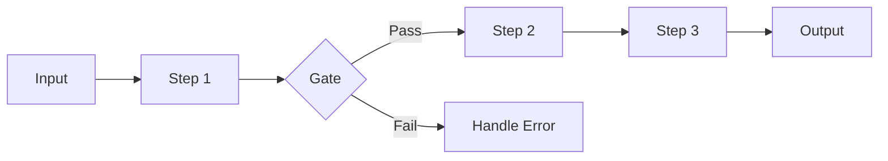
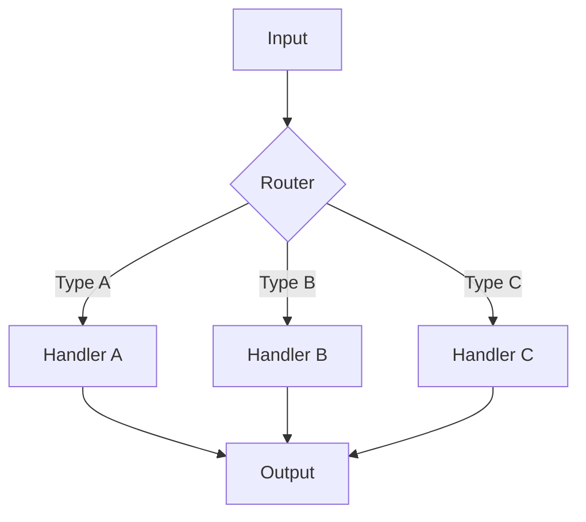
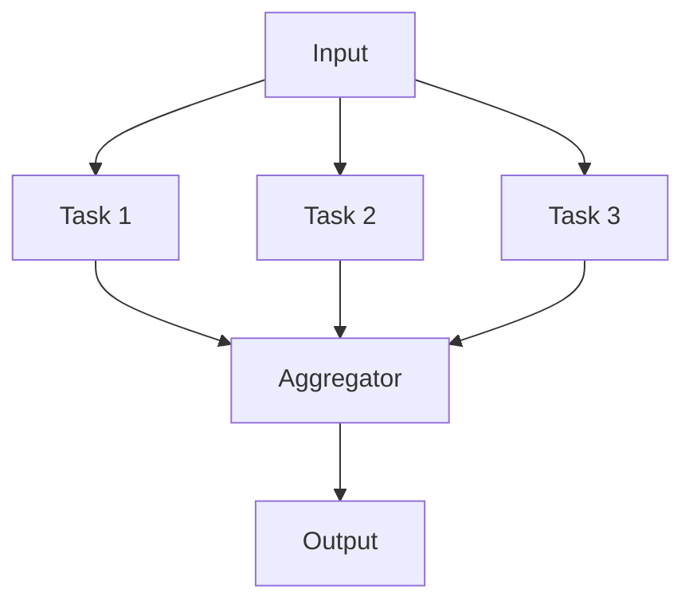
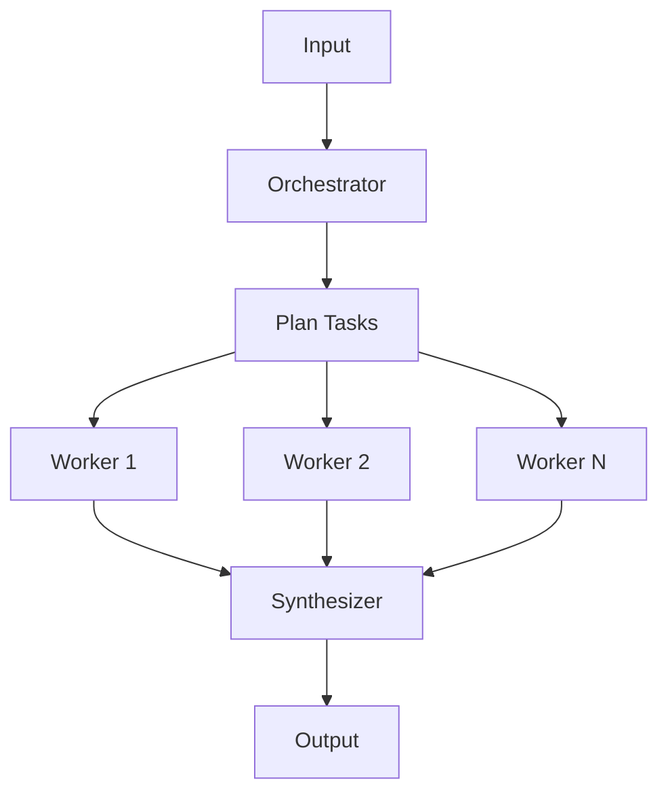
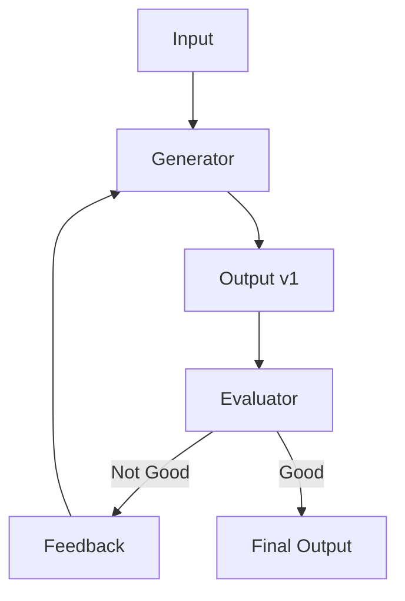
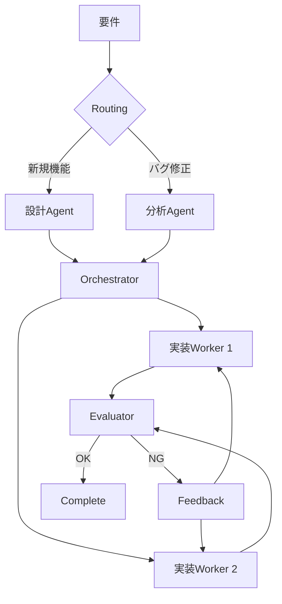

# Workflow Patterns

エージェントワークフローの 5 つの基本パターン。

## パターン選択フローチャート

```
タスクの性質は？
│
├─ 順次処理が必要（ステップに明確な順序）
│   └─→ Prompt Chaining
│
├─ 独立タスクが複数（互いに影響しない）
│   └─→ Parallelization
│
├─ タスク数が動的（事前に決まらない）
│   └─→ Orchestrator-Workers
│
├─ 品質基準を満たすまで繰り返す
│   └─→ Evaluator-Optimizer
│
└─ 入力によって処理が大きく変わる
    └─→ Routing
```

---

## 1. Prompt Chaining

**順次処理、各ステップで検証**



### 特徴

| 観点       | 説明                                           |
| ---------- | ---------------------------------------------- |
| **構造**   | 直列処理、前のステップの出力が次の入力         |
| **Gate**   | 各ステップ後に検証ゲートを設置可能             |
| **適用例** | ドキュメント翻訳、コード生成 → レビュー → 修正 |

### いつ使うか

- タスクが明確なサブタスクに分解できる
- 各ステップの出力が次のステップに必要
- 中間結果の検証が重要

### 実装例

```
Step 1: 要件を分析
    ↓ (Gate: 要件が明確か？)
Step 2: 設計を作成
    ↓ (Gate: 設計が妥当か？)
Step 3: 実装
    ↓ (Gate: テスト通過？)
Step 4: ドキュメント作成
```

---

## 2. Routing

**入力を分類 → 専門処理へ振り分け**



### 特徴

| 観点       | 説明                               |
| ---------- | ---------------------------------- |
| **構造**   | 分類器 + 専門ハンドラー            |
| **利点**   | 各ハンドラーを最適化できる         |
| **適用例** | カスタマーサポート、問い合わせ分類 |

### いつ使うか

- 入力に明確なカテゴリがある
- カテゴリごとに異なる処理が最適
- 分類精度が十分に高い

### 実装例

```
Router: 問い合わせタイプを判定
├─ 技術的質問 → 技術サポートAgent
├─ 料金関連 → 請求サポートAgent
└─ 一般的質問 → FAQAgent
```

---

## 3. Parallelization

**独立タスクを同時実行**



### 特徴

| 観点               | 説明                                 |
| ------------------ | ------------------------------------ |
| **構造**           | 分割 → 並列実行 → 集約               |
| **利点**           | 処理時間短縮、独立性による堅牢性     |
| **バリエーション** | Sectioning（分割）、Voting（多数決） |

### いつ使うか

- タスクが独立している（共有状態なし）
- 並列実行で時間短縮できる
- 複数の視点/結果が欲しい

### 実装例

```
Input: ドキュメント
├─ Agent 1: 文法チェック
├─ Agent 2: 内容正確性チェック
└─ Agent 3: スタイルチェック
    ↓
Aggregator: 全結果を統合
```

---

## 4. Orchestrator-Workers

**動的にタスク分割 → ワーカーへ**



### 特徴

| 観点       | 説明                                               |
| ---------- | -------------------------------------------------- |
| **構造**   | オーケストレーター + 動的ワーカー + シンセサイザー |
| **利点**   | タスク数が事前に決まらなくても OK                  |
| **適用例** | コード変更（複数ファイル）、リサーチ               |

### いつ使うか

- サブタスクの数が入力依存
- 各サブタスクが独立して実行可能
- 結果の統合が必要

### 実装例

```
Orchestrator:
  - ファイル変更リストを生成
  - 各ファイルにWorkerを割り当て

Workers:
  - Worker 1 → file1.py を修正
  - Worker 2 → file2.py を修正
  - Worker 3 → test.py を修正

Synthesizer:
  - 全変更をマージ
  - コンフリクト解決
```

---

## 5. Evaluator-Optimizer

**生成 → 評価 → 改善ループ**



### 特徴

| 観点       | 説明                                   |
| ---------- | -------------------------------------- |
| **構造**   | 生成器 + 評価器 + フィードバックループ |
| **利点**   | 品質基準を満たすまで改善               |
| **適用例** | 翻訳、コードレビュー、文章校正         |

### いつ使うか

- 明確な品質基準がある
- 反復的な改善で品質が上がる
- 人間のフィードバックを模倣したい

### 実装例

```
Generator: 翻訳を生成
    ↓
Evaluator:
  - ニュアンスは正確か？
  - 文法は正しいか？
  - 原文の意図を反映しているか？
    ↓
  ├─ OK → 完了
  └─ NG → フィードバック付きで再生成
```

---

## パターンの組み合わせ

実際のワークフローでは、複数のパターンを組み合わせることが多い。

### 例: コード生成ワークフロー



**使用パターン:**

1. **Routing** - 要件タイプで処理を分岐
2. **Orchestrator-Workers** - ファイルごとに実装
3. **Evaluator-Optimizer** - レビュー → 修正ループ

---

## References

- [Building Effective Agents - Anthropic](https://www.anthropic.com/engineering/building-effective-agents)
- [Workflows and Agents - LangChain](https://docs.langchain.com/oss/python/langgraph/workflows-agents)
