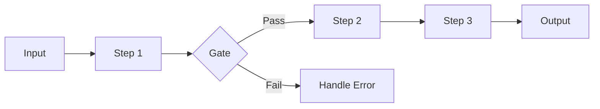
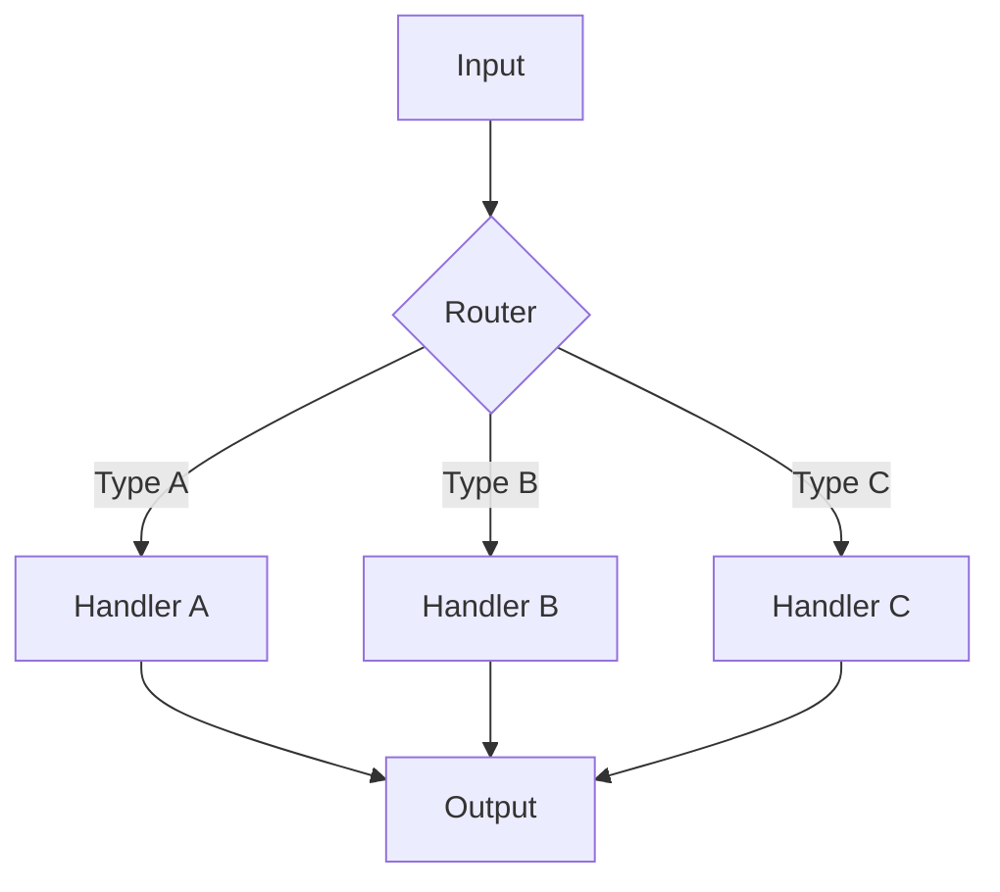
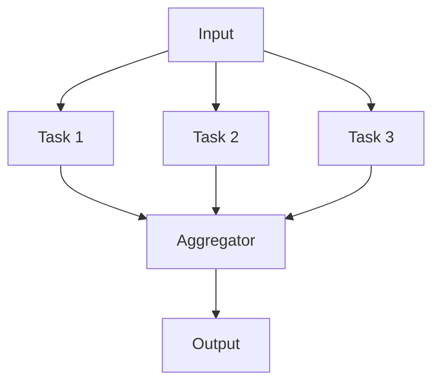
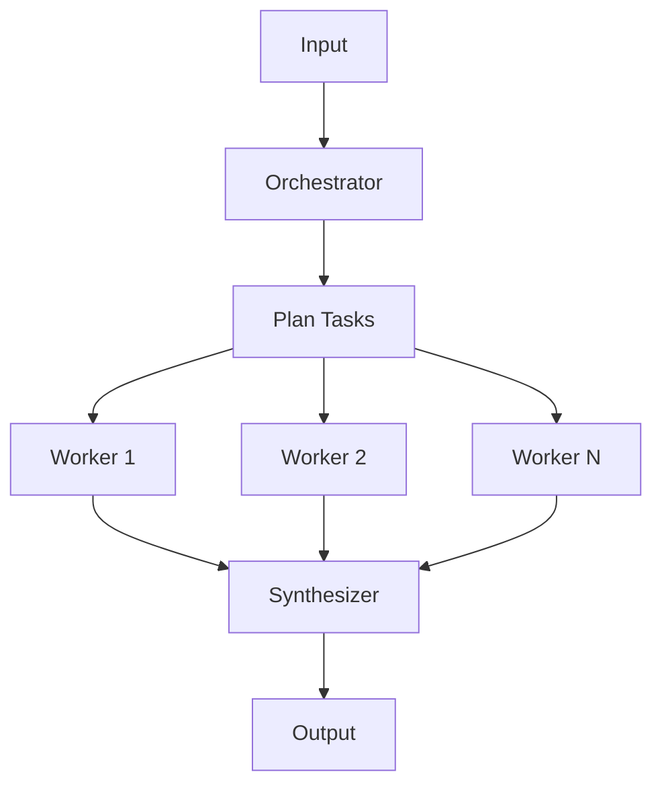
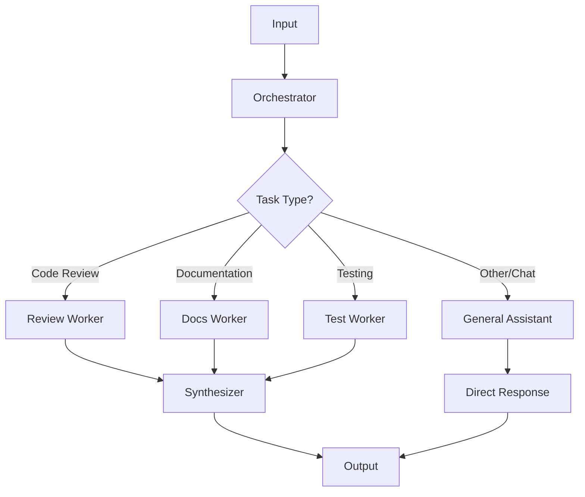
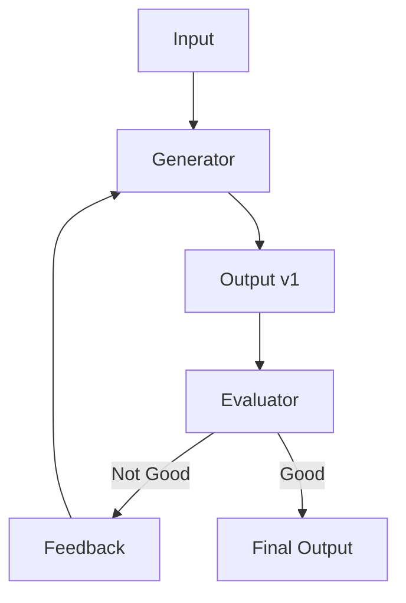
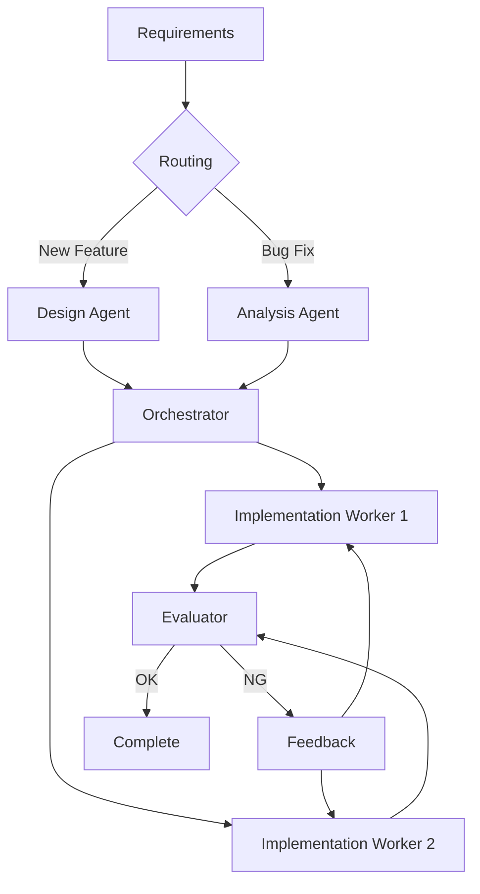
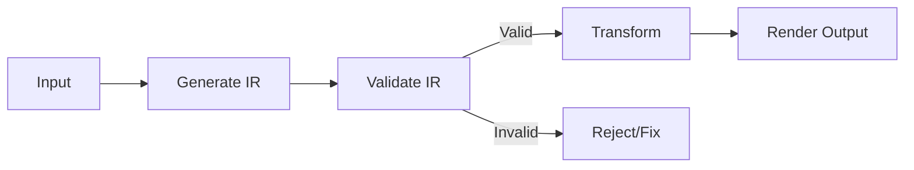

# Workflow Patterns

Five fundamental patterns for agent workflows.

## Pattern Selection Flowchart

```
What's the nature of the task?
│
├─ Sequential processing needed (clear step ordering)
│   └─→ Prompt Chaining
│
├─ Multiple independent tasks (no mutual impact)
│   └─→ Parallelization
│
├─ Dynamic number of tasks (not predetermined)
│   └─→ Orchestrator-Workers
│
├─ Repeat until quality criteria met
│   └─→ Evaluator-Optimizer
│
└─ Processing varies significantly by input
    └─→ Routing
```

---

## 1. Prompt Chaining

**Sequential processing with validation at each step**



### Characteristics

| Aspect        | Description                                              |
| ------------- | -------------------------------------------------------- |
| **Structure** | Serial processing, output of each step is input for next |
| **Gate**      | Can set validation gates after each step                 |
| **Use Cases** | Document translation, code generation → review → fix     |

### When to Use

- Task can be decomposed into clear subtasks
- Each step's output is needed for the next step
- Intermediate result validation is important

### Implementation Example

```
Step 1: Analyze requirements
    ↓ (Gate: Are requirements clear?)
Step 2: Create design
    ↓ (Gate: Is design valid?)
Step 3: Implement
    ↓ (Gate: Tests passing?)
Step 4: Create documentation
```

---

## 2. Routing

**Classify input → Route to specialized handlers**



### Characteristics

| Aspect        | Description                              |
| ------------- | ---------------------------------------- |
| **Structure** | Classifier + specialized handlers        |
| **Benefits**  | Each handler can be optimized            |
| **Use Cases** | Customer support, inquiry classification |

### When to Use

- Input has clear categories
- Different processing is optimal per category
- Classification accuracy is sufficiently high

### Implementation Example

```
Router: Determine inquiry type
├─ Technical question → Technical Support Agent
├─ Billing related → Billing Support Agent
└─ General question → FAQ Agent
```

---

## 3. Parallelization

**Execute independent tasks simultaneously**



### Characteristics

| Aspect         | Description                                           |
| -------------- | ----------------------------------------------------- |
| **Structure**  | Split → parallel execution → aggregate                |
| **Benefits**   | Reduced processing time, robustness from independence |
| **Variations** | Sectioning (division), Voting (majority decision)     |

### When to Use

- Tasks are independent (no shared state)
- Parallel execution can reduce time
- Multiple perspectives/results are desired

### Implementation Example

```
Input: Document
├─ Agent 1: Grammar check
├─ Agent 2: Content accuracy check
└─ Agent 3: Style check
    ↓
Aggregator: Integrate all results
```

---

## 4. Orchestrator-Workers

**Dynamically decompose tasks → Dispatch to workers**



### Characteristics

| Aspect        | Description                                     |
| ------------- | ----------------------------------------------- |
| **Structure** | Orchestrator + dynamic workers + synthesizer    |
| **Benefits**  | Works even when task count is not predetermined |
| **Use Cases** | Code changes (multiple files), research         |

### When to Use

- Number of subtasks depends on input
- Each subtask can be executed independently
- Result synthesis is required

### Implementation Example

```
Orchestrator:
  - Generate file change list
  - Assign workers to each file

Workers:
  - Worker 1 → Modify file1.py
  - Worker 2 → Modify file2.py
  - Worker 3 → Modify test.py

Synthesizer:
  - Merge all changes
  - Resolve conflicts
```

### VS Code Copilot: runSubagent Implementation

⚠️ **Critical:** Workers are spawned via `#tool:agent` (Primary Alias: `agent`, compatible: `runSubagent`). The orchestrator MUST explicitly call this tool.

**Agent Definition:**

```yaml
---
name: Code Review Orchestrator
# Use Primary Aliases in tools: property
tools: ["agent", "search", "read"]
---

# Code Review Orchestrator

## Workflow

1. Identify files to review (search)
2. For EACH file, MUST call #tool:agent:
   - Prompt: "Review {filepath}. Return: {bugs: [], style: [], security: []}"
3. Aggregate all sub-agent results
4. Generate final report

## MANDATORY RULES

- You MUST use #tool:agent for each file
- Do NOT read file contents directly
- Each sub-agent prompt must specify output format
```

**Why This Works:**

- "MUST" language prevents orchestrator from skipping delegation
- Explicit tool reference (`#tool:agent`) triggers tool usage
- Output format in prompt ensures consistent synthesis

### Common Mistake

❌ **Vague instructions:**

```markdown
You can use sub-agents to review files if needed.
```

✅ **Mandatory instructions:**

```markdown
You MUST use #tool:agent for EACH file. Do NOT review directly.
```

### General Assistant (Fallback Worker)

Handle tasks that don't match specialized workers (casual chat, ad-hoc questions, minor help):



**When to Use:**

- Casual conversation or greetings
- Simple clarification questions
- Tasks outside defined worker scope
- Quick one-off requests

**Benefits:**

| Benefit               | Description                                         |
| --------------------- | --------------------------------------------------- |
| **Safety Net**        | Handles edge cases without "I can't help" responses |
| **UX Improvement**    | Users get answers even for undefined task types     |
| **Reduced Overhead**  | No complex routing for simple requests              |
| **Graceful Fallback** | Prevents workflow from failing on unexpected input  |

**Implementation Example:**

```yaml
---
name: Project Orchestrator
tools: ["agent", "search", "read"]
---

# Project Orchestrator

## Routing Rules

1. Code changes → Code Worker
2. Documentation → Docs Worker
3. Testing → Test Worker
4. **Everything else → General Assistant**

## General Assistant Prompt

For unclassified tasks, call #tool:agent with:
- Prompt: "Handle this user request conversationally: {request}"
- No strict output format required
- Prioritize helpfulness over structure
```

**⚠️ Important:** General Assistant should NOT bypass the orchestrator for tasks that genuinely require specialized workers. Use as fallback, not shortcut.

---

## 5. Evaluator-Optimizer

**Generate → Evaluate → Improve loop**



### Characteristics

| Aspect        | Description                                 |
| ------------- | ------------------------------------------- |
| **Structure** | Generator + evaluator + feedback loop       |
| **Benefits**  | Improves until quality criteria are met     |
| **Use Cases** | Translation, code review, text proofreading |

### When to Use

- Clear quality criteria exist
- Iterative improvement increases quality
- Want to mimic human feedback

### Implementation Example

```
Generator: Generate translation
    ↓
Evaluator:
  - Is the nuance accurate?
  - Is the grammar correct?
  - Does it reflect the original intent?
    ↓
  ├─ OK → Complete
  └─ NG → Regenerate with feedback
```

---

## Combining Patterns

In real workflows, multiple patterns are often combined.

### Example: Code Generation Workflow



**Patterns Used:**

1. **Routing** - Branch processing by requirement type
2. **Orchestrator-Workers** - Implement per file
3. **Evaluator-Optimizer** - Review → fix loop

---

## Advanced: IR Architecture

**Intermediate Representation pattern for transformation tasks**

This advanced pattern is particularly effective for document generation, code transformation, and any task where deterministic output is critical.

### Two-Stage Architecture

```
Input → IR (Intermediate Representation) → Output
```



### Core Principles

| Principle                  | Description                                                       |
| -------------------------- | ----------------------------------------------------------------- |
| **Separation of Concerns** | Split responsibility: Generate, Validate, Transform, Render       |
| **Strict Validation**      | Validate IR structure strictly; do not auto-complete missing data |
| **Determinism**            | Same IR → Same output. No creativity in transformation phase      |

### Separation of Concerns

| Responsibility | Agent Role                             | Creativity Level      |
| -------------- | -------------------------------------- | --------------------- |
| **Generate**   | Create IR from input                   | High (interpretation) |
| **Validate**   | Verify IR completeness and correctness | None (rule-based)     |
| **Transform**  | Convert IR to output format            | None (mechanical)     |
| **Render**     | Format final output                    | Low (formatting only) |

### IR Specification Guidelines

1. **Define allowed structure** - JSON, YAML, or structured Markdown
2. **Strict schema** - All required fields must be present
3. **No inference** - Missing data = error, not auto-completion
4. **Version control** - IR schema should be versioned

### When to Use

- Document generation (specs → documentation)
- Code transformation (one language → another)
- Report generation (data → formatted report)
- Template-based output (variables → filled template)

### When NOT to Use

- Creative tasks (writing, brainstorming)
- Exploratory analysis
- Tasks requiring adaptive responses

### Implementation Example

**Document Generation Workflow:**

```
Step 1: Generate IR
  Input: User requirements
  Output: Structured document spec (JSON)

Step 2: Validate IR
  - All required sections present?
  - Data types correct?
  - References valid?
  → Reject if invalid

Step 3: Transform
  IR → Markdown/HTML/PDF
  (Deterministic, no creativity)

Step 4: Render
  Apply styling, formatting
  Output final document
```

### Example IR Schema

```json
{
  "document": {
    "title": "string (required)",
    "sections": [
      {
        "heading": "string (required)",
        "content": "string (required)",
        "subsections": ["array (optional)"]
      }
    ],
    "metadata": {
      "author": "string",
      "version": "string",
      "created": "ISO8601 date"
    }
  }
}
```

### Benefits

| Benefit             | Description                            |
| ------------------- | -------------------------------------- |
| **Reproducibility** | Same IR always produces same output    |
| **Debuggability**   | Can inspect IR to understand failures  |
| **Testability**     | Can unit test each stage independently |
| **Reusability**     | Same IR can render to multiple formats |

---

## References

- [Building Effective Agents - Anthropic](https://www.anthropic.com/engineering/building-effective-agents)
- [Workflows and Agents - LangChain](https://docs.langchain.com/oss/python/langgraph/workflows-agents)
