# Workflow Patterns

Six fundamental patterns for agent workflows.

## Pattern 0: Plan-First (Meta-Pattern)

**Always create a plan before execution**

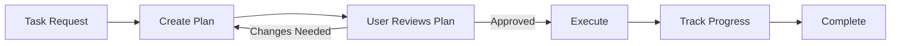

### Characteristics

| Aspect        | Description                                             |
| ------------- | ------------------------------------------------------- |
| **Purpose**   | Ensure alignment before investing effort in execution   |
| **Structure** | Plan → Review → Execute                                 |
| **Benefits**  | Avoids wasted work, enables early course correction     |
| **Use Cases** | Any non-trivial task with multiple steps or uncertainty |

### When to Use

- Task is complex or multi-step
- Execution is costly (time, resources, or reversibility)
- Ambiguity exists in requirements
- Risk of misunderstanding user intent

### Implementation Pattern

```
Step 1: Analyze Request
  - Understand goal and constraints
  - Identify subtasks and dependencies

Step 2: Generate Plan
  - List concrete steps with rationale
  - Estimate effort/time per step
  - Identify risks and alternatives

Step 3: Present for Approval
  - Show plan in clear format
  - Ask: "Does this plan meet your expectations?"

Step 4: Execute (only after approval)
  - Follow plan systematically
  - Report progress at key milestones
```

### Plan Format Example

```markdown
## Plan for [Task Name]

**Goal:** [Clear statement of what will be accomplished]

**Steps:**

1. [Action] - [Rationale] (Est: [time/effort])
2. [Action] - [Rationale] (Est: [time/effort])
3. ...

**Risks:**

- [Risk 1]: [Mitigation approach]

**Alternatives Considered:**

- [Alternative]: [Why not chosen]

**Approval Needed:** Please confirm before I proceed.
```

### Why This Matters

From vscode-ai-toolkit best practices:

> "Generate a plan first and ask the user for approval. This prevents wasted effort on the wrong approach."

**Key Benefits:**

| Benefit              | Description                                       |
| -------------------- | ------------------------------------------------- |
| **Early Feedback**   | Catch misunderstandings before execution          |
| **Transparency**     | User sees reasoning and can guide direction       |
| **Efficiency**       | Avoid rework from incorrect assumptions           |
| **Trust Building**   | Demonstrates thoughtful approach, not blind trial |
| **Scope Management** | Makes complexity visible upfront                  |

### Anti-Pattern: Plan-Free Execution

❌ **Jump straight to implementation:**

```
User: "Refactor this module"
Agent: [Immediately starts making changes]
```

✅ **Plan-First approach:**

```
User: "Refactor this module"
Agent: "I'll analyze the code and create a refactoring plan.
        [Analysis...]
        Here's my proposed approach:
        1. Extract utility functions
        2. Split large class into smaller ones
        3. Update tests
        Does this align with your goals?"
User: "Yes, but keep the main class intact"
Agent: "Understood. Updating plan... [Revised plan]"
```

---

## Pattern Selection Flowchart

```
What's the nature of the task?
│
├─ Sequential processing needed (clear step ordering)
│   └─→ Prompt Chaining
│
├─ Multiple independent tasks (no mutual impact)
│   └─→ Parallelization
│
├─ Dynamic number of tasks (not predetermined)
│   └─→ Orchestrator-Workers
│
├─ Repeat until quality criteria met
│   └─→ Evaluator-Optimizer
│
└─ Processing varies significantly by input
    └─→ Routing
```

---

## 1. Prompt Chaining

**Sequential processing with validation at each step**

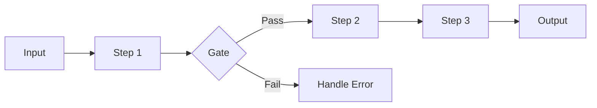

### Characteristics

| Aspect        | Description                                              |
| ------------- | -------------------------------------------------------- |
| **Structure** | Serial processing, output of each step is input for next |
| **Gate**      | Can set validation gates after each step                 |
| **Use Cases** | Document translation, code generation → review → fix     |

### When to Use

- Task can be decomposed into clear subtasks
- Each step's output is needed for the next step
- Intermediate result validation is important

### Implementation Example

```
Step 1: Analyze requirements
    ↓ (Gate: Are requirements clear?)
Step 2: Create design
    ↓ (Gate: Is design valid?)
Step 3: Implement
    ↓ (Gate: Tests passing?)
Step 4: Create documentation
```

---

## 2. Routing

**Classify input → Route to specialized handlers**

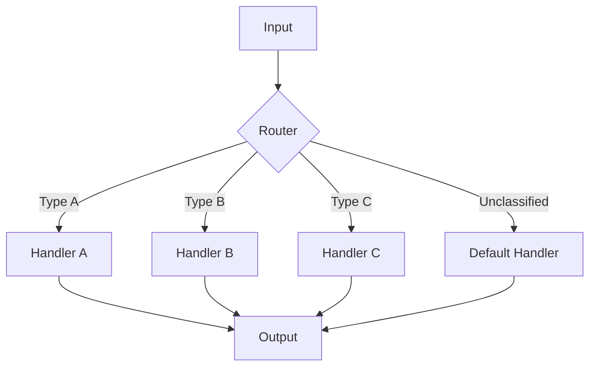

### Characteristics

| Aspect        | Description                              |
| ------------- | ---------------------------------------- |
| **Structure** | Classifier + specialized handlers        |
| **Benefits**  | Each handler can be optimized            |
| **Use Cases** | Customer support, inquiry classification |

### When to Use

- Input has clear categories
- Different processing is optimal per category
- Classification accuracy is sufficiently high

### Implementation Example

```
Router: Determine inquiry type
├─ Technical question → Technical Support Agent
├─ Billing related → Billing Support Agent
├─ General question → FAQ Agent
└─ Unclassified → Default Handler
```

### Default Handler (Fallback Route)

Handle inputs that don't match any defined category:

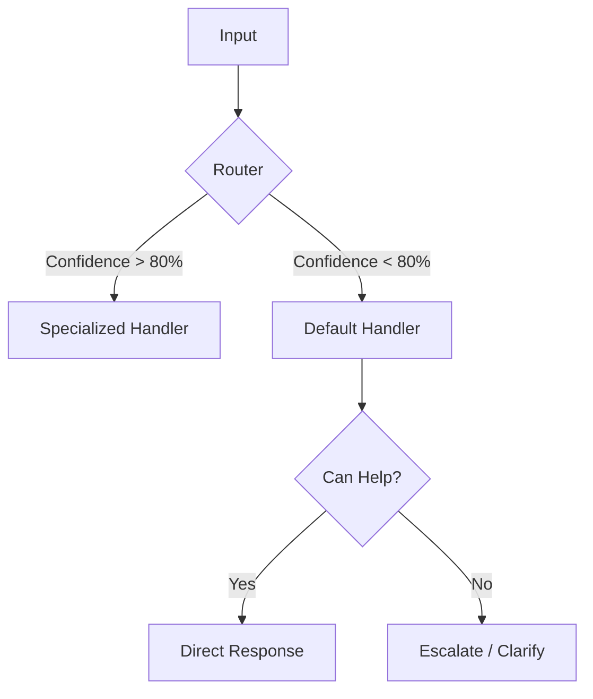

**When to Route to Default:**

| Condition                     | Action                       |
| ----------------------------- | ---------------------------- |
| Low classification confidence | Route to Default Handler     |
| Unknown category              | Route to Default Handler     |
| Ambiguous input               | Ask clarifying question      |
| Out of scope                  | Politely decline or escalate |

**Implementation Example:**

```yaml
---
name: Support Router
tools: ["runSubagent"]
---

# Support Router

## Routing Rules

1. Technical keywords detected → Tech Support Agent
2. Billing/payment keywords → Billing Agent
3. FAQ match found → FAQ Agent
4. **Otherwise → Default Handler**

## Default Handler Behavior

- Attempt general assistance first
- If unable to help: "I'll connect you with a specialist"
- Log unclassified inputs for future category expansion
```

**⚠️ Important:** Default Handler should log unclassified inputs. Frequent patterns may indicate a missing specialized handler.

---

## 3. Parallelization

**Execute independent tasks simultaneously**

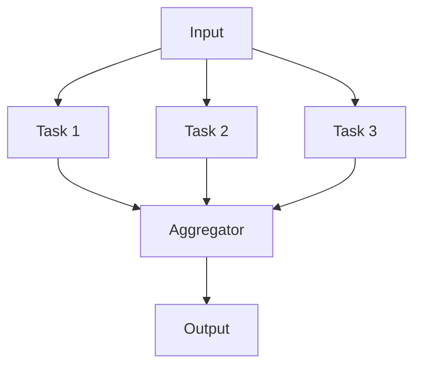

### Characteristics

| Aspect         | Description                                           |
| -------------- | ----------------------------------------------------- |
| **Structure**  | Split → parallel execution → aggregate                |
| **Benefits**   | Reduced processing time, robustness from independence |
| **Variations** | Sectioning (division), Voting (majority decision)     |

### When to Use

- Tasks are independent (no shared state)
- Parallel execution can reduce time
- Multiple perspectives/results are desired

### Implementation Example

```
Input: Document
├─ Agent 1: Grammar check
├─ Agent 2: Content accuracy check
└─ Agent 3: Style check
    ↓
Aggregator: Integrate all results
```

---

## 4. Orchestrator-Workers

**Dynamically decompose tasks → Dispatch to workers**

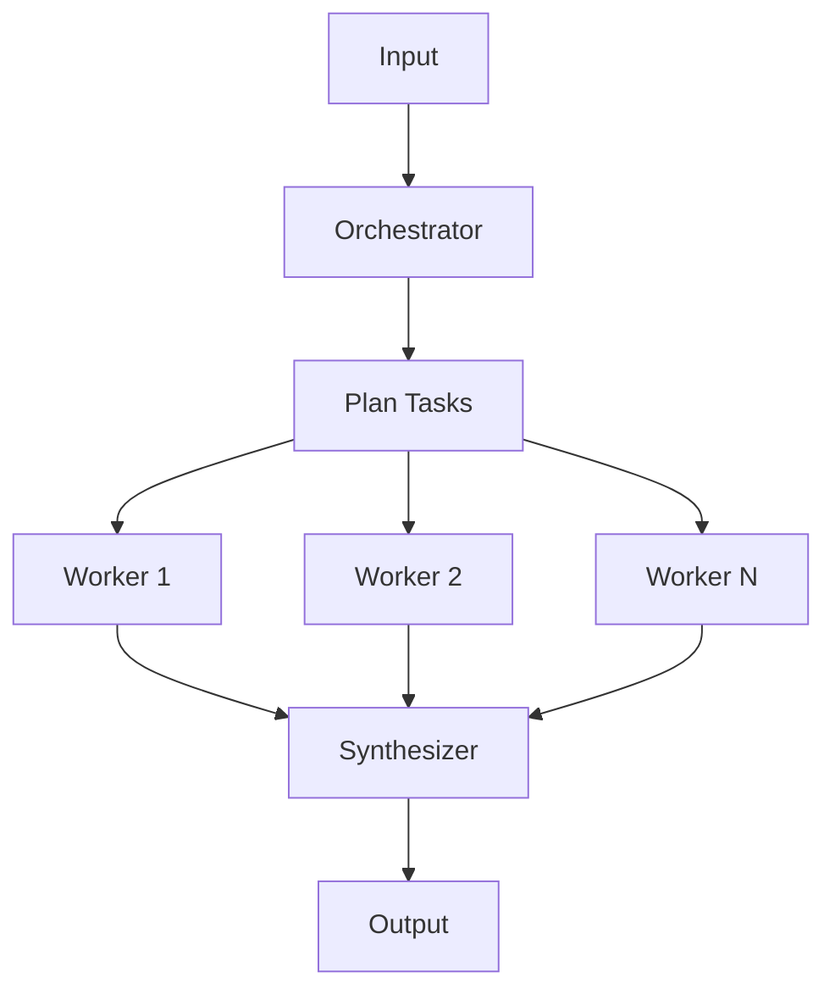

### Characteristics

| Aspect        | Description                                     |
| ------------- | ----------------------------------------------- |
| **Structure** | Orchestrator + dynamic workers + synthesizer    |
| **Benefits**  | Works even when task count is not predetermined |
| **Use Cases** | Code changes (multiple files), research         |

### When to Use

- Number of subtasks depends on input
- Each subtask can be executed independently
- Result synthesis is required

### Implementation Example

```
Orchestrator:
  - Generate file change list
  - Assign workers to each file

Workers:
  - Worker 1 → Modify file1.py
  - Worker 2 → Modify file2.py
  - Worker 3 → Modify test.py

Synthesizer:
  - Merge all changes
  - Resolve conflicts
```

### VS Code Copilot: runSubagent Implementation

⚠️ **Critical:** Workers are spawned via `#tool:runSubagent`. The orchestrator MUST explicitly call this tool.

**Agent Definition:**

```yaml
---
name: Code Review Orchestrator
tools: ["runSubagent", "search", "read"]
---

# Code Review Orchestrator

## Workflow

1. Identify files to review (search)
2. For EACH file, MUST call #tool:runSubagent:
   - Prompt: "Review {filepath}. Return: {bugs: [], style: [], security: []}"
3. Aggregate all sub-agent results
4. Generate final report

## MANDATORY RULES

- You MUST use #tool:runSubagent for each file
- Do NOT read file contents directly
- Each sub-agent prompt must specify output format
```

**Why This Works:**

- "MUST" language prevents orchestrator from skipping delegation
- Explicit tool reference (`#tool:runSubagent`) triggers tool usage
- Output format in prompt ensures consistent synthesis

### Common Mistake

❌ **Vague instructions:**

```markdown
You can use sub-agents to review files if needed.
```

✅ **Mandatory instructions:**

```markdown
You MUST use #tool:runSubagent for EACH file. Do NOT review directly.
```

### General Assistant (Fallback Worker)

Handle tasks that don't match specialized workers (casual chat, ad-hoc questions, minor help):

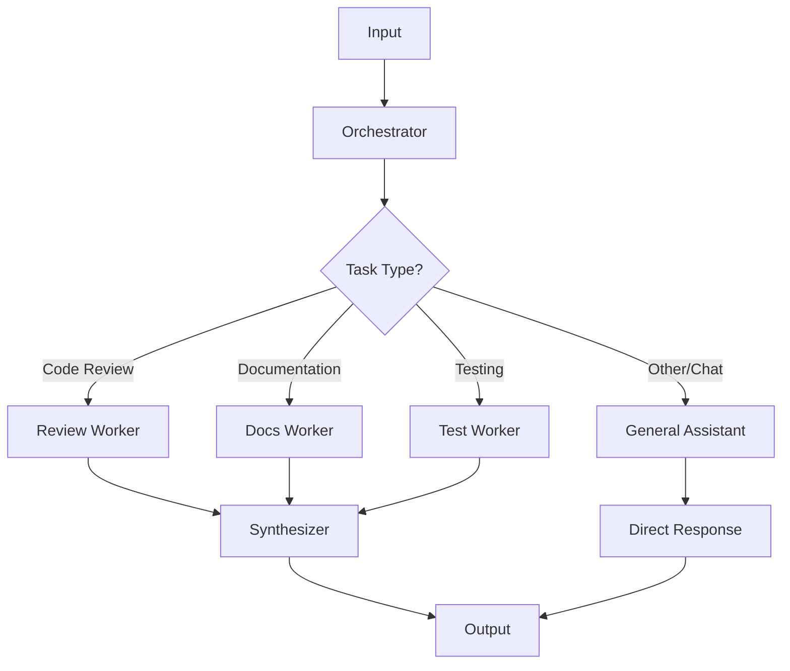

**When to Use:**

- Casual conversation or greetings
- Simple clarification questions
- Tasks outside defined worker scope
- Quick one-off requests

**Benefits:**

| Benefit               | Description                                         |
| --------------------- | --------------------------------------------------- |
| **Safety Net**        | Handles edge cases without "I can't help" responses |
| **UX Improvement**    | Users get answers even for undefined task types     |
| **Reduced Overhead**  | No complex routing for simple requests              |
| **Graceful Fallback** | Prevents workflow from failing on unexpected input  |

**Implementation Example:**

```yaml
---
name: Project Orchestrator
tools: ["runSubagent", "search", "read"]
---

# Project Orchestrator

## Routing Rules

1. Code changes → Code Worker
2. Documentation → Docs Worker
3. Testing → Test Worker
4. **Everything else → General Assistant**

## General Assistant Prompt

For unclassified tasks, call #tool:runSubagent with:
- Prompt: "Handle this user request conversationally: {request}"
- No strict output format required
- Prioritize helpfulness over structure
```

**⚠️ Important:** General Assistant should NOT bypass the orchestrator for tasks that genuinely require specialized workers. Use as fallback, not shortcut.

### Dynamic Worker Creation (New Task Detection)

When the orchestrator encounters a task type that doesn't match existing workers, it should **ask for user confirmation** before creating a new sub-agent.

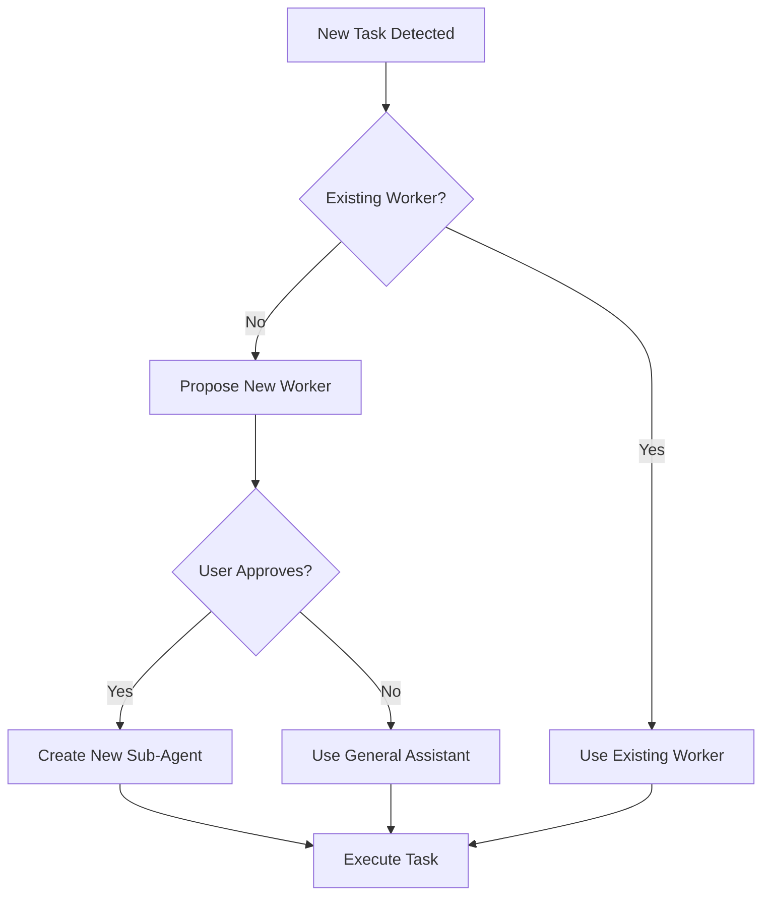

**Why Ask for Confirmation:**

| Reason                | Description                                             |
| --------------------- | ------------------------------------------------------- |
| **Cost Control**      | New sub-agents consume additional tokens/resources      |
| **Scope Management**  | User may prefer to handle new task types differently    |
| **Quality Assurance** | User can provide guidance for the new worker's behavior |
| **Visibility**        | User knows when workflow is expanding                   |

**Implementation Pattern:**

```yaml
---
name: Adaptive Orchestrator
tools: ["runSubagent", "search", "read"]
---

# Adaptive Orchestrator

## Workflow

1. Analyze incoming task
2. Check if existing worker matches task type
3. **If NO match:**
   - Propose: "I detected a new task type: {type}. Create a specialized sub-agent for this?"
   - Wait for user confirmation
   - If YES: Create and execute with new sub-agent
   - If NO: Route to General Assistant

## New Worker Proposal Format

When proposing a new worker, include:
- Task type detected
- Proposed worker name
- Expected responsibilities
- Alternative: General Assistant handling

**Example:**
"I detected a task type I haven't handled before:
- **Type:** Database migration
- **Proposed Worker:** Migration Worker
- **Responsibilities:** Schema changes, data migration, rollback scripts

Should I create a specialized sub-agent for this, or handle it with General Assistant?"
```

**Orchestrator Prompt Template:**

```markdown
## Dynamic Worker Rules

When you encounter a task that doesn't match existing workers:

1. **STOP** - Do not create new workers automatically
2. **PROPOSE** - Ask user:
   "New task type detected: {description}
   - Option A: Create new '{type} Worker' sub-agent
   - Option B: Handle with General Assistant
     Which do you prefer?"
3. **WAIT** - Get explicit confirmation before proceeding
4. **EXECUTE** - Follow user's choice
```

**Decision Flow:**

| Task Type          | Existing Worker? | Action                               |
| ------------------ | ---------------- | ------------------------------------ |
| Code review        | ✅ Yes           | Use Code Review Worker               |
| Documentation      | ✅ Yes           | Use Docs Worker                      |
| Database migration | ❌ No            | **Ask user** → Create or use General |
| Security audit     | ❌ No            | **Ask user** → Create or use General |

**Benefits:**

| Benefit                    | Description                                |
| -------------------------- | ------------------------------------------ |
| **User Control**           | User decides workflow expansion            |
| **Cost Transparency**      | Explicit acknowledgment of resource usage  |
| **Learning Opportunity**   | User can guide new worker's specialization |
| **Avoid Over-Engineering** | One-off tasks stay with General Assistant  |

**Anti-Pattern: Silent Worker Creation**

❌ **Bad:**

```
Orchestrator: [Silently creates DatabaseWorker, SecurityWorker, PerformanceWorker...]
User: "Why did this take so long and cost so much?"
```

✅ **Good:**

```
Orchestrator: "I see a database-related task. I don't have a specialized worker for this.
              Should I create a Database Worker, or handle it with General Assistant?"
User: "Just use General Assistant for now."
Orchestrator: "Got it. Routing to General Assistant..."
```

---

## 5. Evaluator-Optimizer

**Generate → Evaluate → Improve loop**

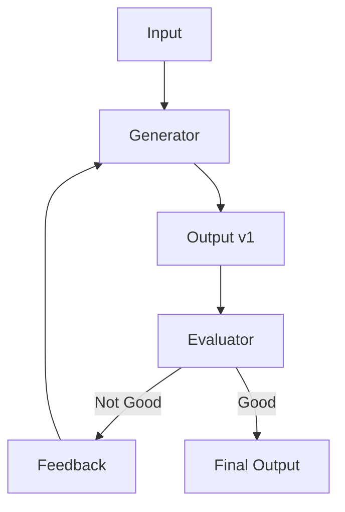

### Characteristics

| Aspect        | Description                                 |
| ------------- | ------------------------------------------- |
| **Structure** | Generator + evaluator + feedback loop       |
| **Benefits**  | Improves until quality criteria are met     |
| **Use Cases** | Translation, code review, text proofreading |

### When to Use

- Clear quality criteria exist
- Iterative improvement increases quality
- Want to mimic human feedback

### Implementation Example

```
Generator: Generate translation
    ↓
Evaluator:
  - Is the nuance accurate?
  - Is the grammar correct?
  - Does it reflect the original intent?
    ↓
  ├─ OK → Complete
  └─ NG → Regenerate with feedback
```

---

## Combining Patterns

In real workflows, multiple patterns are often combined.

### Example: Code Generation Workflow

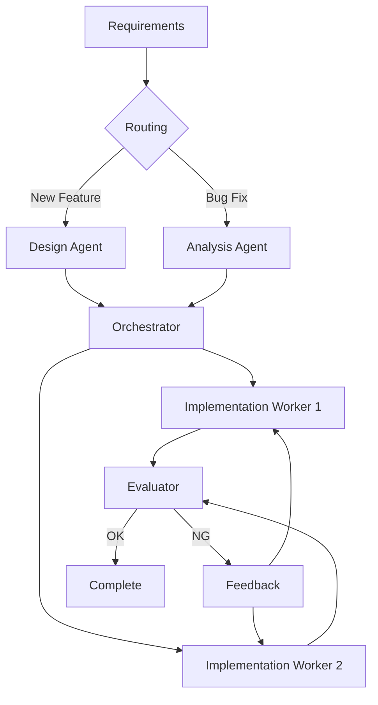

**Patterns Used:**

1. **Routing** - Branch processing by requirement type
2. **Orchestrator-Workers** - Implement per file
3. **Evaluator-Optimizer** - Review → fix loop

---

## Advanced: IR Architecture

**Intermediate Representation pattern for transformation tasks**

This advanced pattern is particularly effective for document generation, code transformation, and any task where deterministic output is critical.

### Two-Stage Architecture

```
Input → IR (Intermediate Representation) → Output
```

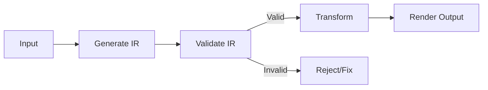

### Core Principles

| Principle                  | Description                                                       |
| -------------------------- | ----------------------------------------------------------------- |
| **Separation of Concerns** | Split responsibility: Generate, Validate, Transform, Render       |
| **Strict Validation**      | Validate IR structure strictly; do not auto-complete missing data |
| **Determinism**            | Same IR → Same output. No creativity in transformation phase      |

### Separation of Concerns

| Responsibility | Agent Role                             | Creativity Level      |
| -------------- | -------------------------------------- | --------------------- |
| **Generate**   | Create IR from input                   | High (interpretation) |
| **Validate**   | Verify IR completeness and correctness | None (rule-based)     |
| **Transform**  | Convert IR to output format            | None (mechanical)     |
| **Render**     | Format final output                    | Low (formatting only) |

### IR Specification Guidelines

1. **Define allowed structure** - JSON, YAML, or structured Markdown
2. **Strict schema** - All required fields must be present
3. **No inference** - Missing data = error, not auto-completion
4. **Version control** - IR schema should be versioned

### When to Use

- Document generation (specs → documentation)
- Code transformation (one language → another)
- Report generation (data → formatted report)
- Template-based output (variables → filled template)

### When NOT to Use

- Creative tasks (writing, brainstorming)
- Exploratory analysis
- Tasks requiring adaptive responses

### Implementation Example

**Document Generation Workflow:**

```
Step 1: Generate IR
  Input: User requirements
  Output: Structured document spec (JSON)

Step 2: Validate IR
  - All required sections present?
  - Data types correct?
  - References valid?
  → Reject if invalid

Step 3: Transform
  IR → Markdown/HTML/PDF
  (Deterministic, no creativity)

Step 4: Render
  Apply styling, formatting
  Output final document
```

### Example IR Schema

```json
{
  "document": {
    "title": "string (required)",
    "sections": [
      {
        "heading": "string (required)",
        "content": "string (required)",
        "subsections": ["array (optional)"]
      }
    ],
    "metadata": {
      "author": "string",
      "version": "string",
      "created": "ISO8601 date"
    }
  }
}
```

### Benefits

| Benefit             | Description                            |
| ------------------- | -------------------------------------- |
| **Reproducibility** | Same IR always produces same output    |
| **Debuggability**   | Can inspect IR to understand failures  |
| **Testability**     | Can unit test each stage independently |
| **Reusability**     | Same IR can render to multiple formats |

---

## 6. Connected Agents (Multi-Agent Collaboration)

**Multiple specialized agents collaborate and share context**

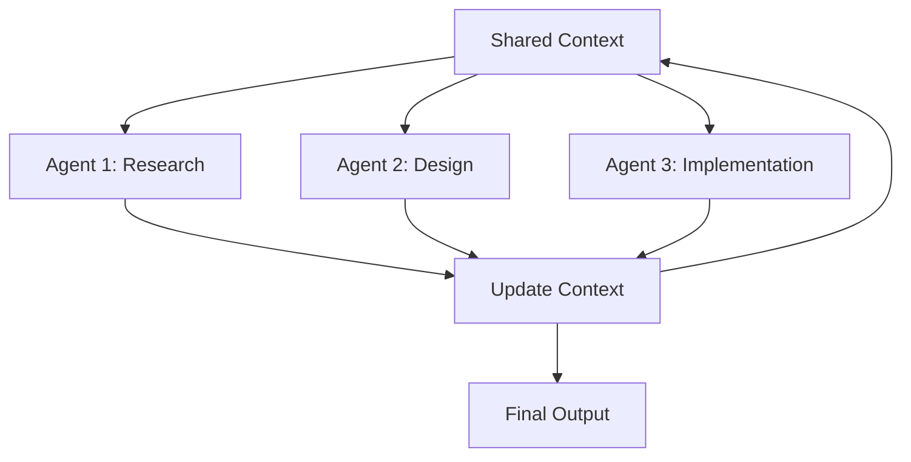

### Characteristics

| Aspect        | Description                                          |
| ------------- | ---------------------------------------------------- |
| **Structure** | Multiple agents with shared state/context            |
| **Benefits**  | Agents build on each other's work, emergent insights |
| **Use Cases** | Complex projects requiring diverse expertise         |

### When to Use

- Task requires multiple specialized capabilities
- Agents need to build on each other's outputs
- Collaboration yields better results than isolation
- Context sharing reduces redundant work

### Implementation Example

```
Shared Context (Memory/Database):
  ├─ Project goals
  ├─ Decisions made
  ├─ Resources created
  └─ Current state

Agent 1 (Research):
  - Reads context
  - Gathers information
  - Updates context with findings

Agent 2 (Design):
  - Reads research findings from context
  - Creates architecture
  - Updates context with design

Agent 3 (Implementation):
  - Reads design from context
  - Implements solution
  - Updates context with code
```

### Key Principles

| Principle                 | Description                                   |
| ------------------------- | --------------------------------------------- |
| **Shared State**          | Central repository for context and decisions  |
| **Read-Update Cycle**     | Each agent reads latest state, then updates   |
| **Specialization**        | Each agent has distinct expertise             |
| **Coordination Protocol** | Clear rules for context access and updates    |
| **Conflict Resolution**   | Handle concurrent updates or conflicting data |

### Coordination Strategies

#### 1. Sequential (Turn-Taking)

```
Agent 1 completes → Agent 2 starts → Agent 3 starts
```

**Pros:** Simple, no conflicts  
**Cons:** Slower, no parallelism

#### 2. Parallel with Merge

```
Agent 1, 2, 3 work simultaneously → Merge updates
```

**Pros:** Fast  
**Cons:** Merge conflicts possible

#### 3. Leader-Follower

```
Leader Agent coordinates → Assigns tasks to followers
```

**Pros:** Clear control flow  
**Cons:** Leader bottleneck

### Context Format Example

```json
{
  "project_context": {
    "goal": "Build a web scraper",
    "constraints": ["Must handle rate limiting", "Store in database"],
    "decisions": [
      {
        "agent": "research",
        "timestamp": "2024-01-15T10:00:00Z",
        "decision": "Use Python with BeautifulSoup",
        "rationale": "Simple, well-documented, handles HTML parsing"
      }
    ],
    "artifacts": [
      {
        "type": "design_doc",
        "created_by": "design_agent",
        "path": "docs/architecture.md"
      }
    ],
    "state": "implementation_in_progress"
  }
}
```

### Benefits

| Benefit               | Description                                |
| --------------------- | ------------------------------------------ |
| **Knowledge Sharing** | Agents leverage each other's work          |
| **Consistency**       | Single source of truth prevents divergence |
| **Auditability**      | Shared context provides complete history   |
| **Flexibility**       | Add/remove agents without restructuring    |

### Challenges

| Challenge            | Mitigation                                  |
| -------------------- | ------------------------------------------- |
| **State Complexity** | Use structured context format (JSON/YAML)   |
| **Race Conditions**  | Implement locking or turn-taking protocol   |
| **Context Bloat**    | Prune old/irrelevant data periodically      |
| **Debugging**        | Log all context reads/writes with timestamp |

### When NOT to Use

- Single-domain task (use Orchestrator-Workers instead)
- Agents work independently (use Parallelization)
- No need for context sharing (use Routing)

### Implementation Checklist

```markdown
- [ ] Define shared context schema
- [ ] Establish read/write protocols
- [ ] Implement conflict resolution strategy
- [ ] Set up context persistence (file/database)
- [ ] Add logging for all context modifications
- [ ] Define agent responsibilities clearly
- [ ] Test concurrent access scenarios
```

### Real-World Example: Software Development

```
Context: GitHub Issue + PR + Discussion Thread

├─ Code Agent:
│    - Reads issue requirements
│    - Implements solution
│    - Updates PR with code

├─ Test Agent:
│    - Reads code changes from PR
│    - Generates test cases
│    - Updates PR with tests

├─ Review Agent:
│    - Reads code and tests
│    - Provides feedback
│    - Updates discussion thread

└─ Documentation Agent:
     - Reads final implementation
     - Updates README and docs
     - Commits to repo
```

Each agent operates on shared artifacts (code, PR, docs) and can see what others have contributed.

---

## References

- [Building Effective Agents - Anthropic](https://www.anthropic.com/engineering/building-effective-agents)
- [Workflows and Agents - LangChain](https://docs.langchain.com/oss/python/langgraph/workflows-agents)
- [vscode-ai-toolkit Patterns](https://github.com/microsoft/vscode-ai-toolkit)
