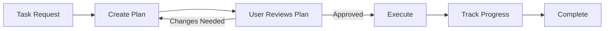

# Pattern 0: Plan-First (Meta-Pattern)

**Always create a plan before execution**

> Back to [overview.md](overview.md)

## Diagram



## Characteristics

| Aspect        | Description                                             |
| ------------- | ------------------------------------------------------- |
| **Purpose**   | Ensure alignment before investing effort in execution   |
| **Structure** | Plan -> Review -> Execute                               |
| **Benefits**  | Avoids wasted work, enables early course correction     |
| **Use Cases** | Any non-trivial task with multiple steps or uncertainty |

## When to Use

- Task is complex or multi-step
- Execution is costly (time, resources, or reversibility)
- Ambiguity exists in requirements
- Risk of misunderstanding user intent

## Implementation Pattern

```
Step 1: Analyze Request
  - Understand goal and constraints
  - Identify subtasks and dependencies

Step 2: Generate Plan
  - List concrete steps with rationale
  - Estimate effort/time per step
  - Identify risks and alternatives

Step 3: Present for Approval
  - Show plan in clear format
  - Ask: "Does this plan meet your expectations?"

Step 4: Execute (only after approval)
  - Follow plan systematically
  - Report progress at key milestones
```

## Plan Format Example

```markdown
## Plan for [Task Name]

**Goal:** [Clear statement of what will be accomplished]

**Steps:**
1. [Action] - [Rationale] (Est: [time/effort])
2. [Action] - [Rationale] (Est: [time/effort])

**Risks:**
- [Risk 1]: [Mitigation approach]

**Approval Needed:** Please confirm before I proceed.
```

## Why This Matters

From vscode-ai-toolkit best practices:

> "Generate a plan first and ask the user for approval. This prevents wasted effort on the wrong approach."

## Anti-Pattern: Plan-Free Execution

Bad: Jump straight to implementation without discussing approach
Good: Propose plan, get feedback, adjust, then execute
