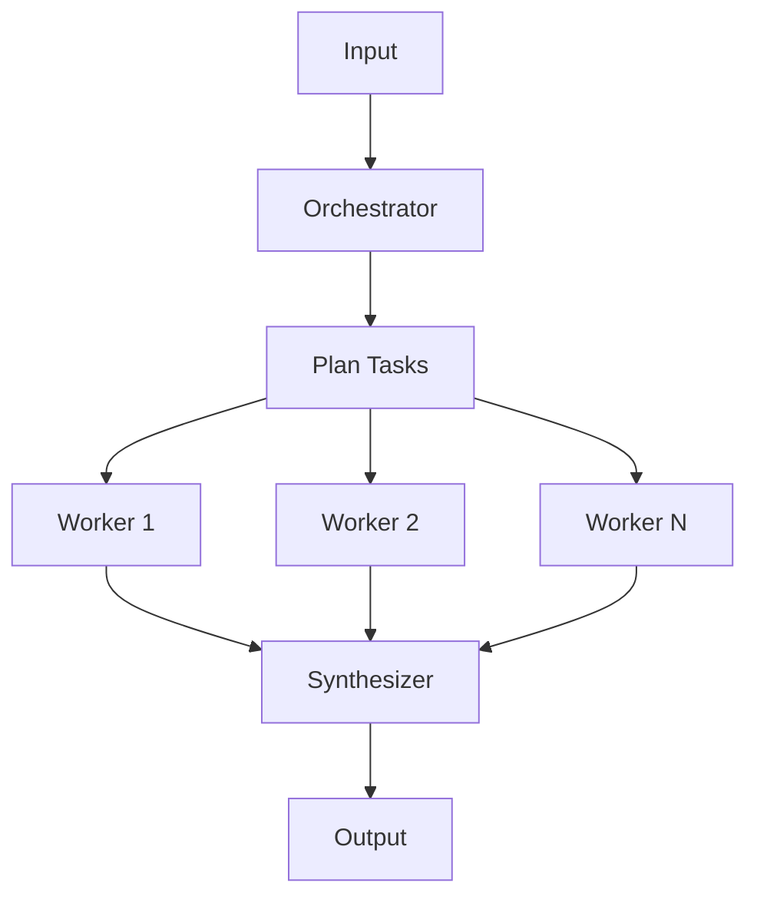
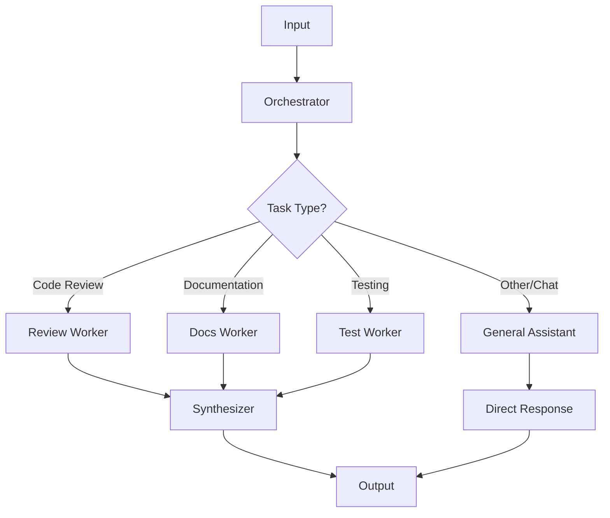
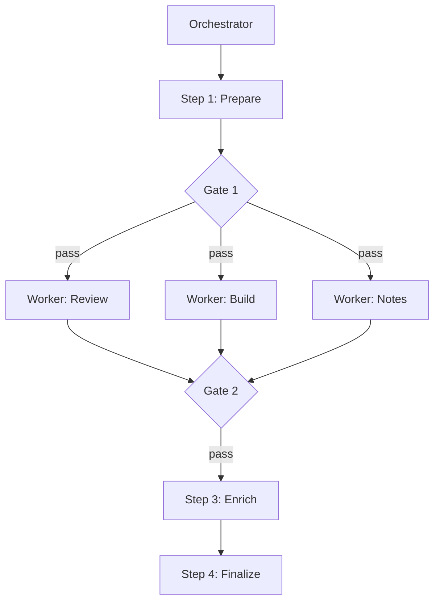
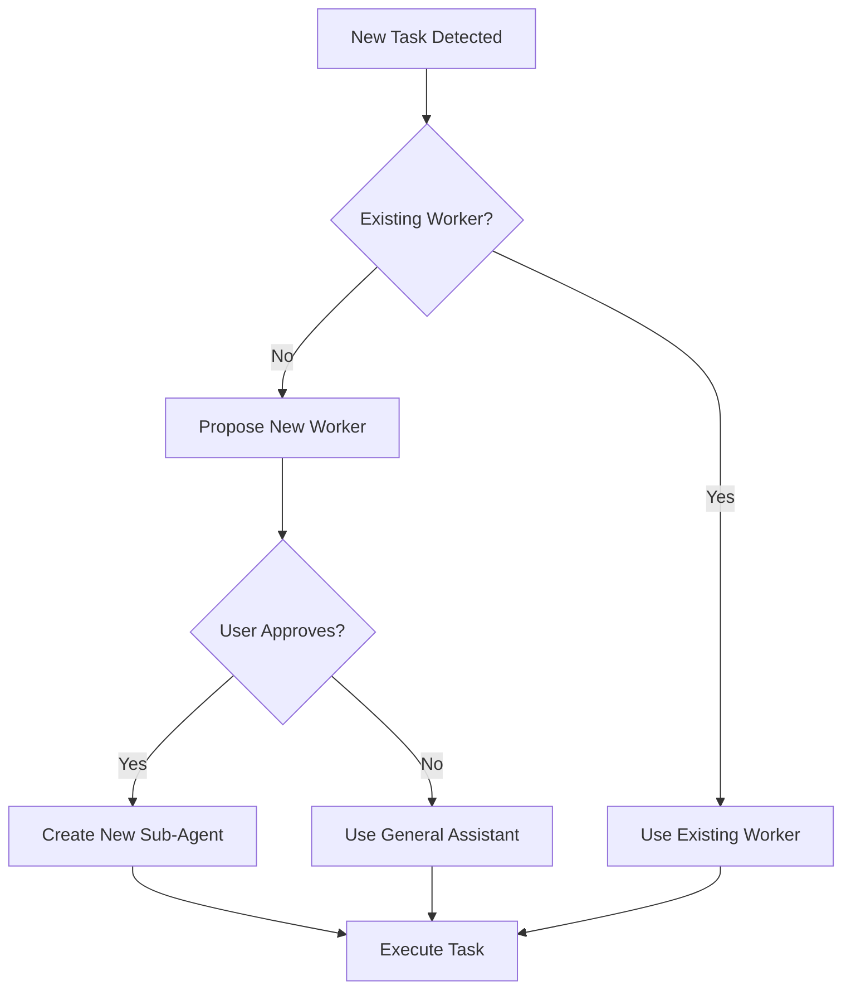

# Pattern 4: Orchestrator-Workers

**Dynamically decompose tasks → Dispatch to workers**

> Back to [overview.md](overview.md)

## Diagram



## Characteristics

| Aspect        | Description                                     |
| ------------- | ----------------------------------------------- |
| **Structure** | Orchestrator + dynamic workers + synthesizer    |
| **Benefits**  | Works even when task count is not predetermined |
| **Use Cases** | Code changes (multiple files), research         |

## When to Use

- Number of subtasks depends on input
- Each subtask can be executed independently
- Result synthesis is required

## Implementation Example

```
Orchestrator:
  - Generate file change list
  - Assign workers to each file

Workers:
  - Worker 1 → Modify file1.py
  - Worker 2 → Modify file2.py
  - Worker 3 → Modify test.py

Synthesizer:
  - Merge all changes
  - Resolve conflicts
```

## VS Code Copilot: agent Implementation

⚠️ **Critical:** Workers are spawned via `#tool:agent`. The orchestrator MUST explicitly call this tool.

**Agent Definition:**

```yaml
---
name: Code Review Orchestrator
tools: ["agent", "search", "read"]
---

# Code Review Orchestrator

## Workflow

1. Identify files to review (search)
2. For EACH file, MUST call #tool:agent:
   - Prompt: "Review {filepath}. Return: {bugs: [], style: [], security: []}"
3. Aggregate all sub-agent results
4. Generate final report

## MANDATORY RULES

- You MUST use #tool:agent for each file
- Do NOT read file contents directly
- Each sub-agent prompt must specify output format
```

**Why This Works:**

- "MUST" language prevents orchestrator from skipping delegation
- Explicit tool reference (`#tool:agent`) triggers tool usage
- Output format in prompt ensures consistent synthesis

### Common Mistake

❌ **Vague instructions:**

```markdown
You can use sub-agents to review files if needed.
```

✅ **Mandatory instructions:**

```markdown
You MUST use #tool:agent for EACH file. Do NOT review directly.
```

## General Assistant (Fallback Worker)

Handle tasks that don't match specialized workers (casual chat, ad-hoc questions, minor help):



**When to Use:**

- Casual conversation or greetings
- Simple clarification questions
- Tasks outside defined worker scope
- Quick one-off requests

**Benefits:**

| Benefit               | Description                                         |
| --------------------- | --------------------------------------------------- |
| **Safety Net**        | Handles edge cases without "I can't help" responses |
| **UX Improvement**    | Users get answers even for undefined task types     |
| **Reduced Overhead**  | No complex routing for simple requests              |
| **Graceful Fallback** | Prevents workflow from failing on unexpected input  |

**Implementation Example:**

```yaml
---
name: Project Orchestrator
tools: ["agent", "search", "read"]
---

# Project Orchestrator

## Routing Rules

1. Code changes → Code Worker
2. Documentation → Docs Worker
3. Testing → Test Worker
4. **Everything else → General Assistant**

## General Assistant Prompt

For unclassified tasks, call #tool:agent with:
- Prompt: "Handle this user request conversationally: {request}"
- No strict output format required
- Prioritize helpfulness over structure
```

**⚠️ Important:** General Assistant should NOT bypass the orchestrator for tasks that genuinely require specialized workers. Use as fallback, not shortcut.

## Parallel Workers Pattern (Orchestrator + Parallelization)

When workers are independent, the Orchestrator can dispatch them **simultaneously** using `runSubagent` parallel invocation, combining Pattern 3 (Parallelization) with Pattern 4.

### Design Steps

1. **Identify independent workers** — no shared output files, no data dependencies
2. **Document safety** — use the dependency table from [3-parallelization.md](3-parallelization.md)
3. **Gate after parallel step** — verify all workers completed before next step
4. **Retry selectively** — if one worker fails, retry only that worker

### Splitting for Parallelization

When a single agent has both **AI reasoning** and **mechanical execution**, consider splitting:

```
Before (sequential):
  Enrich Agent = AI notes generation + PowerPoint writing
  → Total time: T(AI) + T(write)

After (parallel):
  Notes Generator Agent = AI notes generation  ← parallel with others
  Enrich Agent = PowerPoint writing only        ← runs after parallel step
  → Total time: max(T(AI), T(other_agents)) + T(write)
```

**Splitting criteria:**

- The two responsibilities use different tools (MCP vs COM)
- The two responsibilities have no shared state
- One responsibility is the bottleneck

### Workflow Example



## Dynamic Worker Creation (New Task Detection)

When the orchestrator encounters a task type that doesn't match existing workers, it should **ask for user confirmation** before creating a new sub-agent.



**Why Ask for Confirmation:**

| Reason                | Description                                             |
| --------------------- | ------------------------------------------------------- |
| **Cost Control**      | New sub-agents consume additional tokens/resources      |
| **Scope Management**  | User may prefer to handle new task types differently    |
| **Quality Assurance** | User can provide guidance for the new worker's behavior |
| **Visibility**        | User knows when workflow is expanding                   |

**Implementation Pattern:**

```yaml
---
name: Adaptive Orchestrator
tools: ["agent", "search", "read"]
---

# Adaptive Orchestrator

## Workflow

1. Analyze incoming task
2. Check if existing worker matches task type
3. **If NO match:**
   - Propose: "I detected a new task type: {type}. Create a specialized sub-agent for this?"
   - Wait for user confirmation
   - If YES: Create and execute with new sub-agent
   - If NO: Route to General Assistant

## New Worker Proposal Format

When proposing a new worker, include:
- Task type detected
- Proposed worker name
- Expected responsibilities
- Alternative: General Assistant handling

**Example:**
"I detected a task type I haven't handled before:
- **Type:** Database migration
- **Proposed Worker:** Migration Worker
- **Responsibilities:** Schema changes, data migration, rollback scripts

Should I create a specialized sub-agent for this, or handle it with General Assistant?"
```

**Orchestrator Prompt Template:**

```markdown
## Dynamic Worker Rules

When you encounter a task that doesn't match existing workers:

1. **STOP** - Do not create new workers automatically
2. **PROPOSE** - Ask user:
   "New task type detected: {description}
   - Option A: Create new '{type} Worker' sub-agent
   - Option B: Handle with General Assistant
     Which do you prefer?"
3. **WAIT** - Get explicit confirmation before proceeding
4. **EXECUTE** - Follow user's choice
```

**Decision Flow:**

| Task Type          | Existing Worker? | Action                               |
| ------------------ | ---------------- | ------------------------------------ |
| Code review        | ✅ Yes           | Use Code Review Worker               |
| Documentation      | ✅ Yes           | Use Docs Worker                      |
| Database migration | ❌ No            | **Ask user** → Create or use General |
| Security audit     | ❌ No            | **Ask user** → Create or use General |

**Benefits:**

| Benefit                    | Description                                |
| -------------------------- | ------------------------------------------ |
| **User Control**           | User decides workflow expansion            |
| **Cost Transparency**      | Explicit acknowledgment of resource usage  |
| **Learning Opportunity**   | User can guide new worker's specialization |
| **Avoid Over-Engineering** | One-off tasks stay with General Assistant  |

**Anti-Pattern: Silent Worker Creation**

❌ **Bad:**

```
Orchestrator: [Silently creates DatabaseWorker, SecurityWorker, PerformanceWorker...]
User: "Why did this take so long and cost so much?"
```

✅ **Good:**

```
Orchestrator: "I see a database-related task. I don't have a specialized worker for this.
              Should I create a Database Worker, or handle it with General Assistant?"
User: "Just use General Assistant for now."
Orchestrator: "Got it. Routing to General Assistant..."
```
