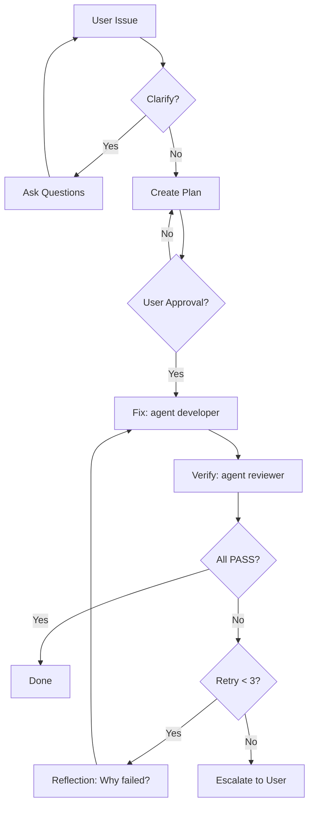

# Pattern 5: Evaluator-Optimizer

**Generate → Evaluate → Improve loop**

> Back to [overview.md](overview.md)

Use only when quality criteria are explicit enough for an evaluator to return PASS/FAIL per item. Without criteria, the loop never converges.

## VS Code Implementation

- Make the evaluator a separate custom agent with read-only tools (`["read", "search"]`) so it cannot "fix" what it reviews.
- Set a different `model` on the evaluator agent when self-review bias matters (same-model review tends to approve its own output).
- Evaluator returns a structured verdict (`{item, pass, reason}`); the generator receives only failed items as feedback.

## Example: Error-Fixer Agent

A practical implementation combining Evaluator-Optimizer with Human-in-the-Loop:

### Key Design Patterns

| Pattern             | Implementation                                        |
| ------------------- | ----------------------------------------------------- |
| **Reflection Loop** | Analyze why previous fix failed before retrying       |
| **Error Context**   | Pass full stack trace + related files + past attempts |
| **No Repeat Fixes** | Track attempt history, try different approaches       |
| **Escalation**      | After 3 failures, report to user with recommendations |

### Stop Conditions (required)

- ✅ All verification items PASS
- ⛔ Max 3 retries reached → Escalate
- ⛔ Same error 2x in a row → Change approach
