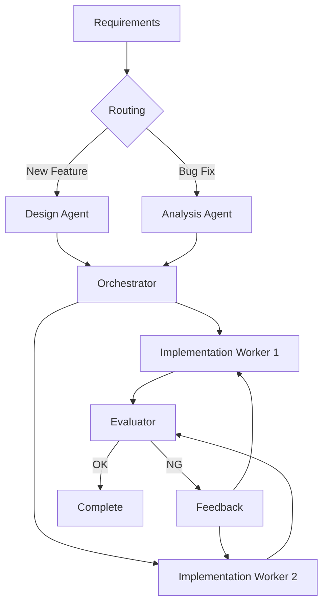

# Combining Patterns

**In real workflows, multiple patterns are often combined.**

> Back to [overview.md](overview.md)

## Example: Code Generation Workflow

Routing picks the path, Orchestrator-Workers implements per file, Evaluator-Optimizer loops review → fix with a retry cap.

## VS Code Constraints When Nesting

- Nested combination (a worker that itself orchestrates or loops) means a subagent calling subagents. That requires `chat.subagents.allowInvocationsFromSubagents`; without it, flatten the nesting into the top-level orchestrator.
- Each added layer adds a context boundary: pass state through files and keep the [delegated evidence contract](4-orchestrator-workers.md#delegated-evidence-contract) at every layer.
- Every loop inside the combination needs its own stop condition; a global cap alone lets one inner loop consume the budget.

## Common Combinations

| Combination                           | Use Case                               |
| ------------------------------------- | -------------------------------------- |
| Routing + Orchestrator-Workers        | Multi-type tasks with dynamic subtasks |
| Prompt Chaining + Evaluator-Optimizer | Sequential with quality gates          |
| Parallelization + Evaluator-Optimizer | Parallel execution with voting         |
| Connected Agents + IR Architecture    | Shared context with structured output  |

## Anti-Patterns

- Over-engineering: a linear translation task does not need Routing → Orchestrator → Workers → Evaluator; Prompt Chaining is enough.
- Pattern mismatch: forcing independent tasks through Prompt Chaining serializes them for no reason; use Parallelization.
