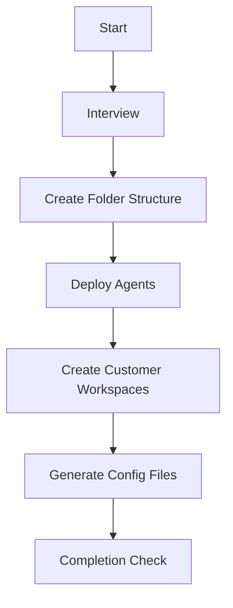

# Biz-Ops Workspace Setup

Initialize a business operations workspace with integrated reporting and task management.

## When to Use

- Setting up a new workspace from scratch
- "biz-ops setup", "business management workspace"
- Deploying workIQ-based reporting and task management
- Converting existing folder to business operations workspace

## Prerequisites

| Item                     | Required | Description                                       |
| ------------------------ | -------- | ------------------------------------------------- |
| VS Code + GitHub Copilot | Yes      | Agent execution environment                       |
| Git                      | Yes      | Version control                                   |
| PowerShell 7+            | Yes      | Script execution                                  |
| workIQ MCP Server        | Optional | M365 integration (basic features work without it) |
| OneDrive Sync            | Optional | External folder references                        |

## Setup Flow



## Phase 1: Interview (MANDATORY)

Ask the following in order. Unknown items can be skipped.

### 1.1 Customer Information (Required)

```
Please provide customer list:
- Customer name
- Customer ID (alphanumeric, used for folder names)
- Primary contact (optional)

Example:
- Contoso Inc / contoso / John Doe
- Fabrikam Ltd / fabrikam / Jane Smith
```

### 1.2 External Data Sources (Optional)

```
Any external folders to reference for report generation?

- Tech QA repository (e.g., D:\repos\tech-qa)
- Blog folder (e.g., D:\blog)
- Customer project folder (e.g., C:\Users\{user}\OneDrive\Customers)
```

### 1.3 Holiday Configuration

```
Select holiday configuration country:
- japan (default)
- us
- other (manual setup)
```

## Phase 2: Create Folder Structure

→ [references/folder-structure.md](references/folder-structure.md)

## Phase 3: Deploy Agents & Prompts

→ [references/agent-list.md](references/agent-list.md)

## Phase 4: Create Customer Workspaces

Create `Customers/{id}/` for each interviewed customer.

→ Use customer-workspace skill

## Phase 5: Generate Configuration Files

- Add customer mapping to `copilot-instructions.md`
- Deploy `_workiq/{country}-holidays.md` or selected holiday file
- Configure external paths in `_datasources/`

## Phase 6: Completion Check

```markdown
✅ Setup Complete

### Created Folders

- ActivityReport/
- Customers/{customer-list}
- Tasks/
- \_internal/
- \_inbox/

### Deployed Agents

- orchestrator, report-generator, task-manager, data-collector, work-inventory

### Next Steps

1. Open DASHBOARD.md to view today's tasks
2. Test "create daily report"
3. Paste Teams chat to test auto-classification
```

## Key References

| Topic                      | Reference                                                                |
| -------------------------- | ------------------------------------------------------------------------ |
| Folder Structure           | [references/folder-structure.md](references/folder-structure.md)         |
| Agent List                 | [references/agent-list.md](references/agent-list.md)                     |
| External Data Source Setup | [references/external-datasources.md](references/external-datasources.md) |
| Holiday Configuration      | [references/holidays.md](references/holidays.md)                         |
