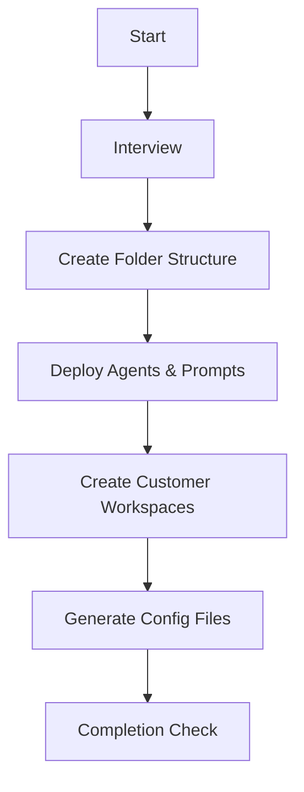

# Biz-Ops Workspace Setup

Initialize a business operations workspace with integrated reporting and task management.

## When to Use

- **biz-ops setup**, **業務管理ワークスペース**, **レポート管理**
- Setting up a new workspace from scratch
- Deploying workIQ-based reporting and task management
- Converting existing folder to business operations workspace

## Prerequisites

| Item                     | Required | Description                                       |
| ------------------------ | -------- | ------------------------------------------------- |
| VS Code + GitHub Copilot | Yes      | Agent execution environment                       |
| Git                      | Yes      | Version control                                   |
| PowerShell 7+            | Yes      | Script execution                                  |
| workIQ MCP Server        | Optional | M365 integration (basic features work without it) |
| OneDrive Sync            | Optional | External folder references                        |

## Setup Flow



## Phase 1: Interview (MANDATORY)

Ask the following in order. Unknown items can be skipped.

### 1.1 Customer Information (Required)

```
Please provide customer list:
- Customer name
- Customer ID (alphanumeric, used for folder names)
- Primary contact (optional)
- Contact-customer mapping (optional, for auto-routing)

Example:
- Contoso Inc / contoso / John Doe
- Fabrikam Ltd / fabrikam / Jane Smith
```

### 1.1.1 Date Confirmation Rule (MANDATORY)

> ⚠️ **CRITICAL**: Always confirm current date/time before generating reports.

```
Before generating any report, confirm:
1. Today's date? → Run `Get-Date` in terminal
2. Report period? → Daily: today / Weekly: this week / Monthly: this month
3. Holidays? → Check _workiq/{country}-holidays.md
```

### 1.2 External Data Sources (Optional)

```
Any external folders to reference for report generation?

- Tech QA repository (e.g., D:\repos\tech-qa)
- Blog folder (e.g., D:\blog)
- Customer project folder (e.g., C:\Users\{user}\OneDrive\Customers)
```

### 1.3 Holiday Configuration

```
Select holiday configuration country:
- japan (default)
- us
- other (manual setup)
```

### 1.4 workIQ Availability (Optional)

```
Is workIQ MCP server available?
- Yes → Enable M365 data auto-collection
- No → Use manual data input and workspace data only
```

## Phase 2: Create Folder Structure

**Option A: Use Script (Recommended)**

```powershell
# Initialize workspace with customer list
.\scripts\Initialize-BizOpsWorkspace.ps1 -WorkspacePath "D:\my-biz-ops" -Customers @("contoso", "fabrikam")
```

**Option B: Manual Creation**

→ [references/folder-structure.md](references/folder-structure.md)

## Phase 3: Deploy Agents & Prompts (MANDATORY)

**Option A: Use Script (Recommended)**

```powershell
# Deploy all templates with optional customer mappings
.\scripts\Deploy-BizOpsTemplates.ps1 -WorkspacePath "D:\my-biz-ops"

# With customer mappings
.\scripts\Deploy-BizOpsTemplates.ps1 `
    -Customers @{"Contoso Inc" = "contoso"; "Fabrikam Ltd" = "fabrikam"} `
    -Contacts @{"John Doe" = "contoso"; "Jane Smith" = "fabrikam"}
```

**Option B: Manual Deployment**

Deploy ALL agent and prompt templates to create a complete workflow.

### 3.1 Agents (Required)

Copy from `assets/agents/` to `.github/agents/`:

| Template                             | Destination                 | Role                       |
| ------------------------------------ | --------------------------- | -------------------------- |
| `orchestrator.agent.template.md`     | `orchestrator.agent.md`     | Task routing, coordination |
| `report-generator.agent.template.md` | `report-generator.agent.md` | Report generation          |
| `report-reviewer.agent.template.md`  | `report-reviewer.agent.md`  | IMPACT review              |
| `task-manager.agent.template.md`     | `task-manager.agent.md`     | Task management            |
| `data-collector.agent.template.md`   | `data-collector.agent.md`   | Data collection, routing   |
| `work-inventory.agent.template.md`   | `work-inventory.agent.md`   | Work analysis, PR          |

### 3.2 Prompts (Required)

Copy from `assets/prompts/` to `.github/prompts/`:

| Template                            | Destination                | Purpose               |
| ----------------------------------- | -------------------------- | --------------------- |
| `daily-report.prompt.template.md`   | `daily-report.prompt.md`   | Daily report format   |
| `weekly-report.prompt.template.md`  | `weekly-report.prompt.md`  | Weekly report format  |
| `monthly-report.prompt.template.md` | `monthly-report.prompt.md` | Monthly report format |
| `review-report.prompt.template.md`  | `review-report.prompt.md`  | IMPACT review prompt  |

### 3.3 Root Configuration Templates

Copy from `assets/` to workspace root or `.github/`:

| Template                           | Destination                       | Purpose                |
| ---------------------------------- | --------------------------------- | ---------------------- |
| `copilot-instructions.template.md` | `.github/copilot-instructions.md` | Workspace rules        |
| `AGENTS.template.md`               | `AGENTS.md`                       | Agent registry         |
| `DASHBOARD.template.md`            | `DASHBOARD.md`                    | Status dashboard       |
| `external-paths.template.md`       | `_datasources/external-paths.md`  | External folder config |

### 3.4 Data Source Configuration

Copy from `assets/_datasources/` to `_datasources/`:

| Template                           | Destination            | Purpose                         |
| ---------------------------------- | ---------------------- | ------------------------------- |
| `workiq-spec.template.md`          | `workiq-spec.md`       | workIQ query reference          |
| `external-folders.template.md`     | `external-folders.md`  | External folder sync config     |
| `README.template.md`               | `README.md`            | Data sources overview           |

### 3.5 Scripts

Copy from `assets/scripts/` to `_datasources/scripts/`:

| Script                        | Purpose                          |
| ----------------------------- | -------------------------------- |
| `Check-ExternalFolders.ps1`   | External folder update checker   |

### 3.6 Post-Deploy Customization

After copying, customize these sections in copied files:

1. **Customer Mapping** (all agents): Add customer patterns from interview
2. **Contact Mapping** (data-collector): Add contact→customer mappings
3. **External Paths** (report-generator): Configure from interview

→ [references/agent-list.md](references/agent-list.md) for detailed specifications

## Phase 4: Create Customer Workspaces

Create `Customers/{id}/` for each interviewed customer.

→ Use customer-workspace skill

## Phase 5: Generate Configuration Files

### 5.1 Customer Mapping

- Add customer detection patterns to `copilot-instructions.md`
- Add contact→customer mappings from interview

### 5.2 Holiday Configuration

- Deploy `_workiq/{country}-holidays.md` from `references/holidays.md`
- Configure holiday detection in `copilot-instructions.md`

### 5.3 External Data Sources

**If external folders were specified in interview:**

1. Create `_datasources/external-paths.md` from `assets/external-paths.template.md`
2. Fill in paths from Phase 1.2 interview results
3. Uncomment external data source section in `copilot-instructions.md`

### 5.4 workIQ Configuration

**If workIQ is available (Phase 1.4 = Yes):**

1. Verify `_datasources/workiq-spec.md` is deployed
2. Enable workIQ sections in agents (uncomment if needed)

**If workIQ is NOT available:**

1. Keep workIQ sections as optional/fallback
2. System will use workspace data and manual input

## Phase 6: Completion Check

```markdown
✅ Setup Complete

### Created Folders

- ActivityReport/
- Customers/{customer-list}
- Tasks/
- \_internal/
- \_inbox/
- \_datasources/
- \_datasources/scripts/
- \_workiq/

### Deployed Agents (6)

- orchestrator
- report-generator
- report-reviewer
- task-manager
- data-collector
- work-inventory

### Deployed Prompts (4)

- daily-report.prompt.md
- weekly-report.prompt.md
- monthly-report.prompt.md
- review-report.prompt.md

### Root Configuration Files

- AGENTS.md (agent registry)
- DASHBOARD.md (status dashboard)
- copilot-instructions.md (with customer mappings)
- \_datasources/external-folders.md (external folder sync)
- \_datasources/README.md (data sources overview)
- \_datasources/workiq-spec.md
- \_datasources/scripts/Check-ExternalFolders.ps1
- \_workiq/{country}-holidays.md

### Workflow Verification

Test these commands to verify setup:

1. "Create daily report" → report-generator activates
   - ⚠️ Runs Phase 0 date/weekday check first
   - ⚠️ Skips weekend and holidays automatically
2. Paste Teams chat → data-collector routes to customer folder
3. "Add task: {content}" → task-manager creates task
4. "Update tasks" → workIQ integration (if available)
5. "Create weekly report" → Confirm week start/end dates before generating
6. "Check external folders" → Check-ExternalFolders.ps1 executes
```

## Key References

| Topic                      | Reference                                                                |
| -------------------------- | ------------------------------------------------------------------------ |
| Folder Structure           | [references/folder-structure.md](references/folder-structure.md)         |
| Agent List                 | [references/agent-list.md](references/agent-list.md)                     |
| External Data Source Setup | [references/external-datasources.md](references/external-datasources.md) |
| Holiday Configuration      | [references/holidays.md](references/holidays.md)                         |
| workIQ Specification       | `assets/_datasources/workiq-spec.template.md`                            |
