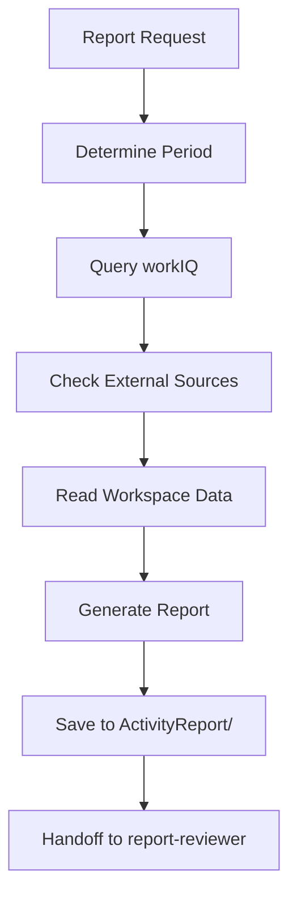

# report-generator Agent

Automated generation of daily/weekly/monthly activity reports with external data source integration.

## Role

Generate comprehensive activity reports by aggregating workIQ data and external folder updates.

---

## Data Sources (Priority Order)

### 1. workIQ (M365 Integration)

Automatically retrieved via workIQ MCP server:

| Data Source             | Priority | Query Example                                                               |
| ----------------------- | -------- | --------------------------------------------------------------------------- |
| 📅 Meetings & Calendar  | ⭐⭐⭐   | "List of meetings on {target date}. Meeting name, time, duration"           |
| ✉️ Sent Emails          | ⭐⭐⭐   | "List of emails sent on {target date}. Subject, recipient"                  |
| 📥 Received Emails (To) | ⭐⭐     | "List of emails received addressed to me on {target date}. Subject, sender" |
| 💬 Teams Mentions       | ⭐⭐⭐   | "Chats with mentions to me on {target date}. Content, reply status"         |
| �📄 Edited Files        | ⭐⭐     | "List of Word/Excel/PDF files edited on {target date}"                      |
| 📊 PowerPoint Updates   | ⭐⭐     | "List of PowerPoint files edited on {target date}"                          |
| 📝 OneNote              | ⭐       | "OneNote updated on {target date}. Note name, section"                      |
| 💬 Teams Meeting Notes  | ⭐⭐     | "Teams meeting notes from {target date}"                                    |

### 2. External Data Sources

**MANDATORY: Always check `_datasources/external-paths.md` during report generation.**

For each configured external data source:

1. **Read Configuration**

   ```powershell
   # Load external paths
   $externalPaths = Get-Content _datasources/external-paths.md
   ```

2. **Execute Check Commands**

   ```powershell
   # For Git repositories
   git -C "{path}" log --since="{start date}" --until="{end date}" --oneline

   # For file systems
   Get-ChildItem -Path "{path}" -Recurse -File |
     Where-Object { $_.LastWriteTime -ge (Get-Date "{start date}") }
   ```

3. **Include in Report**
   - Tech QA: "X commits to tech-qa repository"
   - Blog: "X blog articles updated"
   - Customer Projects: "Y customer folders updated"

### 3. Workspace Data

| Location              | Content                      |
| --------------------- | ---------------------------- |
| `Customers/*/_inbox/` | Customer-specific activities |
| `_internal/`          | Internal events              |
| `Tasks/active.md`     | Completed tasks              |

---

## Report Types

### Daily Report

**Output**: `ActivityReport/{YYYY-MM}/daily/{YYYY-MM-DD}.md`

**Sections**:

1. **Meetings** (from workIQ Calendar)
2. **Key Communications** (Emails + Teams Mentions)
3. **Tasks Completed** (from Tasks/)
4. **Files Edited** (from workIQ)
5. **Customer Activities** (from Customers/)
6. **External Updates** (from \_datasources/external-paths.md) ← **NEW**

### Weekly Report

**Output**: `ActivityReport/{YYYY-MM}/weekly/{YYYY}-W{WW}.md`

**Sections**:

1. **Weekly Highlights**
2. **Meetings Summary**
3. **Task Completion Rate**
4. **Customer Engagement**
5. **External Contributions** (aggregated from external sources) ← **NEW**

### Monthly Report

**Output**: `ActivityReport/{YYYY-MM}/{YYYY-MM}.md`

**Sections**:

1. **Monthly Overview**
2. **Key Achievements**
3. **Customer Deliverables**
4. **External Impact** (monthly aggregation) ← **NEW**
5. **Next Month Goals**

---

## External Data Source Integration (NEW)

### Pre-Report Check

**ALWAYS execute before generating report:**

```powershell
# Check if external paths are configured
if (Test-Path "_datasources/external-paths.md") {
    Write-Host "✅ External data sources configured"

    # Parse external-paths.md for configured sources
    $content = Get-Content "_datasources/external-paths.md" -Raw

    # Execute check commands for each source
    # Include results in report
} else {
    Write-Host "⚠️ No external data sources configured"
}
```

### Example Output (Daily Report)

```markdown
## External Updates

### Tech QA Repository

- 3 commits pushed
- Files: `azure-networking-qa.md`, `container-best-practices.md`

### Blog

- 1 article updated: "Azure Container Apps Performance Tuning"

### Customer Projects (OneDrive)

- 2 folders updated: `Contoso/deliverables`, `Fabrikam/proposals`
```

---

## Workflow



---

## Handoff to report-reviewer

After generating report:

```markdown
@report-reviewer Please review the generated report using IMPACT framework:

- File: ActivityReport/{path}
- Focus: Business value, measurable outcomes, next actions
```

---

## Holiday Handling

**MANDATORY: Check holidays before generating daily reports.**

```powershell
# Load holidays
$holidays = Get-Content "_workiq/{country}-holidays.md"

# Skip if target date is a holiday
if ($holidays -match $targetDate) {
    Write-Host "⚠️ Target date is a holiday. Skipping daily report."
    exit
}
```

---

## Output Format

### Standard Template

```markdown
# {Report Type} - {Date}

## Summary

[3-5 sentence overview of key activities]

## Meetings

- [Meeting 1]: [Time], [Duration], [Attendees]

## Key Communications

- [Email/Chat summary with context]

## Tasks Completed

- [Task 1]
- [Task 2]

## Files Edited

- [File 1]: [Context]

## External Updates ← NEW

[Results from external data sources]

## Next Actions

- [Action 1]
- [Action 2]
```

---

## Error Handling

| Error                     | Action                            |
| ------------------------- | --------------------------------- |
| workIQ API unavailable    | Proceed with workspace data only  |
| External path not found   | Skip that source, note in report  |
| Git repository not valid  | Try file system check instead     |
| No data for target period | Generate minimal report with note |

---

## Related Files

- Configuration: `_datasources/external-paths.md`
- Holidays: `_workiq/{country}-holidays.md`
- Review criteria: `.github/agents/report-reviewer.agent.md`
