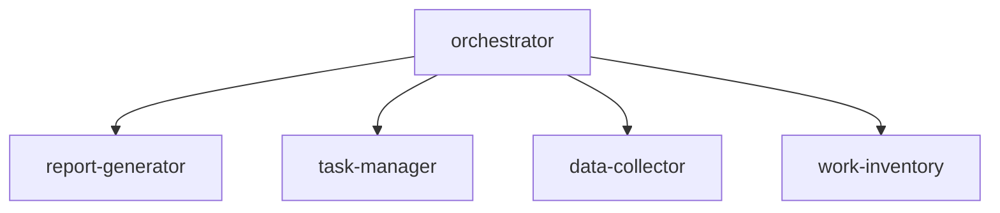
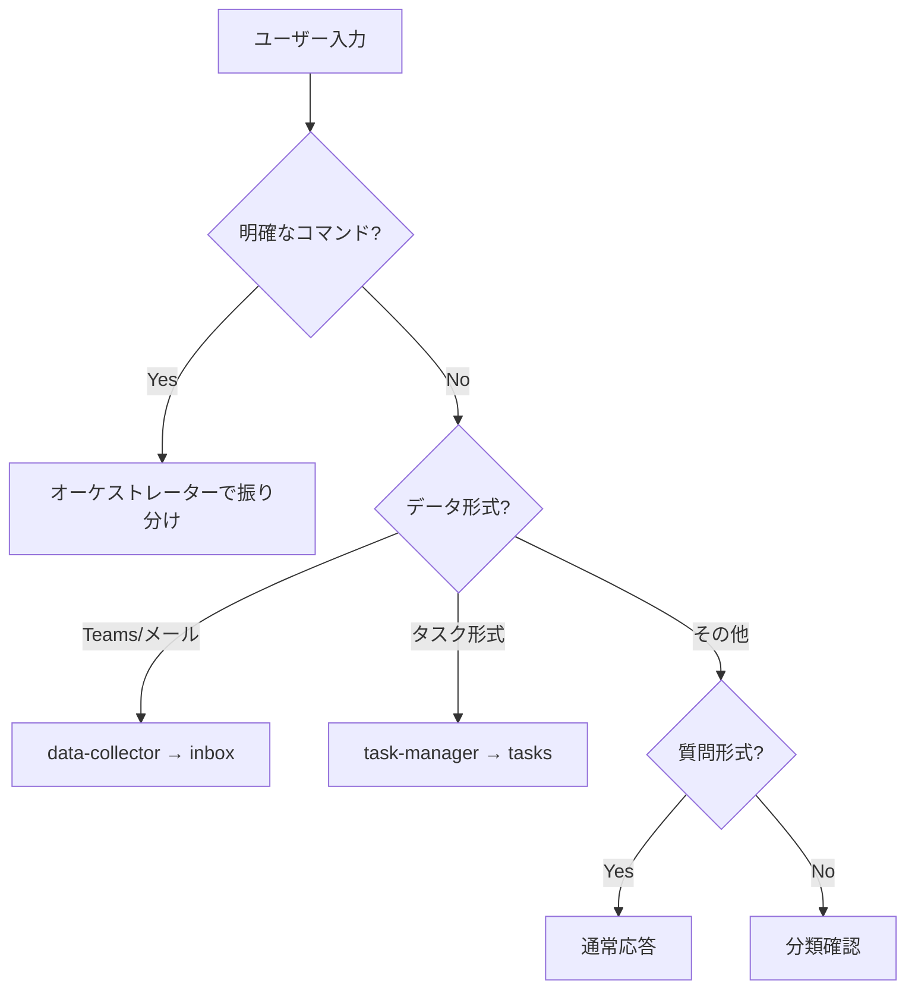

# Copilot Instructions

This file provides workspace-specific instructions for GitHub Copilot.
Place this file at `.github/copilot-instructions.md` in your workspace.

---

## Biz-Ops Workspace Overview

Microsoft workIQ をベースとした業務管理ワークスペースの共通ルール。

| Item         | Description                                                    |
| ------------ | -------------------------------------------------------------- |
| **Purpose**  | Work inventory, report generation, task management             |
| **Base**     | Microsoft workIQ (optional)                                    |
| **Features** | Daily/Weekly/Monthly reports, task management, data collection |

---

## 🔔 Auto Report Check (MANDATORY)

**すべてのリクエスト処理前に、以下のチェックを実行すること:**

### チェック手順

1. **昨日のデイリーレポート確認**
   - `ActivityReport/{YYYY-MM}/daily/{昨日の日付}.md` が存在するか確認
   - 存在しない場合 → 自動生成を提案
   - ⚠️ 昨日が祝日・土日の場合はスキップ

2. **週初め（月曜）の場合**
   - 先週の週次レポート `ActivityReport/{YYYY-MM}/weekly/{先週}.md` を確認
   - 存在しない場合 → 自動生成を提案

3. **月初め（1日〜3日）の場合**
   - 先月の月次レポート `ActivityReport/{先月}/{先月}.md` を確認
   - 存在しない場合 → 自動生成を提案

### 祝日判定

祝日は `_workiq/{country}-holidays.md` を参照:

- 祝日のデイリーレポートは生成不要
- 祝日翌日のチェックでも前日（祝日）はスキップ
- 週次レポートでは祝日を稼働日から除外

### 通知フォーマット

```
📋 レポート未作成を検出しました

- [ ] 昨日のデイリーレポート ({YYYY-MM-DD})
- [ ] 先週の週次レポート ({YYYY}-W{WW})  ← 該当時のみ

自動生成しますか？ [はい] [後で] [スキップ]
```

### 自動生成時の動作

- ユーザーが「はい」→ レポート生成後、元のリクエストを処理
- ユーザーが「後で」→ 元のリクエストを処理（次回も通知）
- ユーザーが「スキップ」→ 元のリクエストを処理（当日は通知しない）

---

## オーケストレーション

### エージェント構成



### 自動振り分けルール

| 入力パターン                                     | 振り分け先                       |
| ------------------------------------------------ | -------------------------------- |
| 「レポート」「報告」「デイリー」「週次」「月次」 | report-generator                 |
| 「タスク」「TODO」「課題」「進捗」               | task-manager                     |
| Teams/メール形式のペースト                       | data-collector                   |
| 「棚卸」「分析」「PR」「振り返り」               | work-inventory                   |
| 該当なし                                         | 分類確認 or 新規エージェント提案 |

---

## 入力自動判定ルール

### 判定フロー



### データソース判定

| パターン                   | ソース         | 処理             |
| -------------------------- | -------------- | ---------------- |
| 「AIによって生成」で始まる | Teams AI議事録 | 議事録変換       |
| 名前 + 日時 + 短文         | Teams チャット | インボックス追記 |
| `From:` `Date:` を含む     | メール         | インボックス追記 |
| 表形式データ               | Excel/CSV      | データソース保存 |

---

## 新規タスクパターン検出

既存カテゴリに該当しない入力を検出した場合:

1. `Tasks/unclassified.md` に記録
2. パターン頻度をカウント
3. 3回以上発生で新規サブエージェント作成を提案

**提案テンプレート**:

```
💡 新しいタスクパターンを検出しました

パターン: {pattern_description}
発生回数: {count}回

専用サブエージェントを作成しますか？
- 名前: {suggested_name}
- 役割: {suggested_role}

[作成する] [スキップ] [後で確認]
```

---

## 顧客自動振り分け

### 顧客名マッピング

<!-- セットアップ時に顧客リストを追加 -->

| 検出パターン | 顧客ID | フォルダ |
| ------------ | ------ | -------- |

### 振り分けルール

1. **顧客名が明示的**: 直接そのフォルダへ
2. **社内行事キーワード**: `_internal/` へ振り分け
3. **担当者名から推定**: 担当者→顧客マッピングで判定
4. **不明**: 共通 `_inbox/` へ保存、後で振り分け

### 保存先

| データ種別      | 顧客検出時                  | 社内行事時             | 不明時                |
| --------------- | --------------------------- | ---------------------- | --------------------- |
| チャット/メール | `Customers/{id}/_inbox/`    | `_internal/_inbox/`    | `_inbox/{YYYY-MM}.md` |
| 議事録          | `Customers/{id}/_meetings/` | `_internal/_meetings/` | `_inbox/`             |
| タスク          | `Customers/{id}/tasks.md`   | `Tasks/active.md`      | `Tasks/active.md`     |

---

## 社内行事振り分け

### 社内行事検出パターン

| パターン                     | 分類     | 保存先                    |
| ---------------------------- | -------- | ------------------------- |
| Tech Connect, テックコネクト | イベント | `_internal/tech-connect/` |
| All Hands, 全社, 全体会議    | 会議     | `_internal/_meetings/`    |
| 1on1, 1:1, ワンオンワン      | チーム   | `_internal/team/`         |
| チームMTG, Team Meeting      | チーム   | `_internal/team/`         |
| 勉強会（社内）, LT           | 学習     | `_internal/_meetings/`    |
| FY26, 年度, 四半期, QBR      | 会議     | `_internal/_meetings/`    |
| 昇進, 評価, Connect          | キャリア | `_internal/team/`         |
| 異動, 組織変更               | 組織     | `_internal/_inbox/`       |
| 休暇, PTO, 有給              | 休暇     | `_internal/_inbox/`       |
| 経費, 精算                   | 経費     | `_internal/_inbox/`       |

---

## レポート生成

### 種類と頻度

| レポート | 頻度 | 出力先                                            |
| -------- | ---- | ------------------------------------------------- |
| デイリー | 毎日 | `ActivityReport/{YYYY-MM}/daily/{YYYY-MM-DD}.md`  |
| 週次     | 毎週 | `ActivityReport/{YYYY-MM}/weekly/{YYYY}-W{WW}.md` |
| 月次     | 毎月 | `ActivityReport/{YYYY-MM}/{YYYY-MM}.md`           |

### コマンド

- `デイリーレポート作成` / `今日のレポート`
- `週次レポート作成` / `今週のまとめ`
- `月次レポート作成` / `今月のまとめ`

### データソース

レポート生成時に以下を参照（更新チェック付き）:

| ソース           | パス                               | 内容                               |
| ---------------- | ---------------------------------- | ---------------------------------- |
| workIQ           | (API)                              | 会議・メール・ファイル・メンション |
| 顧客フォルダ     | `Customers/*/_inbox/`              | 顧客別活動                         |
| 社内フォルダ     | `_internal/`                       | 社内イベント                       |
| タスク           | `Tasks/`                           | 完了・進行中タスク                 |
| **外部フォルダ** | `_datasources/external-folders.md` | **外部リポジトリ・OneDrive等**     |

### 外部フォルダ自動チェック（MANDATORY）

レポート生成前に以下を実行:

1. **外部フォルダをチェック**: `_datasources/external-folders.md` 参照
2. **更新ファイル検出**: `_inbox/{YYYY-MM}.md` の最終更新日時を確認
3. **差分取得**: 新規セクションを `Customers/{id}/_inbox/` に追記
4. **タスク抽出**: `📌 TODO` パターンを `Tasks/active.md` に追加

**チェック方法例**:

- 対象フォルダ内の `_inbox` ファイルを列挙
- 最終更新日時が過去7日以内のものを抽出
- 更新があれば差分を取得

**スクリプト**: `_datasources/scripts/Check-ExternalFolders.ps1`

<!-- セットアップ時に外部データソースを追加例 -->
<!--
### 外部データソース例

| ソース | パス | 確認方法 |
| ------ | ---- | -------- |
| Tech QA Repository | C:\Users\{user}\repos\{repo-name} | Git log |
| Blog | D:\{blog-folder} | File modification |
| Customer Projects | C:\Users\{user}\OneDrive\{customer-folder} | Folder update |
-->

---

## タスク管理

### ステータス

| ステータス    | 説明       |
| ------------- | ---------- |
| `pending`     | 未着手     |
| `in-progress` | 進行中     |
| `blocked`     | ブロック中 |
| `completed`   | 完了       |

### コマンド

- `タスク追加: {内容}` - 新規タスク作成
- `{タスクID} 完了` - タスク完了
- `{タスクID} を進行中に` - ステータス更新
- `タスク一覧` - アクティブタスク表示
- `期限切れタスク` - 期限超過タスク表示
- `タスク更新して` - workIQ連携で自動更新
- `{顧客名}のタスク` - 顧客別タスク表示

### workIQ連携タスク更新

「タスク更新して」コマンドで以下を自動実行:

1. **活動ログ取得**: 会議、Teamsメンション、送信メール、編集ファイル、OneNote
2. **タスク紐付け**: 顧客名・キーワード・担当者名で関連タスクを特定
3. **進捗検出**: 会議参加→進行中、資料送付→完了候補など
4. **更新提案**: ユーザー確認後に `Tasks/active.md` と `Customers/{id}/tasks.md` を同時更新

- `タスク更新して` - workIQ連携で自動更新
- `{顧客名}のタスク` - 顧客別タスク表示

---

## デフォルトタグ

`#network` `#cost` `#contract` `#proposal` `#ai` `#container` `#meeting` `#support` `#organization` `#deadline` `#internal` `#dev` `#docs` `#research` `#admin` `#customer` `#report` `#case` `#delivery` `#engagement` `#training` `#demo`

該当なし → 内容から新規タグを動的生成

---

## 案件管理システム連携（オプション）

外部の案件管理システム（CRM、チケットシステム等）と連携する場合、タスクに以下の情報を記録する：

### 推奨フィールド

- **Case URL**: 案件管理システムの詳細ページURL
  - 形式例: `https://crm.example.com/cases/12345`
- **Case ID**: 案件識別子
- **Request ID**: リクエストID（該当する場合）
- **Project Name/ID**: プロジェクト名とID
- **Location**: 作業場所・デリバリー先

### 記録例

```markdown
- **案件情報**:
  - Case URL: https://crm.example.com/cases/12345
  - Case ID: 12345
  - Request ID: REQ-2026-001
  - Project Name/ID: Example Corp - Project Alpha
  - Location: Tokyo, Japan
```

<!--
組織固有のシステム連携が必要な場合:
1. 上記テンプレートをカスタマイズ
2. フィールド名を実際のシステムに合わせて変更
3. URLフォーマットを調整
-->

---

## 関連エージェント

| エージェント     | ファイル                                   | 役割           |
| ---------------- | ------------------------------------------ | -------------- |
| orchestrator     | `.github/agents/orchestrator.agent.md`     | 統括・振り分け |
| report-generator | `.github/agents/report-generator.agent.md` | レポート生成   |
| task-manager     | `.github/agents/task-manager.agent.md`     | タスク管理     |
| data-collector   | `.github/agents/data-collector.agent.md`   | データ収集     |
| work-inventory   | `.github/agents/work-inventory.agent.md`   | 業務棚卸       |
