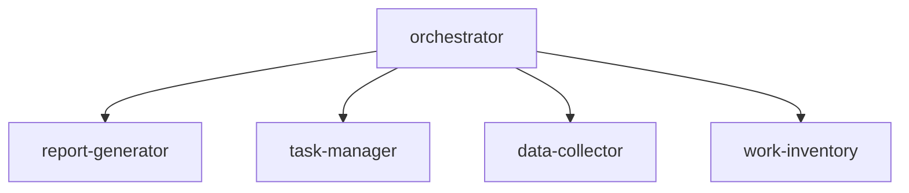

# Biz-Ops Copilot Instructions Template

Microsoft workIQ をベースとした業務管理ワークスペースの共通ルール。

---

## ワークスペース概要

| 項目         | 内容                                               |
| ------------ | -------------------------------------------------- |
| **目的**     | 業務棚卸、レポート生成、タスク管理、上司PR         |
| **ベース**   | Microsoft workIQ                                   |
| **主要機能** | デイリー/週次/月次レポート、タスク管理、データ収集 |

---

## 🔔 自動レポートチェック（MANDATORY）

**すべてのリクエスト処理前に、以下のチェックを実行すること:**

### チェック手順

1. **昨日のデイリーレポート確認**
   - `ActivityReport/{YYYY-MM}/daily/{昨日の日付}.md` が存在するか確認
   - 存在しない場合 → 自動生成を提案
   - ⚠️ 昨日が祝日・土日の場合はスキップ

2. **週初め（月曜）の場合**
   - 先週の週次レポート `ActivityReport/{YYYY-MM}/weekly/{先週}.md` を確認
   - 存在しない場合 → 自動生成を提案

3. **月初め（1日〜3日）の場合**
   - 先月の月次レポート `ActivityReport/{先月}/{先月}.md` を確認
   - 存在しない場合 → 自動生成を提案

### 祝日判定

祝日は `_workiq/{country}-holidays.md` を参照:

- 祝日のデイリーレポートは生成不要
- 祝日翌日のチェックでも前日（祝日）はスキップ
- 週次レポートでは祝日を稼働日から除外

---

## オーケストレーション

### エージェント構成

### 自動振り分けルール

| 入力パターン                                     | 振り分け先       |
| ------------------------------------------------ | ---------------- |
| 「レポート」「報告」「デイリー」「週次」「月次」 | report-generator |
| 「タスク」「TODO」「課題」「進捗」               | task-manager     |
| Teams/メール形式のペースト                       | data-collector   |
| 「棚卸」「分析」「PR」「振り返り」               | work-inventory   |

---

## 顧客自動振り分け

### 顧客名マッピング

<!-- セットアップ時に顧客リストを追加 -->

| 検出パターン | 顧客ID | フォルダ |
| ------------ | ------ | -------- |

### 振り分けルール

1. **顧客名が明示的**: 直接そのフォルダへ
2. **社内行事キーワード**: `_internal/` へ振り分け
3. **担当者名から推定**: 担当者→顧客マッピングで判定
4. **不明**: 共通 `_inbox/` へ保存、後で振り分け

### 保存先

| データ種別      | 顧客検出時                  | 社内行事時             | 不明時                |
| --------------- | --------------------------- | ---------------------- | --------------------- |
| チャット/メール | `Customers/{id}/_inbox/`    | `_internal/_inbox/`    | `_inbox/{YYYY-MM}.md` |
| 議事録          | `Customers/{id}/_meetings/` | `_internal/_meetings/` | `_inbox/`             |
| タスク          | `Customers/{id}/tasks.md`   | `Tasks/active.md`      | `Tasks/active.md`     |

---

## レポート生成

### 種類と頻度

| レポート | 頻度 | 出力先                                            |
| -------- | ---- | ------------------------------------------------- |
| デイリー | 毎日 | `ActivityReport/{YYYY-MM}/daily/{YYYY-MM-DD}.md`  |
| 週次     | 毎週 | `ActivityReport/{YYYY-MM}/weekly/{YYYY}-W{WW}.md` |
| 月次     | 毎月 | `ActivityReport/{YYYY-MM}/{YYYY-MM}.md`           |

### コマンド

- `デイリーレポート作成` / `今日のレポート`
- `週次レポート作成` / `今週のまとめ`
- `月次レポート作成` / `今月のまとめ`

### データソース

レポート生成時に以下を参照（更新チェック付き）:

| ソース       | パス                  | 内容                               |
| ------------ | --------------------- | ---------------------------------- |
| workIQ       | (API)                 | 会議・メール・ファイル・メンション |
| 顧客フォルダ | `Customers/*/_inbox/` | 顧客別活動                         |
| 社内フォルダ | `_internal/`          | 社内イベント                       |
| タスク       | `Tasks/`              | 完了・進行中タスク                 |

<!-- 外部データソースをセットアップ時に追加 -->

---

## タスク管理

### ステータス

| ステータス    | 説明       |
| ------------- | ---------- |
| `pending`     | 未着手     |
| `in-progress` | 進行中     |
| `blocked`     | ブロック中 |
| `completed`   | 完了       |

### コマンド

- `タスク追加: {内容}` - 新規タスク作成
- `{タスクID} 完了` - タスク完了
- `{タスクID} を進行中に` - ステータス更新
- `タスク一覧` - アクティブタスク表示
- `期限切れタスク` - 期限超過タスク表示
- `タスク更新して` - workIQ連携で自動更新
- `{顧客名}のタスク` - 顧客別タスク表示

---

## デフォルトタグ

`#network` `#cost` `#contract` `#proposal` `#ai` `#container` `#meeting` `#support` `#organization` `#deadline` `#internal` `#dev` `#docs` `#research` `#admin` `#customer` `#report` `#ross` `#delivery` `#vbd` `#training` `#demo`

---

## 関連エージェント

| エージェント     | ファイル                                   | 役割           |
| ---------------- | ------------------------------------------ | -------------- |
| orchestrator     | `.github/agents/orchestrator.agent.md`     | 統括・振り分け |
| report-generator | `.github/agents/report-generator.agent.md` | レポート生成   |
| task-manager     | `.github/agents/task-manager.agent.md`     | タスク管理     |
| data-collector   | `.github/agents/data-collector.agent.md`   | データ収集     |
| work-inventory   | `.github/agents/work-inventory.agent.md`   | 業務棚卸       |
