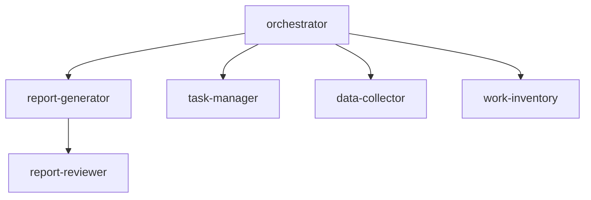

# Biz-Ops Agent List

## Agent Architecture

## Agent Details

| Agent                | File                        | Role                                                               |
| -------------------- | --------------------------- | ------------------------------------------------------------------ |
| **orchestrator**     | `orchestrator.agent.md`     | Coordination, task routing, and new agent suggestions              |
| **report-generator** | `report-generator.agent.md` | Automated generation of daily/weekly/monthly reports               |
| **report-reviewer**  | `report-reviewer.agent.md`  | Results-oriented review (IMPACT framework)                         |
| **task-manager**     | `task-manager.agent.md`     | Task creation, updates, classification, and progress management    |
| **data-collector**   | `data-collector.agent.md`   | Data collection, normalization, and automatic customer/internal routing |
| **work-inventory**   | `work-inventory.agent.md`   | Work inventory, analysis, and manager PR material creation         |

## Prompt List

| Prompt          | File                       | Purpose                        |
| --------------- | -------------------------- | ------------------------------ |
| Daily Report    | `daily-report.prompt.md`   | Generate daily activity report |
| Weekly Report   | `weekly-report.prompt.md`  | Generate weekly summary        |
| Monthly Report  | `monthly-report.prompt.md` | Generate monthly overview      |

## IMPACT Framework (Review Criteria)

| Aspect                      | Description                                    |
| --------------------------- | ---------------------------------------------- |
| **I**nsight                 | Does it provide meaningful interpretation?     |
| **M**easurable              | Are results expressed with metrics?            |
| **P**erception              | Does value communicate to management?          |
| **A**ctionable              | Does it lead to next actions?                  |
| **C**redible                | Are evidence and rationale clear?              |
| **T**imebound               | Is temporal impact demonstrated?               |

## workIQ Data Sources

Data retrieved from workIQ for report generation and task updates:

| Data Source              | Priority | Purpose                           |
| ------------------------ | -------- | --------------------------------- |
| 📅 Meetings & Calendar   | ⭐⭐⭐   | Attended meetings                 |
| ✉️ Sent Emails           | ⭐⭐⭐   | Emails sent by you                |
| 📥 Received Emails (To)  | ⭐⭐     | Emails addressed to you           |
| 💬 Teams Mentions        | ⭐⭐⭐   | Mentions directed to you          |
| � Teams Posts            | ⭐⭐     | Messages posted by you            |
| �📄 Edited Files         | ⭐⭐     | Word/Excel/PDF                    |
| 📊 PowerPoint Updates    | ⭐⭐     | PPTX edit history                 |
| 📝 OneNote               | ⭐       | Note updates                      |
| 💬 Teams Meeting Notes   | ⭐⭐     | AI meeting minutes                |

## Automatic Routing Rules

| Input Pattern                                      | Destination      |
| -------------------------------------------------- | ---------------- |
| "Report", "Status", "Daily", "Weekly", "Monthly" | report-generator |
| "Task", "TODO", "Issue", "Progress"              | task-manager     |
| Teams/Email format paste                           | data-collector   |
| "Inventory", "Analysis", "PR", "Retrospective"   | work-inventory   |
