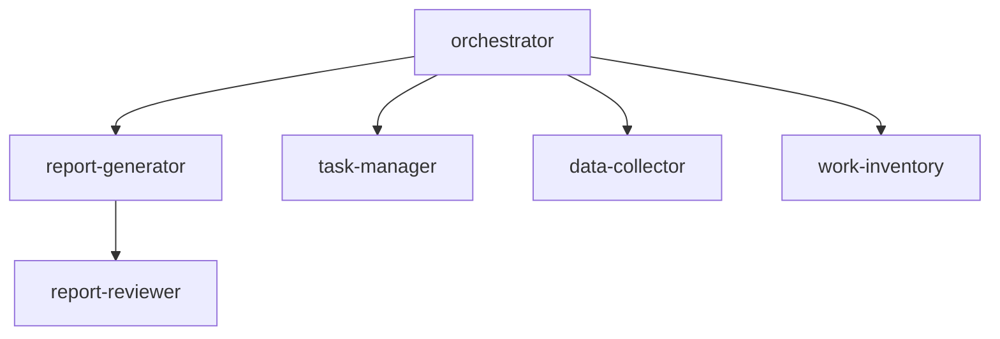

# Biz-Ops Agent List

## Agent Architecture


```mermaid
graph TD
    O[orchestrator] --> R[report-generator]
    O --> T[task-manager]
    O --> D[data-collector]
    O --> W[work-inventory]
    R --> RR[report-reviewer]
```

## Template Files

All templates are in `assets/` folder. Copy to workspace during setup.

### Agent Templates

| Template File                                  | Deploy To                                     | Role                              |
| ---------------------------------------------- | --------------------------------------------- | --------------------------------- |
| `agents/orchestrator.agent.template.md`        | `.github/agents/orchestrator.agent.md`        | Coordination, task routing        |
| `agents/report-generator.agent.template.md`    | `.github/agents/report-generator.agent.md`    | Daily/weekly/monthly reports      |
| `agents/report-reviewer.agent.template.md`     | `.github/agents/report-reviewer.agent.md`     | IMPACT framework review           |
| `agents/task-manager.agent.template.md`        | `.github/agents/task-manager.agent.md`        | Task CRUD, progress tracking      |
| `agents/data-collector.agent.template.md`      | `.github/agents/data-collector.agent.md`      | Data collection, customer routing |
| `agents/work-inventory.agent.template.md`      | `.github/agents/work-inventory.agent.md`      | Work analysis, manager PR         |
| `agents/1on1-assistant.agent.template.md`      | `.github/agents/1on1-assistant.agent.md`      | 1on1 prep, action item extraction |
| `agents/general-worker.agent.template.md`      | `.github/agents/general-worker.agent.md`      | Fallback for unclassified tasks   |
| `agents/availability-finder.agent.template.md` | `.github/agents/availability-finder.agent.md` | Calendar free-slot search         |

`Deploy-BizOpsTemplates.ps1` deploys every `agents/*.template.md`, so the table and the folder must stay in sync.

### Prompt Templates

| Template File                               | Deploy To                                  | Purpose               |
| ------------------------------------------- | ------------------------------------------ | --------------------- |
| `prompts/daily-report.prompt.template.md`   | `.github/prompts/daily-report.prompt.md`   | Daily report format   |
| `prompts/weekly-report.prompt.template.md`  | `.github/prompts/weekly-report.prompt.md`  | Weekly report format  |
| `prompts/monthly-report.prompt.template.md` | `.github/prompts/monthly-report.prompt.md` | Monthly report format |
| `prompts/review-report.prompt.template.md`  | `.github/prompts/review-report.prompt.md`  | IMPACT report review  |

> Prompt files load only in the VS Code Local agent; Agent Host sessions do not load them. Keep the report agents usable directly (`@report-generator`, `@report-reviewer`) instead of relying on the prompts as the only entry point.

### Configuration Templates

| Template File                          | Deploy To                         | Purpose                |
| -------------------------------------- | --------------------------------- | ---------------------- |
| `external-paths.template.md`           | `_datasources/external-paths.md`  | External folder config |
| `_datasources/workiq-spec.template.md` | `_datasources/workiq-spec.md`     | workIQ query reference |
| `copilot-instructions.template.md`     | `.github/copilot-instructions.md` | Workspace rules        |
| `AGENTS.template.md`                   | `AGENTS.md`                       | Workspace description  |
| `DASHBOARD.template.md`                | `DASHBOARD.md`                    | Daily hub              |

## IMPACT Framework (Review Criteria)

| Aspect         | Description                                |
| -------------- | ------------------------------------------ |
| **I**nsight    | Does it provide meaningful interpretation? |
| **M**easurable | Are results expressed with metrics?        |
| **P**erception | Does value communicate to management?      |
| **A**ctionable | Does it lead to next actions?              |
| **C**redible   | Are evidence and rationale clear?          |
| **T**imebound  | Is temporal impact demonstrated?           |

## workIQ Data Sources (Optional)

workIQ is optional; the system works from workspace data without it. The source list, priorities, and fallback methods are in [external-datasources.md](external-datasources.md).

## Automatic Routing Rules

| Input Pattern                                    | Destination         |
| ------------------------------------------------ | ------------------- |
| "Report", "Daily", "Weekly", "Monthly"           | report-generator    |
| "Task", "TODO", "Issue", "Progress"              | task-manager        |
| Teams/Email format paste                         | data-collector      |
| "Inventory", "Analysis", "PR", "Retrospective"   | work-inventory      |
| "1on1", "1:1", "ワンオンワン", "prep"            | 1on1-assistant      |
| "空き時間", "日程調整", "候補日", "いつ空いてる" | availability-finder |
| (No match / Fallback)                            | general-worker      |

## Preflight Checks (Orchestrator)

Before processing any request, the orchestrator runs a lightweight, read-only preflight so missing work surfaces automatically instead of being noticed late.

| Check                   | Trigger / Window                                    | Action                                               |
| ----------------------- | --------------------------------------------------- | ---------------------------------------------------- |
| Missing daily report    | Past 2 business days (holiday/weekend-normalized)   | Notify user, offer to auto-generate                  |
| Missing weekly report   | On the first business day of a new week             | Notify user, offer to auto-generate                  |
| Missing monthly report  | On the first 1-3 days of a new month                | Notify user, offer to auto-generate                  |
| Non-business-day work   | Weekend/holiday between last business day and today | If activity exists, fold it into today's report      |
| Customer data freshness | Before customer-facing or 1on1 prep work            | If profile `last-updated` is stale, offer to refresh |

- Normalize target dates against the configured holiday list (see [holidays.md](holidays.md)) so weekends and holidays never count as missing.
- Keep preflight read-only and delegated; let the user choose `generate now` / `later` / `skip` before doing the original request.
- Run preflight via a read-only worker, not by having the orchestrator read or write files directly.

## Post-Setup Customization

After deploying templates, customize these sections:

### 1. Customer Mapping (All Agents)

Add customer detection patterns from interview:

```markdown
| Detection Pattern | Customer ID | Folder             |
| ----------------- | ----------- | ------------------ |
| Contoso, CONTOSO  | contoso     | Customers/contoso  |
| Fabrikam          | fabrikam    | Customers/fabrikam |
```

### 2. Contact Mapping (data-collector)

Add contact→customer mappings:

```markdown
| Contact Name | Customer |
| ------------ | -------- |
| John Doe     | contoso  |
| Jane Smith   | fabrikam |
```

### 3. External Paths (report-generator)

Configure external folders from interview in `_datasources/external-paths.md`.
