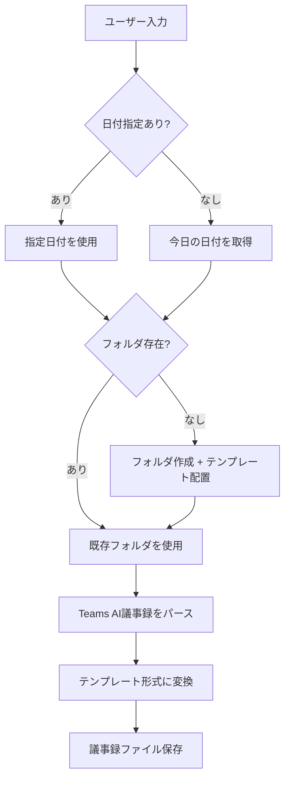

# Teams AI議事録 → 議事録変換

## 概要

Teams会議のAI生成議事録を、議事録テンプレートに沿ったMarkdownに変換します。
日付フォルダがない場合は自動作成します。

---

## 🔄 処理フロー



---

## 📋 実行手順

### Step 1: 日付の決定

1. ユーザーが日付を指定した場合 → その日付を使用
2. 日付指定がない場合 → 今日の日付 `Get-Date -Format "yyyyMMdd"` を使用

### Step 1.5: ファイル確認と連携判定

1. **現在開いているファイルを確認** (`editorContext`)
2. ファイル名から日付を抽出（例: `20260204_議事録.md` → `20260204`）
3. **入力データの日付と比較**：
   - **一致**: 通常の変換処理（Step 2 へ）
   - **不一致（入力が過去）**: 「前回持ち帰りを次回に反映」と判断
     - 入力データから「フォローアップ タスク」を抽出
     - 現在開いているファイルの「🔄 前回持ち帰り事項の確認」に反映
     - **ユーザーに確認**: 「入力は{入力日付}のメモですが、開いているファイルは{ファイル日付}です。前回持ち帰りとして反映しますか？」

### Step 2: フォルダ作成

日付フォルダがなければ作成:

```
{日付}/
├── {日付}_議事録.md       ← _templates/meeting-minutes.md からコピー
└── {日付}_内部メモ.md     ← _templates/internal-memo.md からコピー
```

### Step 3: 議事録変換

Teams AI議事録を以下のルールで変換：

| Teams AI形式               | テンプレート                 |
| -------------------------- | ---------------------------- |
| 会議のメモ: [トピック]     | 📝 議事内容 → トピックN      |
| トピック詳細（インデント） | ディスカッション             |
| フォローアップ タスク      | 🚀 今回の持ち帰り事項（NEW） |
| 担当者が自社名             | 自社 持ち帰り                |
| 担当者がお客様名           | お客様 持ち帰り              |

### Step 4: ファイル保存

変換結果を `{日付}/{日付}_議事録.md` に保存。

---

## 🎯 使用例

### 例1: 日付指定なし（今日の日付を使用）

```
# 以下をペースト:
AI によって生成されます。必ず精度を確認してください。
会議のメモ:
コストアセスメントの実施方針...
```

### 例2: 日付指定あり

```
日付: 20260204

# 以下をペースト:
AI によって生成されます。必ず精度を確認してください。
...
```

---

## 📝 変換ルール詳細

### 1. 基本情報

- **日時**: 日付フォルダから `2026/01/21` 形式に変換
- **出席者**: 議事録内の名前から推定

### 2. 議事内容

- Teams AIの「会議のメモ:」の各トピック（コロン前）を `### トピックN: [タイトル]` として展開
- トピック概要を `**概要:**` に
- 詳細項目を `**ディスカッション:**` に箇条書き
- 決定事項を推定して `**決定事項:**` に記載

### 3. 持ち帰り事項

「フォローアップ タスク:」を振り分け：

| 担当者キーワード | 分類            |
| ---------------- | --------------- |
| 自社メンバー名   | 自社 持ち帰り   |
| その他           | お客様 持ち帰り |

### 4. 顧客共有用ハイライトブロック

議事録に、内部用 `## 次のアクション (社内メモ)` とは別に、**メール / Teams にそのままコピペできる** `## お客様共有用ハイライト (コピペ用)` セクションを必ず 1 つ入れる。

構成:

- 冒頭 1 行 (例: 「本日はお時間いただきありがとうございました。以下、本日ミーティングのハイライトと次アクションをお送りします。」)
- `### 本日の主な確認事項`: 3〜5 bullets で決定事項と方針をサマリ
- `### 次アクション` を 3 バケットに切り分ける:
  - **お客様側**: 顧客側だけで進むタスク
  - **自社側**: 自社側だけで進むタスク
  - **双方 (両者で調整)**: 日程調整 / 共同レビューなど両者協力が必要なタスク。**お客様側 / 自社側に重複させない**

ルール:

- 共有用は断定・合意済み・実他既事だけで埋める。内部推測や `要確認` は入れない。
- 内部ファイルパス、ワークスペース内リンク (`_customer/`, `_meetings/`, `next-actions/` 等) は含めない。
- **担当者の名前表記は `会社名 (姓)` 形式を默認にする** (例: `Microsoft (山本)`, `パートナー名 (沼尻)`)。内部 handle / first name (`Tatsumi` など) やエンゲージメント内の肊書き (`Azure CSA` など) は顧客共有ブロックに入れない。顧客側は「さん / 様」付けを保持する。

### 5. 品質ゲート

- 音声書き起こしは、**短い技術略語 / 時間単位 / エンゲージメント名 / 固有名詞**を特に聞き違える。例: `2H` が `EDE (Enhanced Delivery Engagement) 時間`、`SES` が `CES` / `SES`、`Entra ID` が `エントラID` になるなど。文脈と合わない短いトークンは推測で確定せず、ユーザーに確認するか `要確認` で残す。
- Teams AI の follow-up タスクは一般化しすぎ / literal すぎのことがある。本文トランスクリプトと cross-check し、実際に合意された内容 (期限、owner、具体的な成果物) へ refine する。ambiguous な表現はそのまま残さない。
- 未回答事項、宿題、次回確認事項は `_questions/{YYYY-MM}.md` にも抽出する。
- 会議後の作業が発生する場合だけ `next-actions/` に切り出し、議事録本文は決定事項と持ち帰りの発生記録までで止める。
