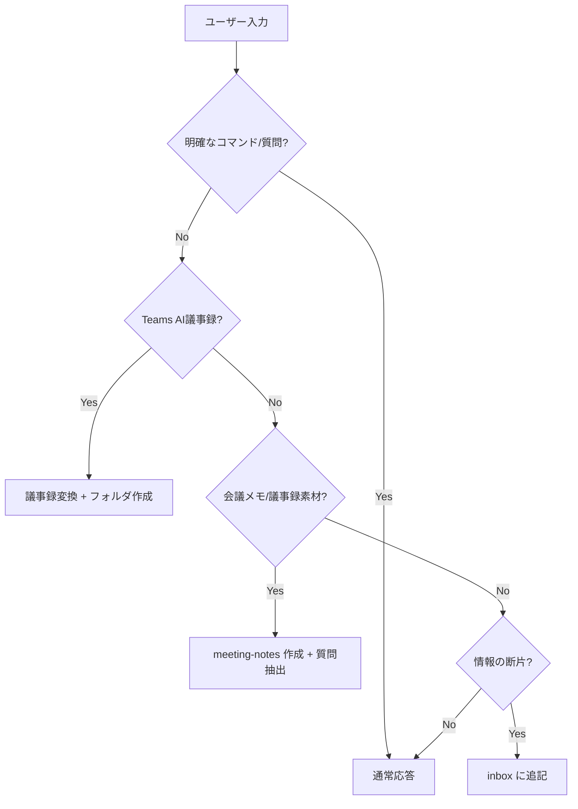

# Copilot Instructions

このワークスペースでの共通ルールです。

---

## 顧客情報

> ⚠️ セットアップ時に自動入力されます

| 項目           | 内容                |
| -------------- | ------------------- |
| **顧客名**     | {{CUSTOMER_NAME}}   |
| **契約形態**   | {{CONTRACT_TYPE}}   |
| **契約期間**   | {{CONTRACT_PERIOD}} |
| **主要連絡先** | {{KEY_CONTACTS}}    |

---

## 入力自動判定ルール

ユーザーの入力が明確なコマンドや質問でない場合、以下の順で判定し自動処理します。

### 判定フロー



### 判定基準

| パターン                                        | 判定           | 処理                      |
| ----------------------------------------------- | -------------- | ------------------------- |
| 「AI によって生成されます」で始まる             | Teams AI議事録 | `convert-meeting-minutes` |
| 「会議のメモ:」「フォローアップ タスク:」を含む | Teams AI議事録 | `convert-meeting-minutes` |
| 「今日のミーティングのメモ」「議題」「課題」「宿題」「次回打ち合わせ」など会議メモの見出しが複数ある | 会議メモ | `meeting-notes` 作成 + `extract-questions` |
| 名前 + 日時 + 短文（Teamsチャット風）           | インボックス   | `inbox` に追記            |
| `From:` `Date:` を含む（メール風）              | インボックス   | `inbox` に追記            |
| `[#channel]` を含む（Slack風）                  | インボックス   | `inbox` に追記            |
| 箇条書きのみ（`-` で始まる行が主）              | インボックス   | `inbox` に追記            |
| 文脈なしの短文メモ                              | インボックス   | `inbox` に追記            |
| 質問形式（「?」「教えて」「どうすれば」等）     | 質問           | 通常応答                  |
| 「質問を抽出」「質問事項を」「宿題を抜き出し」  | 質問抽出       | `extract-questions`       |

### インボックス追記時の動作

1. `_inbox/{現在の年月}.md` を確認（なければ作成）
2. 日時・送信元・タグを自動付与
3. ファイル末尾に追記
4. **確認メッセージ**: 「📥 インボックスに追記しました: {タグ}」

### 議事録検出時の動作

1. 日付を抽出（入力から or 今日の日付）
2. 日付フォルダを作成（なければ）
   - `{日付}/`
   - `{日付}/{日付}_議事録.md`
   - `{日付}/{日付}_内部メモ.md`
3. Teams AI議事録をテンプレート形式に変換
4. **確認メッセージ**: 「📝 議事録を作成しました: {日付}」

### 会議メモ検出時の動作

1. 日付を抽出（入力から or 今日の日付）
2. `meeting-notes/` 形式の議事メモを作成または更新する
3. 同じ入力から宿題・確認事項・アクションを抽出し、`_questions/{YYYY-MM}.md` に追記する
4. inbox 追記は補助記録として必要な場合だけ行い、meeting-notes / questions の代替にしない
5. **確認メッセージ**: 「📝 会議メモと質問事項を反映しました: {日付}」

### 顧客プロファイル更新の提案

以下を検出したら `_customer/profile.md` への追記を提案:

- 契約情報（期間、金額、形態の変更）
- 組織情報（担当者異動、新規連絡先）
- 技術スタック（新規導入、廃止）

### 確認が必要なケース

以下の場合はユーザーに確認:

- 長文で判定が曖昧
- 複数パターンに該当
- ファイルパスや日付の指定がある

---

## 関連プロンプト

- `inbox.prompt.md` - インボックス追記の詳細ルール
- `convert-meeting-minutes.prompt.md` - 議事録変換
- `extract-questions.prompt.md` - 質問事項抽出

---

## 次回までの宿題ワークスペース運用ルール

ミーティング後に発生した作業は `next-actions/` 配下に切り出し、ミーティングノート自体は決定事項と宿題の発生記録までで止める。

### フォルダ構成

```
next-actions/
  to-YYYY-MM-DD/                ← 次回 MTG までの作業（日付は次回日）
    README.md                    ← 進捗ボード（一覧と状態のみ）
    homework/                    ← 顧客と合意した宿題（議事録由来）
    proposals/                   ← こちらから持っていく追加提案準備
    research/                    ← 調査・検証（補足扱い）
  ongoing/                       ← 期日に縛られない継続案件
```

### 双方向リンクの必須ルール

- ミーティングノート側の「決定事項」「宿題」テーブルには、対応する `next-actions/to-YYYY-MM-DD/.../xxx.md` への相対パスリンクを必ず併記する。
- 作業ファイル側の冒頭メタには `出どころ: meeting-notes/YYYY-MM-DD_xxx.md の宿題` または `自主提案` を必ず書く。
- これにより、議事録 → 宿題、宿題 → 議事録、どちらからでも辿れる状態を維持する。

### 出どころのタイプ分け

| タイプ   | 出どころの書き方                                                          |
| -------- | ------------------------------------------------------------------------- |
| homework | `出どころ: meeting-notes/YYYY-MM-DD_xxx.md の宿題`                        |
| proposal | `出どころ: 自主提案（YYYY-MM-DD 着想）` または `元ネタ demo-plans/xxx.md` |
| research | `出どころ: meeting-notes/YYYY-MM-DD_xxx.md の補足検証` または `自主検証`  |

### 進捗管理

- 各タスクの状態は `not-started` / `in-progress` / `blocked` / `done` / `dropped`。
- 状態と担当は `next-actions/to-YYYY-MM-DD/README.md` に一覧化する。
- 詳細メモ・成果物・判断理由は各タスクファイルに書く。

### ミーティングノートを汚さないために

- 議事録に詳細手順・調査メモ・成果物本文を書かない。すべて作業ファイル側に置き、リンクで参照する。
- 議事録の宿題テーブルには「内容・担当・期限・作業先（パス）」の最小情報のみ書く。
- 完了後も議事録のリンクは残し、履歴として保つ。
