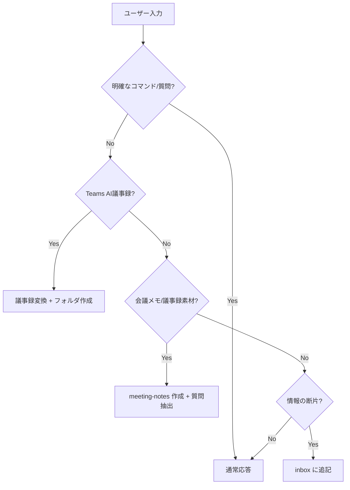

# Copilot Instructions

このワークスペースでの共通ルールです。

---

## 顧客情報

> ⚠️ セットアップ時に自動入力されます

| 項目           | 内容                |
| -------------- | ------------------- |
| **顧客名**     | {{CUSTOMER_NAME}}   |
| **契約/支援形態** | {{CONTRACT_TYPE}}   |
| **契約期間**   | {{CONTRACT_PERIOD}} |
| **主要連絡先** | {{KEY_CONTACTS}}    |

---

## セットアップ時の確認

初期セットアップでは、詳細を聞きすぎず、ルーティングと共有可否に効く情報だけを確認する。未確定なら `未確認` として `_customer/profile.md` に残す。

| 確認項目 | 用途 |
| --- | --- |
| ワークスペースの目的・範囲 | 顧客全体 / 特定PJ / 提案 / PoC / 継続支援などの切り分け |
| 共有境界 | 顧客共有可 / 内部のみ / 混在。議事録に出してよい情報を決める |
| 自社チーム名・表記ゆれ | 議事録の自社持ち帰り / お客様持ち帰り判定に使う |
| 主要連絡先と役割 | 意思決定者、技術窓口、事務局などのルーティングに使う |
| 定例 cadence / 次回予定 | `next-actions/to-YYYY-MM-DD/` の日付決定に使う |
| 主な情報源 | 会議、チャット、メール、共有ファイル、受領資料、ポータルなど |

---

## 入力自動判定ルール

ユーザーの入力が明確なコマンドや質問でない場合、以下の順で判定し自動処理します。

### 判定フロー



### 判定基準

| パターン                                        | 判定           | 処理                      |
| ----------------------------------------------- | -------------- | ------------------------- |
| 「AI によって生成されます」で始まる             | Teams AI議事録 | `convert-meeting-minutes` |
| 「会議のメモ:」「フォローアップ タスク:」を含む | Teams AI議事録 | `convert-meeting-minutes` |
| 「今日のミーティングのメモ」「議題」「課題」「宿題」「次回打ち合わせ」など会議メモの見出しが複数ある | 会議メモ | `meeting-notes` 作成 + `extract-questions` |
| 名前 + 日時 + 短文（Teamsチャット風）           | インボックス   | `inbox` に追記            |
| `From:` `Date:` を含む（メール風）              | インボックス   | `inbox` に追記            |
| `[#channel]` を含む（Slack風）                  | インボックス   | `inbox` に追記            |
| 箇条書きのみ（`-` で始まる行が主）              | インボックス   | `inbox` に追記            |
| 文脈なしの短文メモ                              | インボックス   | `inbox` に追記            |
| 質問形式（「?」「教えて」「どうすれば」等）     | 質問           | 通常応答                  |
| 「質問を抽出」「質問事項を」「宿題を抜き出し」  | 質問抽出       | `extract-questions`       |
| 「ナレッジ化」「汎用知見」「学びを残す」「再利用できる知見」 | 知見抽出 | `_knowledge/` に opt-in で追記 |

### インボックス追記時の動作

1. `_inbox/{現在の年月}.md` を確認（なければ作成）
2. 日時・送信元・タグを自動付与
3. ファイル末尾に追記
4. **確認メッセージ**: 「📥 インボックスに追記しました: {タグ}」

### 議事録検出時の動作

1. 日付を抽出（入力から or 今日の日付）
2. 日付フォルダを作成（なければ）
   - `{日付}/`
   - `{日付}/{日付}_議事録.md`
   - `{日付}/{日付}_内部メモ.md`
3. Teams AI議事録をテンプレート形式に変換
4. **確認メッセージ**: 「📝 議事録を作成しました: {日付}」

### 会議メモ検出時の動作

1. 日付を抽出（入力から or 今日の日付）
2. `meeting-notes/` 形式の議事メモを作成または更新する
3. 同じ入力から宿題・確認事項・アクションを抽出し、`_questions/{YYYY-MM}.md` に追記する
4. inbox 追記は補助記録として必要な場合だけ行い、meeting-notes / questions の代替にしない
5. **確認メッセージ**: 「📝 会議メモと質問事項を反映しました: {日付}」

### 顧客プロファイル更新の提案

以下を検出したら `_customer/profile.md` への追記を提案:

- 契約情報（期間、金額、形態の変更）
- 組織情報（担当者異動、新規連絡先）
- 技術スタック（新規導入、廃止）

### 確認が必要なケース

以下の場合はユーザーに確認:

- 長文で判定が曖昧
- 複数パターンに該当
- ファイルパスや日付の指定がある

---

## 関連プロンプト

- `inbox.prompt.md` - インボックス追記の詳細ルール
- `convert-meeting-minutes.prompt.md` - 議事録変換
- `extract-questions.prompt.md` - 質問事項抽出

---

## 成果物の置き場

- レポート、調査メモ、比較メモ、デモ仕様メモなどの Markdown 成果物は、ルート直下に置かず `research-reports/` に保存する。
- 会議や調査から抽出した短い汎用知見、判断基準、Gotcha、再利用パターンは、明示依頼があるときだけ `_knowledge/` に保存する。長文分析は `research-reports/` に残し、`_knowledge/` には要点だけを書く。

---

## ナレッジ台帳（_knowledge）

- `_knowledge/` は、会議・インシデント・調査から出た再利用可能な知見を蓄積する場所。
- 既定は `_knowledge/general.md` に追記し、件数が増えてからカテゴリ別ファイルへ分ける。
- `_inbox/` は生ログ、`_questions/` は未回答・宿題、`research-reports/` は長文成果物、`_knowledge/` は短い汎用知見として使い分ける。
- 顧客名、人物名、チケットID、ローカル絶対パス、未公開情報、社内限定スコアは入れない。必要なら抽象化する。
- Microsoft 製品仕様、価格、課金、サポート境界、ロードマップは、公式URLで確認済みでなければ `official confirmation: required` と書く。
- 議事録作成のたびに自動追記しない。「ナレッジ化して」「汎用知見を抜き出して」など明示依頼があるとき、または棚卸し時だけ追記する。

---

## 受領資料取り込み

- ユーザーが「ルートに資料を置いた」と言ったら、まずルート直下の全ファイルを確認し、PDF だけでなく PowerPoint / Excel / Word / 画像 / 図面も受領候補として見る。
- 受領原本は日付付きの安定名にリネームし、分類後は `_received/overall-architecture/` または該当 `mtg-YYYY-MM-DD-name/` へ移す。未分類だけ `_received/incoming/` に残す。
- 会議中にスクリーンショットや画像が貼られた場合は、会議記録の添付として保存する。顧客・相手から受領した原本は `_received/mtg-YYYY-MM-DD-name/images/`、内部調査用スクショは `_working/mtg-YYYY-MM-DD-name/screenshots/`、顧客共有用に加工した画像は `_provided/mtg-YYYY-MM-DD-name/` に置く。
- 会議に紐づかない単発画像は、まず `_received/incoming/` または `_working/misc/YYYY-MM-DD-topic/` に置き、後で分類する。
- 画像ファイル名は `YYYY-MM-DD_topic_kind-NN.ext` を基本にする。例: `2026-07-02_sr-review_screenshot-01.png`。
- 会議素材フォルダには、必要に応じて `attachments.md` を置き、file / source / sensitivity / description / related note を記録する。
- 拡張子と実体を確認する。`.pptx` が OLE/旧 Office 実体なら `.ppt` として整理し、内容確認は COM も使う。
- PDF は全ページ、PowerPoint は全スライドを確認してから要点メモへ反映する。途中ページや冒頭だけで完了扱いにしない。
- ルート直下の受領候補確認には、必要に応じて customer-workspace skill の `scripts/Test-ReceivedMaterialPlacement.ps1` を使う。このスクリプトは read-only の監査だけを行う。

---

## 次回までの宿題ワークスペース運用ルール

ミーティング後に発生した作業は `next-actions/` 配下に切り出し、ミーティングノート自体は決定事項と宿題の発生記録までで止める。

### フォルダ構成

```
next-actions/
  to-YYYY-MM-DD/                ← 次回 MTG までの作業（日付は次回日）
    README.md                    ← 進捗ボード（一覧と状態のみ）
    homework/                    ← 顧客と合意した宿題（議事録由来）
    proposals/                   ← こちらから持っていく追加提案準備
    research/                    ← 調査・検証（補足扱い）
  ongoing/                       ← 期日に縛られない継続案件
```

### 追跡リンクのルール

- ミーティングノート側の「決定事項」「宿題」テーブルは、共有しやすいように「内容・担当・期限・状態」などの相手に見せてよい情報だけで書く。
- `next-actions/to-YYYY-MM-DD/.../xxx.md` のようなローカル作業先パスは、ミーティングノートの共有用テーブルに入れない。
- 作業ファイル側の冒頭メタには `出どころ: meeting-notes/YYYY-MM-DD_xxx.md の宿題` または `自主提案` を必ず書く。
- 作業先リンクは `next-actions/to-YYYY-MM-DD/README.md` と各タスクファイルで管理する。

### 出どころのタイプ分け

| タイプ   | 出どころの書き方                                                          |
| -------- | ------------------------------------------------------------------------- |
| homework | `出どころ: meeting-notes/YYYY-MM-DD_xxx.md の宿題`                        |
| proposal | `出どころ: 自主提案（YYYY-MM-DD 着想）` または `元ネタ demo-plans/xxx.md` |
| research | `出どころ: meeting-notes/YYYY-MM-DD_xxx.md の補足検証` または `自主検証`  |

### 進捗管理

- 各タスクの状態は `not-started` / `in-progress` / `blocked` / `done` / `dropped`。
- 状態と担当は `next-actions/to-YYYY-MM-DD/README.md` に一覧化する。
- 詳細メモ・成果物・判断理由は各タスクファイルに書く。

### ミーティングノートを汚さないために

- 議事録に詳細手順・調査メモ・成果物本文を書かない。すべて作業ファイル側に置き、リンクで参照する。
- 議事録の宿題テーブルには「内容・担当・期限・状態」など、共有先にも通じる最小情報だけを書く。
- ローカル作業先パスや内部進捗リンクは `next-actions/` 側に置き、議事録本文には混ぜない。
- 人名、時刻、製品名、モデル名、価格、サポート境界など不確かな情報は、断定せず `要確認` として残す。
- 会議ログから作った議事録は、同じターンで `_questions/{YYYY-MM}.md` に未回答事項・宿題も抽出する。

### 事後フォロー（Teams / メール送付）の記録

MTG 直後〜次回 MTG 前に、Teams やメールで顧客へ送る補足連絡（追加情報、参考記事、宿題再確認、提案の先出しなど）は、口頭やり取りとは別に必ず記録する。記録しないと、次回 MTG で重複説明したり、外形上 `not-started` のままのタスクが実は外部送付済みだった、という乖離が起きる。

- 議事録ファイルの末尾に `## 事後フォロー（Teams 送付）` 節を作り、各送付ごとに「日付 / 宛先 / チャネル / メッセージリンク / 要点 / 連動タスク名」を書く。ローカルの相対パスは必要なら `next-actions/` 側に書く。
- その送付が既存の next-actions タスクに直結する場合は、同じターンで以下も更新する。
  1. 該当タスクファイルの「作業メモ」に日付見出しで送付内容と Teams リンクを追記。
  2. タスクの状態を `not-started` → `in-progress` に上げる（実態に合わせる）。
  3. `next-actions/to-YYYY-MM-DD/README.md` の状態列を同期し、必要なら「Teams で第一報送付済み」など短い注記を内容列に添える。
- 送付内容がどのタスクにも紐付かない純粋な共有なら、議事録の事後フォロー節だけで止めてよい。新規 next-actions タスクを安易に増やさない。
