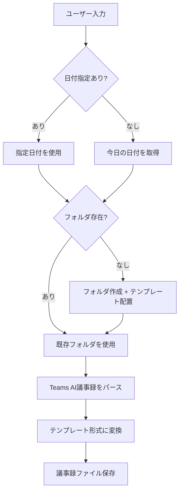

# 議事録変換ルール

> このファイルは議事録変換の詳細ルールを記載しています。

## 処理フロー



## 検出パターン

以下を検出したらTeams AI議事録と判定:

- 「AI によって生成されます」で始まる
- 「会議のメモ:」を含む
- 「フォローアップ タスク:」を含む

以下を検出したら自由形式の会議メモと判定:

- 「今日のミーティングのメモ」「今日のやつです」など会議メモ開始を示す文
- 「議題」「課題」「宿題」「決定事項」「次回打ち合わせ」などの見出しが複数ある
- 会議本文と次回予定が同居している

## 変換ルール

| Teams AI形式               | テンプレート                 |
| -------------------------- | ---------------------------- |
| 会議のメモ: [トピック]     | 📝 議事内容 → トピックN      |
| トピック詳細（インデント） | ディスカッション             |
| フォローアップ タスク      | 🚀 今回の持ち帰り事項（NEW） |
| 担当者が自社名             | 自社 持ち帰り                |
| 担当者がお客様名           | お客様 持ち帰り              |

「自社 / お客様」の振り分けは、`_customer/profile.md` の **「自社チーム」 セクション** を SSOT として参照する。表にない名前が出てきたら推測せずユーザーに確認し、確定後に profile へ追記してから議事録を仕上げる。フル名だけでなく姓のみ・ニックネーム（やまぱん など）も取りこぼさない。

自由形式の会議メモは以下で整形:

| 自由形式メモ                       | 出力先                                   |
| ---------------------------------- | ---------------------------------------- |
| 会議の背景や一言メモ               | meeting-notes の冒頭メモ                 |
| 「議題」「課題」配下の本文         | 議題ごとの箇条書き                       |
| 「宿題」「持ち帰り」「次回までに」 | 宿題テーブルと `_questions/{YYYY-MM}.md` |
| 「次回打ち合わせ」                 | 次回予定                                 |

自由形式の会議メモを扱うときは、議事メモ作成だけで止めず、同じ入力から質問・宿題・確認事項を抽出して questions にも反映する。

## ファイル確認と連携判定

1. 現在開いているファイルを確認（`editorContext`）
2. ファイル名から日付を抽出（例: `20260204_議事録.md` → `20260204`）
3. 入力データの日付と比較:
   - **一致**: 通常の変換処理
   - **不一致（入力が過去）**: 前回持ち帰りを次回に反映と判断
     - ユーザーに確認してから処理

## フォルダ作成

日付フォルダがなければ作成:

```
{日付}/
├── {日付}_議事録.md       ← _templates/meeting-minutes.md
└── {日付}_内部メモ.md     ← _templates/internal-memo.md
```
