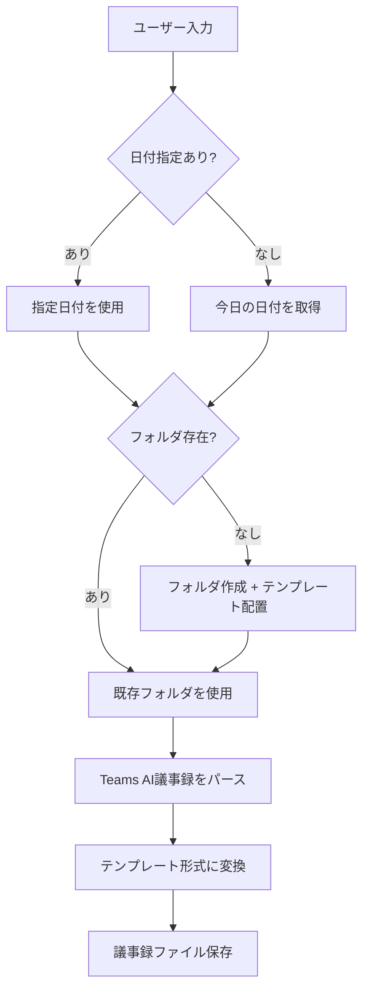

# 議事録変換ルール

> このファイルは議事録変換の詳細ルールを記載しています。

## 処理フロー



## 検出パターン

以下を検出したらTeams AI議事録と判定:

- 「AI によって生成されます」で始まる
- 「会議のメモ:」を含む
- 「フォローアップ タスク:」を含む

以下を検出したら自由形式の会議メモと判定:

- 「今日のミーティングのメモ」「今日のやつです」など会議メモ開始を示す文
- 「議題」「課題」「宿題」「決定事項」「次回打ち合わせ」などの見出しが複数ある
- 会議本文と次回予定が同居している

## 変換ルール

| Teams AI形式               | テンプレート                 |
| -------------------------- | ---------------------------- |
| 会議のメモ: [トピック]     | 📝 議事内容 → トピックN      |
| トピック詳細（インデント） | ディスカッション             |
| フォローアップ タスク      | 🚀 今回の持ち帰り事項（NEW） |
| 担当者が自社名             | 自社 持ち帰り                |
| 担当者がお客様名           | お客様 持ち帰り              |

「自社 / お客様」の振り分けは、`_customer/profile.md` の **「自社チーム」 セクション** を SSOT として参照する。表にない名前が出てきたら推測せずユーザーに確認し、確定後に profile へ追記してから議事録を仕上げる。フル名だけでなく姓のみ・ニックネーム（やまぱん など）も取りこぼさない。

自由形式の会議メモは以下で整形:

| 自由形式メモ                       | 出力先                                   |
| ---------------------------------- | ---------------------------------------- |
| 会議の背景や一言メモ               | meeting-notes の冒頭メモ                 |
| 「議題」「課題」配下の本文         | 議題ごとの箇条書き                       |
| 「宿題」「持ち帰り」「次回までに」 | 宿題テーブルと `_questions/{YYYY-MM}.md` |
| 「次回打ち合わせ」                 | 次回予定                                 |

自由形式の会議メモを扱うときは、議事メモ作成だけで止めず、同じ入力から質問・宿題・確認事項を抽出して questions にも反映する。

## 共有しやすい議事録

- 「決定事項」「持ち帰り事項」の表は、他者へそのまま貼れるように、内容・担当・期限・状態など共有してよい項目だけで構成する。
- `next-actions/...` のようなローカル作業先パスは議事録本文に入れず、`next-actions/to-YYYY-MM-DD/README.md` や各タスクファイルで管理する。
- 作業ファイル側には `出どころ:` として元の meeting note を書き、議事録本文をローカルリンクで汚さずに追跡性を保つ。

## 品質ゲート

- 人名、時刻、製品名、モデル名、価格、サポート境界などが文字起こし由来で怪しい場合は、本文で断定せず `要確認` に残す。
- 顧客共有し得る議事録には、内部ファイルパス、ローカル作業リンク、内部だけの推測を混ぜない。
- 未回答事項、宿題、次回確認事項は `_questions/{YYYY-MM}.md` にも抽出する。
- 会議後の作業が発生する場合だけ `next-actions/` に切り出し、議事録本文は決定事項と持ち帰りの発生記録までで止める。

## 汎用知見の抽出（opt-in）

- 会議ログから得た再利用可能な判断基準、Gotcha、設計パターン、検証観点は、ユーザーが明示したときだけ `_knowledge/` に抽出する。
- `_knowledge/` には短い一般化済みの知見だけを書く。長文分析や詳細レポートは `research-reports/` に置き、必要なら `_knowledge/` からリンクする。
- 顧客名、人物名、チケットID、ローカルパス、未公開情報、内部限定スコアは入れない。抽象化できない内容は `_knowledge/` に入れない。
- Microsoft 製品仕様、価格、課金、サポート境界、ロードマップは、公式URLで確認済みでなければ `official confirmation: required` と明記する。

## 会議中の画像・スクリーンショット

- 会議中に画像やスクリーンショットが貼られたら、チャット内だけで終わらせず会議素材として保存する。
- 顧客・相手から受領した原本は `_received/mtg-YYYY-MM-DD-name/images/`、内部調査用スクショは `_working/mtg-YYYY-MM-DD-name/screenshots/`、顧客共有用に加工した画像は `_provided/mtg-YYYY-MM-DD-name/` に置く。
- ファイル名は `YYYY-MM-DD_topic_kind-NN.ext` を基本にする。例: `2026-07-02_sr-review_screenshot-01.png`。
- 必要に応じて同じ素材フォルダに `attachments.md` を置き、出どころ、感度、説明、関連する議事録やレポートを記録する。

## ファイル確認と連携判定

1. 現在開いているファイルを確認（`editorContext`）
2. ファイル名から日付を抽出（例: `20260204_議事録.md` → `20260204`）
3. 入力データの日付と比較:
   - **一致**: 通常の変換処理
   - **不一致（入力が過去）**: 前回持ち帰りを次回に反映と判断
     - ユーザーに確認してから処理

## フォルダ作成

日付フォルダがなければ作成:

```
{日付}/
├── {日付}_議事録.md       ← _templates/meeting-minutes.md
└── {日付}_内部メモ.md     ← _templates/internal-memo.md
```
