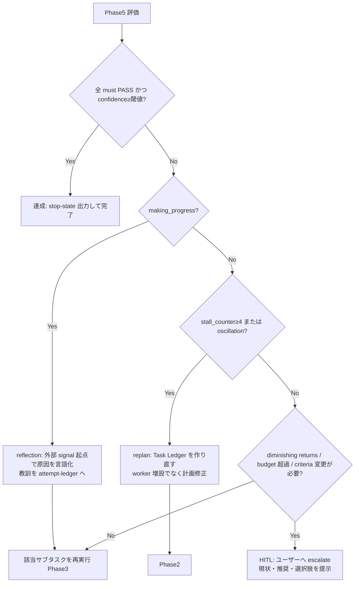

# Goal Loop

合意した success criteria を満たすまで、orchestrator + evaluator のループでゴールをやり遂げる手順書。

このスキルを起動した **あなた（現在の agent）が orchestrator** になる。自分で実装を書くより、
worker subagent に委譲し、外部検証で裏を取り、criteria と突合してループを回すことに集中する。

## Core Stance

- **criteria を最初に合意してから動く**。合意前に実行へ進まない（Phase 1 が gate）。
- **評価は自己申告でなく外部 signal で**。test / lint / build / grep / schema の exit code を判定の起点にする。
  自己評価だけの reflection は精度を下げうる（外部 signal が無いと改善しない）。
- **ループは必ず止まる設計**。max iteration だけに頼らず多層 stop（Phase 6）を使う。
- **大きな変更は小さく試してから**（Small-Bet-First）。pilot → 検証 PASS → 本適用へ拡大。
- **目的を接地してから回す**。outcome / audience / destination / baseline / constraints / primary verifier を確認し、
  不足が finish line を変えるときだけ質問する。
- **調査は verifier が支えられた時点で止める**。事実・ユーザー要件・推測を分け、goal design を無限調査にしない。
- **トップゴールは固定、サブゴールは証跡付きで変える**。original brief / criteria / quality gate は守り、
  現実の発見に合わせてサブゴールだけ steering で組み替える。
- **委譲は明示的に**。"委譲する" と言って自分でやらない。MUST `runSubagent` で worker を起動する。
- **worker は goal state を所有しない**。worker は evidence を返すだけ。checkpoint / complete / blocked 判定は
  orchestrator だけが行う。
- **粘り強くやり遂げる**。失敗しても reflection → 別 approach → replan で進む。止まるのは「達成」か
  「本物のブロッカー」か「Autonomy Mode で認められていない操作」のときだけ。

## Autonomy Modes（自律度）

Phase 1 で必ずモードを確認する。**起動時にユーザーが明示（AUTO / フル / ALL / 超自律 等）していなければ、
実行に進む前に聞く**。

| 操作                                                                      | Normal（既定）             | 超自律（AUTO / FULL / ALL）                |
| ------------------------------------------------------------------------- | -------------------------- | ------------------------------------------ |
| backup を取れる破壊的操作 （DB drop/migrate、一括削除・リネーム 等）  | **backup→自律実行**        | **backup→自律実行**                        |
| backup を取れない不可逆操作 （本番 deploy、force push、課金/送信 等） | HITL                       | **実行可**（rollback 不能を明記しログ）    |
| criteria の緩和・再定義 （AC が技術的に矛盾 等）                      | HITL（再合意）             | **自分で緩和/再定義し、記録+通知して継続** |
| `verify:` 検証手段の修正 （コマンドが壊れている/対象改名）            | **常に自由（止まらない）** | **常に自由（止まらない）**                 |

共通ルール（どちらのモードでも）:

- **Backup-first**: 破壊的操作の前に可能な限り backup を取る（git branch/stash/commit、ファイル copy、
  DB dump/snapshot、export）。**backup の場所と戻し方を ledger に記録**する。backup を取れた操作は
  Normal でも自律実行してよい（「戻せる」から）。
- **verify 手段の修正は criteria 変更ではない**。検証コマンド自体が壊れているなら止まらず直す。
  ただし「何を満たせば達成か」の意味は変えない（検証を甘くして通すのは must NOT）。
- 超自律でも **must NOT（抜け道封鎖）と達成の偽装禁止は維持**。criteria は緩めても、満たしたと偽るのは禁止。
- 超自律でも **秘密情報の露出・個人情報の公開・未許可の外部公開は対象外**（別途明示許可が要る）。
  これらに当たったら **その操作だけ保留してよい**（ゴール全体を止めず、他の達成可能な部分は進める）。
  保留した項目は ledger に記録し、**Phase 7 で Next Action / ハンドオフとしてレポート**する。

## Effort Scaling（過剰起動を防ぐ）

ゴールの大きさに応じて重さを変える。小さいゴールに full ループを被せない（primitive first）。

| ゴールの規模               | orchestrator               | worker                         | evaluator          | ledger             | Small-Bet      |
| -------------------------- | -------------------------- | ------------------------------ | ------------------ | ------------------ | -------------- |
| 些末（1 ファイル・自明）   | このスキルを使わず直接実行 | —                              | —                  | —                  | —              |
| 小（数ステップ・低リスク） | 軽量                       | 1–2 直列                       | 外部検証 1 回      | 暗黙でよい         | 任意           |
| 中（複数成果物・依存あり） | 通常                       | 並列 read-only + 直列 mutation | rubric 評価        | 明示               | 大変更時は必須 |
| 大（不可逆・広範囲・多段） | 厳格                       | 多段 + replan                  | rubric + reference | 明示・毎ループ更新 | 必須           |

長期・多段・context compaction で再開が必要なゴールだけ **Durable Ledger Mode** を使う。会話内 ledger で足りる
小さいゴールではファイルを作らない。詳細は [./references/ledger-templates.md](./references/ledger-templates.md)。

## Two Ledgers（中核データ構造）

このスキルは stateless なので、orchestrator が **毎ループ markdown で ledger を更新**して状態を持つ。
雛形は [./references/ledger-templates.md](./references/ledger-templates.md)。

- **Task Ledger**: 合意 criteria（各に検証コマンド）/ 確定した事実 / 未確定の推測 / 現計画 / 各サブタスク状態。
- **Progress Ledger**: iteration 毎に `goal_satisfied?` / `making_progress?` / `looping?` と `stall_counter`、
  そして attempt 教訓 table（何を試して何が失敗したか）。同じ失敗の再試行を防ぐ。
- **Status / Event Ledger**（必要時）: サブゴール状態、steering の採否、review blocker、final gate の証跡。

orchestrator は full transcript を抱えず、この ledger を SSOT にする。worker へは **delta だけ**渡す。

---

## Phase 1 — Criteria 合意 + Freeze（gate・必須有人）

実行に進む前に、ユーザーと次を合意して固定する。テンプレは
[./references/criteria-agreement.md](./references/criteria-agreement.md)。

合意項目:

1. **Goal**: 1 文で達成状態を書く。deploy / 配布 / 公開が絡むときは「ビルド・デプロイ完了」で書かず、
   **エンドユーザーが触れる状態**（URL が応答する / アプリが起動して使える / 配布物が入手・起動できる）で書く。
2. **Grounding**: audience / destination / baseline（現状態・失敗・開始指標）/ constraints / evidence gaps を明記する。
3. **受入基準（Acceptance Criteria）**: 各基準に **`verify:` 検証方法（コマンド / 観測手順）** を必ず添える。
   検証できない基準は、検証可能な形に書き直す。
4. **Primary Verifier / Supporting Checks**: 成功と失敗を最も強く分ける primary verifier と補助チェックを分ける。
   deploy / runtime goal では build / test / `provisioningState=Succeeded` を primary にせず、ライブの end-to-end signal
   （実リクエストの成功 / healthy replica）を primary verifier に置く。
5. **非ゴール（Out of Scope）**: やらないことを明記する。
6. **must NOT（抜け道の封鎖）**: criteria を形式上満たす不正な近道を禁止する
   （例: test を消す / 出力を切り詰める / TODO で埋める / ハードコードで通す）。
7. **制約**: 触ってよい範囲、使ってよい tool、破壊的操作の可否。
8. **Architecture / Domain Invariants**: 壊してはいけない境界・仕様・用語・データ契約があれば明記する。
9. **Autonomy Mode**: Normal か 超自律（AUTO / FULL / ALL）か。**起動時に明示されていなければここで聞く**。
10. **Stop 条件**: max iteration、コスト/時間の上限、confidence 閾値。

合意後、criteria を **freeze** する。ループ中に criteria を自分で緩めてはいけない。
変更が要るときは Phase 6 の HITL（ユーザー再合意）へ。

Phase 1 では、名前付きファイル・repo・既存成果物・再現手順・関連 instructions を必要最小限だけ確認する。
finish line と verifier が支えられたら調査を止める。missing answer が finish line / consequential approval /
互換しないゴール選択を変える場合だけユーザーに聞き、それ以外は前提として記録して進める。

合意できたら Task Ledger を初期化する。

---

## Phase 2 — 計画（薄い事前計画 → 検証可能な最小サブゴール列）

- まず粗い全体計画を立て（Plan-and-Solve）、それを **検証可能な最小サブゴールの列**へ分解する
  （least-to-most。各サブゴールが Phase 1 の `verify:` の一部を満たす形にする）。
- 事前に細かく決めすぎない。サブタスク実行で前提が崩れたら Phase 6 で replan する。
- 各サブタスクに「入力 / 期待出力スキーマ / 境界 / 使う tool / 依存・並列可否」を定義し Task Ledger に書く。
- サブゴール状態は原則 `pending` / `in_progress` / `complete` / `failed` / `blocked` / `review_blocked` /
  `superseded` で表す。`complete` は外部 evidence 付きでのみ付ける。
- 独立した **read-only 調査**だけ並列にする。**mutation（書き込み）は直列**にして衝突を避ける。

---

## Phase 3 — Small-Bet-First gate → 委譲（workers）

### Small-Bet-First gate

サブタスクが **大きい変更**（多数ファイル / 不可逆 / 一括置換 / 新規依存 / スキーマ変更 等）を含むなら、
いきなり全体に適用しない。次の順で進める:

1. **pilot**: 最小スコープ（1 ファイル / 1 ケース / dry-run）でだけ変更を試す。
2. **外部検証**: その pilot に `verify:` を実行し exit code を取る。
3. **判定**: PASS → 同じパターンを残りへ展開（必要なら並列）。 FAIL → 本適用せず reflection→approach 変更。

小さいゴールや低リスク変更では pilot を省略してよい（Effort Scaling 参照）。

### 委譲

worker は **MUST `runSubagent`** で起動する。read-only 調査は `Explore` 等を並列で使ってよい。
worker prompt には **delta のみ**を渡す:

- 達成すべきサブゴールと、対応する受入基準の該当項目
- 期待する出力フォーマット / スキーマ
- 触ってよい境界、使う tool、禁止事項（must NOT）
- **過去 attempt の教訓**（Progress Ledger から関連分だけ。同じ失敗を繰り返させない）
- 期待する成果物と検証点

worker の戻りは Task Ledger のサブタスク状態に反映する。
worker の evidence だけで `complete` にしない。Phase 4 の外部検証または Phase 5 の rubric 評価で裏を取る。

---

## Phase 4 — 外部検証（決定論チェックを最上位に）

成果物に対し、Phase 1 で決めた `verify:` を実行する（test / lint / build / grep / schema 等）。
**exit code と実出力を取得**し、これを評価の一次情報にする。

- **Primary verifier** は、ユーザーの実際の成功面に最も近い検証にする。失敗と成功を分け、次の修正を選べる
  evidence を返す必要がある。
- build / unit test / static analysis / mock は supporting checks。成果が UI、browser、app、認証、OS 連携、
  クリップボード、通知、インストール、再起動、複数アプリ workflow に依存するなら、実サーフェスを primary にする。
- **control-plane / build の成功 ≠ runtime の成功**。deploy では `provisioningState=Succeeded` / `update Succeeded` /
  build・test pass を完了の根拠にしない（設定受理やビルド成功と、実プロセスが起動して応答することは別）。
  最後に必ずライブ surface（実リクエストの成功 / healthy replica）で確認してから `complete` にする。
- 実サーフェス検証が必要なのに tool / account / device / credential / environment が無い場合は、弱い検証へ黙って
  置き換えない。capability gap と手動検証手順・必要 evidence を Deferred / Next Actions に記録する。
  そのブロッカーが解除されたら（例: ユーザーが login / MFA / 承認を完了）、弱い検証で完了扱いにせず、
  **保留した primary verifier に復帰して実行**してから完了する。
- flaky / stateful な検証は、clean-state 再現や連続成功回数を risk に応じて決める。
- 自動検証できるものは必ずコマンドで検証する。推測で PASS としない。
- 検証コマンドが無い基準だけ、Phase 5 の LLM 評価で補う。

---

## Phase 5 — 評価（evaluator）

外部検証の出力を入力に、**rubric で criteria と項目単位に突合**する。手順とバイアス対策は
[./references/evaluation-rubric.md](./references/evaluation-rubric.md)。

評価の作法（judge bias を抑える）:

- **生成と評価のロールを分ける**。可能なら evaluator を別 subagent（別 system prompt）として起動する。
- **rubric + reference** で採点する（各基準の「満たす条件」と「反例」を明記）。
- pairwise 比較を使うときは **順序を randomize** する（position bias 対策）。
  長い出力を優遇しない（verbosity bias）。自作を甘く見ない（self-enhancement bias）。
- 判定は基準ごとに **PASS / FAIL + 根拠（どの検証結果に基づくか）+ gap** を出す。
- **PASS = すべての must 基準が PASS かつ confidence ≥ 閾値**。曖昧・同点は PASS にせず Phase 6 の HITL。
- 大きなコード変更・設計変更では、Phase 1 の invariants を実装 evidence / test evidence / review evidence で
  突合する。詳細は [./references/steering-and-final-gates.md](./references/steering-and-final-gates.md)。

---

## Phase 6 — Progress Ledger 更新 + ループ判定（多層 stop）

Progress Ledger を更新し、次の分岐に従う。詳細は
[./references/loop-control.md](./references/loop-control.md)。

多層 stop（どれか 1 つでも該当したら無限ループを止める）:

- **収束**: 全 must PASS かつ confidence ≥ 閾値 → 完了。
- **stall**: `stall_counter ≥ 4`（4 ループ連続で進展なし）→ replan。
- **oscillation**: 同一の `(action, target)` の繰り返し検知 → replan か HITL。
- **diminishing returns**: 改善幅が ε 未満で連続 → HITL。
- **budget**: max iteration / コスト・時間上限 超過 → HITL。

**HITL トリガー**（criteria 合意後に止まるのはこれだけ。**Autonomy Mode で変わる**）:

1. **破壊的操作が必要**になったとき — ただし backup を取れるなら止まらず backup→実行。
   backup 不能の不可逆操作は Normal＝HITL / 超自律＝実行可（rollback 不能を明記）。
2. **criteria の変更が必要** — Normal＝HITL（再合意）/ 超自律＝自分で緩和・再定義し記録+通知して継続。
   （`verify:` 検証手段の修正は criteria 変更ではなく、どちらのモードでも止まらず自由に直す。）
3. **本物のブロッカー**に当たったとき。stall / 低 confidence だけでは上げず、loop-control.md の
   **Blocker Test（4 問すべて Yes）**で「自分が制御できない外的・構造的な障害」と判定できた場合のみ。
   （超自律でも、外的ブロッカーは自力で解けないので HITL。）

reflection は **必ず外部 signal（失敗した検証出力）を起点**にする。自己評価だけの反省で再試行しない。
同じ approach を 2 回繰り返さない（attempt 教訓 table で確認）。

replan でサブゴールを変えるときは **Dynamic Steering** として記録する。許可する変更は
`add_subgoal` / `split_subgoal` / `reorder_pending` / `revise_pending_wording` / `annotate_ledger` /
`mark_blocked_superseded` のみ。criteria / original brief / quality gate を弱める変更は steering で扱わない。
詳細は [./references/steering-and-final-gates.md](./references/steering-and-final-gates.md)。

---

## Phase 7 — 完了報告

- 各受入基準について **`verify:` の結果（証跡）** を示し、満たしたことを裏付ける。
- primary verifier と supporting checks の結果を分けて示す。実サーフェス検証を保留した場合は、弱い検証で完了扱いにせず
  capability gap と手動確認の next action を示す。
- 大きなコード変更・設計変更では、最終報告前に final quality gate を通す: targeted verify → cleanup → re-verify →
  invariant audit → independent review。非 clean なら `review_blocked` とし、blocker 解消サブゴールを追加して続行する。
- 生成物 / 変更点、残リスク、未対応の非ゴールを簡潔に。
- **Deferred / Next Actions（ハンドオフ）**: 自律で進めず保留した項目（安全弁に当たった
  秘密露出・個人情報公開・外部公開、Normal で HITL した backup 不能の不可逆操作・criteria 変更 等）を
  一覧化し、それぞれ **なぜ保留したか / 実行に要るもの / 推奨アクション** を明示してユーザーに渡す。
- 取った backup の場所と戻し方、緩和した criteria があればその内容と理由を示す。
- 一時ファイル（pilot 用 / scratch / 中間 ledger ファイル等）を cleanup する。
- 途中停止（HITL / budget）なら、再開に必要な state（Task/Progress Ledger）と次アクションを明示する。

---

## Anti-Patterns（やってはいけない）

- criteria 未合意のまま実行を始める。
- 自己評価だけで PASS を出す（外部検証を飛ばす）。
- max iteration だけで stop を組む（stall / oscillation を見ない）。
- 大きな変更を pilot 無しで全体適用する。
- "委譲する" と書いて自分で全部やる。
- worker に checkpoint / complete / blocked 判定を任せる。
- ループ中に criteria をこっそり緩める（達成を偽装する）。超自律でも緩和は記録+通知し、黙って変えない。
- 実サーフェスが必要な成果を、mock / static check / unit test だけで完了扱いする。
- deploy / 配布 goal を、`Succeeded` 応答や build-pass だけで完了扱いする（ライブ surface 未確認のまま）。
- worker に full transcript を渡して context を膨らませる。
- サブゴールを hard-delete する。不要になったものは `superseded` として audit-visible に残す。

## References

- [./references/criteria-agreement.md](./references/criteria-agreement.md) — criteria 合意テンプレ
- [./references/evaluation-rubric.md](./references/evaluation-rubric.md) — 採点 rubric と judge bias 対策
- [./references/loop-control.md](./references/loop-control.md) — 多層 stop / replan / Small-Bet-First / reflection / escalation
- [./references/ledger-templates.md](./references/ledger-templates.md) — Task / Progress ledger と attempt 教訓 table
- [./references/steering-and-final-gates.md](./references/steering-and-final-gates.md) — dynamic steering / final gate / invariant audit

## Design Rationale（出典）

このスキルの設計根拠（SOTA 調査）。各メカニズムがどの知見に基づくかの出典。

- Anthropic, Building effective agents（orchestrator-workers / evaluator-optimizer / stop condition）: https://www.anthropic.com/research/building-effective-agents
- Reflexion（外部 signal 起点の self-reflection）: https://arxiv.org/abs/2303.11366
- Self-Refine（反復改善ループ）: https://arxiv.org/abs/2303.17651
- Large Language Models Cannot Self-Correct Reasoning Yet（自己評価だけの反省は劣化しうる）: https://arxiv.org/abs/2310.01798
- Judging LLM-as-a-Judge（position / verbosity / self-enhancement bias）: https://arxiv.org/abs/2306.05685
- Magentic-One / AutoGen（task + progress ledger、stall→replan）: https://www.microsoft.com/en-us/research/articles/magentic-one-a-generalist-multi-agent-system-for-solving-complex-tasks/
- Plan-and-Solve Prompting（薄い事前計画）: https://arxiv.org/abs/2305.04091
- Least-to-Most Prompting（検証可能な最小サブゴール分解）: https://arxiv.org/abs/2205.10625
- UltraGoal（durable goal wrapper / steering / final review gate の設計参考。Codex goal tool や生存系機能は取り込まない）: https://github.com/Yeachan-Heo/oh-my-codex/blob/main/docs/ultragoal.md
