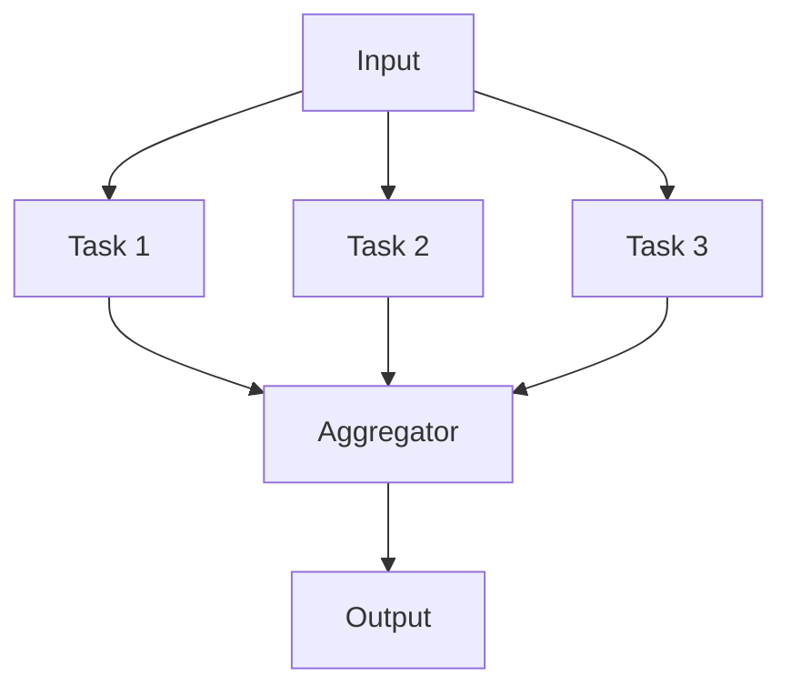

# Pattern 3: Parallelization

**Execute independent tasks simultaneously**

> Back to [overview.md](overview.md)

## Diagram



## Characteristics

| Aspect         | Description                                           |
| -------------- | ----------------------------------------------------- |
| **Structure**  | Split → parallel execution → aggregate                |
| **Benefits**   | Reduced processing time, robustness from independence |
| **Variations** | Sectioning (division), Voting (majority decision)     |

## When to Use

- Tasks are independent (no shared state)
- Parallel execution can reduce time
- Multiple perspectives/results are desired

## Implementation Example

```
Input: Document
├─ Agent 1: Grammar check
├─ Agent 2: Content accuracy check
└─ Agent 3: Style check
    ↓
Aggregator: Integrate all results
```
