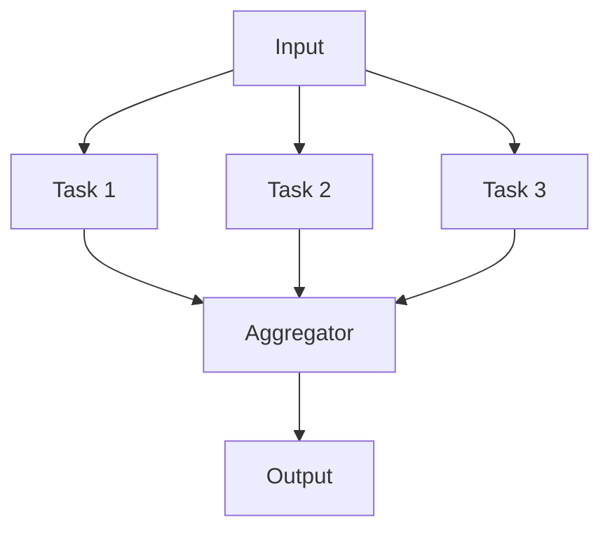

# Pattern 3: Parallelization

**Execute independent tasks simultaneously**

> Back to [overview.md](overview.md)

## Diagram



## Characteristics

| Aspect         | Description                                           |
| -------------- | ----------------------------------------------------- |
| **Structure**  | Split → parallel execution → aggregate                |
| **Benefits**   | Reduced processing time, robustness from independence |
| **Variations** | Sectioning (division), Voting (majority decision)     |

## When to Use

- Tasks are independent (no shared state)
- Parallel execution can reduce time
- Multiple perspectives/results are desired

## Implementation Example

```
Input: Document
├─ Agent 1: Grammar check
├─ Agent 2: Content accuracy check
└─ Agent 3: Style check
    ↓
Aggregator: Integrate all results
```

## VS Code Copilot: runSubagent Parallel Invocation

### Key Finding

`runSubagent` calls can be invoked **simultaneously** from an Orchestrator agent. The runtime executes them concurrently and returns all results before the Orchestrator proceeds.

### Safety Requirements

Before parallelizing, verify **all three conditions**:

| Condition              | Check                                         | Example                      |
| ---------------------- | --------------------------------------------- | ---------------------------- |
| **No file conflict**   | Each agent writes to different output files   | A→file1.json, B→file2.json   |
| **No COM conflict**    | At most one agent uses COM (e.g., PowerPoint) | Only Build agent opens .pptx |
| **No data dependency** | Agents don't read each other's outputs        | A doesn't need B's result    |

### Implementation Pattern

```yaml
# In Orchestrator agent definition:
# Call all three runSubagent simultaneously

runSubagent("Review",          prompt: "...", description: "Review: MCP verification")
runSubagent("Build PPTX",      prompt: "...", description: "Build: slide insertion")
runSubagent("Notes Generator", prompt: "...", description: "Notes: speaker notes generation")

# All three execute concurrently. Results return together.
# Orchestrator then verifies all succeeded before proceeding.
```

### Dependency Table Template

Use this table in the Orchestrator's Step definition to document parallelization safety:

```markdown
| Agent           | Input               | Output               | COM | Conflict |
| --------------- | ------------------- | -------------------- | --- | -------- |
| Review          | region_info.json    | region_reviewed.json | No  | None     |
| Build PPTX      | classification.json | output.pptx          | Yes | None     |
| Notes Generator | classification.json | notes.json           | No  | None     |
```

### Gate Pattern (Wait for All)

After parallel execution, use a Gate to verify all agents completed:

```
Gate: All parallel agents completed
  - [ ] Agent A output exists and is valid
  - [ ] Agent B output exists and is valid
  - [ ] Agent C output exists and is valid
  → PASS: proceed to next step
  → FAIL: identify which agent failed, retry only that one
```

### Performance Impact

Parallel execution reduces wall-clock time from `sum(A, B, C)` to `max(A, B, C)`, typically **30-40% faster** for 3 parallel agents.

### Anti-Patterns

| ❌ Anti-Pattern                                          | ✅ Correct Approach                  |
| -------------------------------------------------------- | ------------------------------------ |
| Two agents writing to same file                          | Separate output files per agent      |
| Two agents using COM simultaneously                      | Only one COM agent in parallel group |
| Agent B reads Agent A's output                           | Sequential execution, not parallel   |
| Parallel agents calling `run_in_terminal` simultaneously | Stagger or isolate terminal usage    |
