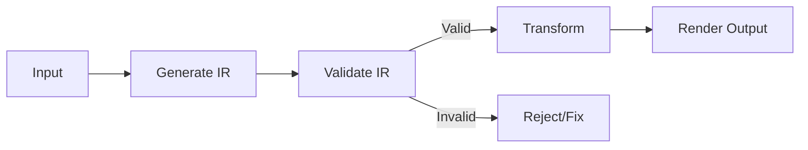

# IR Architecture (Intermediate Representation)

**Advanced pattern for transformation tasks with deterministic output**

> Back to [overview.md](overview.md)

## Overview

This advanced pattern is particularly effective for document generation, code transformation, and any task where deterministic output is critical.

## Two-Stage Architecture

```
Input → IR (Intermediate Representation) → Output
```



## Core Principles

| Principle                  | Description                                                       |
| -------------------------- | ----------------------------------------------------------------- |
| **Separation of Concerns** | Split responsibility: Generate, Validate, Transform, Render       |
| **Strict Validation**      | Validate IR structure strictly; do not auto-complete missing data |
| **Determinism**            | Same IR → Same output. No creativity in transformation phase      |

## Separation of Concerns

| Responsibility | Agent Role                             | Creativity Level      |
| -------------- | -------------------------------------- | --------------------- |
| **Generate**   | Create IR from input                   | High (interpretation) |
| **Validate**   | Verify IR completeness and correctness | None (rule-based)     |
| **Transform**  | Convert IR to output format            | None (mechanical)     |
| **Render**     | Format final output                    | Low (formatting only) |

## IR Specification Guidelines

1. **Define allowed structure** - JSON, YAML, or structured Markdown
2. **Strict schema** - All required fields must be present
3. **No inference** - Missing data = error, not auto-completion
4. **Version control** - IR schema should be versioned

## When to Use

- Document generation (specs → documentation)
- Code transformation (one language → another)
- Report generation (data → formatted report)
- Template-based output (variables → filled template)

## When NOT to Use

- Creative tasks (writing, brainstorming)
- Exploratory analysis
- Tasks requiring adaptive responses

## Implementation Example

**Document Generation Workflow:**

```
Step 1: Generate IR
  Input: User requirements
  Output: Structured document spec (JSON)

Step 2: Validate IR
  - All required sections present?
  - Data types correct?
  - References valid?
  → Reject if invalid

Step 3: Transform
  IR → Markdown/HTML/PDF
  (Deterministic, no creativity)

Step 4: Render
  Apply styling, formatting
  Output final document
```

## Example IR Schema

```json
{
  "document": {
    "title": "string (required)",
    "sections": [
      {
        "heading": "string (required)",
        "content": "string (required)",
        "subsections": ["array (optional)"]
      }
    ],
    "metadata": {
      "author": "string",
      "version": "string",
      "created": "ISO8601 date"
    }
  }
}
```

## Benefits

| Benefit             | Description                            |
| ------------------- | -------------------------------------- |
| **Reproducibility** | Same IR always produces same output    |
| **Debuggability**   | Can inspect IR to understand failures  |
| **Testability**     | Can unit test each stage independently |
| **Reusability**     | Same IR can render to multiple formats |
