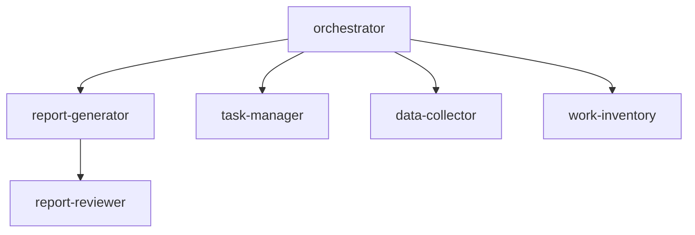

# Biz-Ops Agent List

## Agent Architecture



## Template Files

All templates are in `assets/` folder. Copy to workspace during setup.

### Agent Templates

| Template File                               | Deploy To                                  | Role                              |
| ------------------------------------------- | ------------------------------------------ | --------------------------------- |
| `agents/orchestrator.agent.template.md`     | `.github/agents/orchestrator.agent.md`     | Coordination, task routing        |
| `agents/report-generator.agent.template.md` | `.github/agents/report-generator.agent.md` | Daily/weekly/monthly reports      |
| `agents/report-reviewer.agent.template.md`  | `.github/agents/report-reviewer.agent.md`  | IMPACT framework review           |
| `agents/task-manager.agent.template.md`     | `.github/agents/task-manager.agent.md`     | Task CRUD, progress tracking      |
| `agents/data-collector.agent.template.md`   | `.github/agents/data-collector.agent.md`   | Data collection, customer routing |
| `agents/work-inventory.agent.template.md`   | `.github/agents/work-inventory.agent.md`   | Work analysis, manager PR         |
| `agents/1on1-assistant.agent.template.md`   | `.github/agents/1on1-assistant.agent.md`   | 1on1 prep, action item extraction |
| `agents/general-worker.agent.template.md`   | `.github/agents/general-worker.agent.md`   | Fallback for unclassified tasks   |

### Prompt Templates

| Template File                               | Deploy To                                  | Purpose               |
| ------------------------------------------- | ------------------------------------------ | --------------------- |
| `prompts/daily-report.prompt.template.md`   | `.github/prompts/daily-report.prompt.md`   | Daily report format   |
| `prompts/weekly-report.prompt.template.md`  | `.github/prompts/weekly-report.prompt.md`  | Weekly report format  |
| `prompts/monthly-report.prompt.template.md` | `.github/prompts/monthly-report.prompt.md` | Monthly report format |

### Configuration Templates

| Template File                          | Deploy To                         | Purpose                |
| -------------------------------------- | --------------------------------- | ---------------------- |
| `external-paths.template.md`           | `_datasources/external-paths.md`  | External folder config |
| `_datasources/workiq-spec.template.md` | `_datasources/workiq-spec.md`     | workIQ query reference |
| `copilot-instructions.template.md`     | `.github/copilot-instructions.md` | Workspace rules        |
| `AGENTS.template.md`                   | `AGENTS.md`                       | Workspace description  |
| `DASHBOARD.template.md`                | `DASHBOARD.md`                    | Daily hub              |

## Agent Details

| Agent                | Role                                                           |
| -------------------- | -------------------------------------------------------------- |
| **orchestrator**     | Coordination, task routing, pre-flight report check            |
| **report-generator** | Automated generation of daily/weekly/monthly reports           |
| **report-reviewer**  | Results-oriented review (IMPACT framework)                     |
| **task-manager**     | Task creation, updates, classification, progress management    |
| **data-collector**   | Data collection, normalization, customer/internal auto-routing |
| **work-inventory**   | Work inventory, analysis, manager PR material creation         |
| **1on1-assistant**   | 1on1 meeting prep, activity summary, action item extraction    |
| **general-worker**       | Fallback handler for unclassified tasks, pattern detection     |
| **availability-finder**  | Calendar analysis, free slot extraction, scheduling messages   |

## IMPACT Framework (Review Criteria)

| Aspect         | Description                                |
| -------------- | ------------------------------------------ |
| **I**nsight    | Does it provide meaningful interpretation? |
| **M**easurable | Are results expressed with metrics?        |
| **P**erception | Does value communicate to management?      |
| **A**ctionable | Does it lead to next actions?              |
| **C**redible   | Are evidence and rationale clear?          |
| **T**imebound  | Is temporal impact demonstrated?           |

## workIQ Data Sources (Optional)

> Note: workIQ is optional. System works without it using workspace data.

Data retrieved from workIQ for report generation and task updates:

| Data Source             | Priority | Purpose                  |
| ----------------------- | -------- | ------------------------ |
| 📅 Meetings & Calendar  | ⭐⭐⭐   | Attended meetings        |
| ✉️ Sent Emails          | ⭐⭐⭐   | Emails sent by you       |
| 📥 Received Emails (To) | ⭐⭐     | Emails addressed to you  |
| 💬 Teams Mentions       | ⭐⭐⭐   | Mentions directed to you |
| 💬 Teams Posts          | ⭐⭐     | Messages posted by you   |
| 📄 Edited Files         | ⭐⭐     | Word/Excel/PDF           |
| 📊 PowerPoint Updates   | ⭐⭐     | PPTX edit history        |
| 📝 OneNote              | ⭐       | Note updates             |
| 💬 Teams Meeting Notes  | ⭐⭐     | AI meeting minutes       |

## Automatic Routing Rules

| Input Pattern                                  | Destination      |
| ---------------------------------------------- | ---------------- |
| "Report", "Daily", "Weekly", "Monthly"         | report-generator |
| "Task", "TODO", "Issue", "Progress"            | task-manager     |
| Teams/Email format paste                       | data-collector   |
| "Inventory", "Analysis", "PR", "Retrospective" | work-inventory   |
| "1on1", "1:1", "ワンオンワン", "prep"           | 1on1-assistant       |
| "空き時間", "日程調整", "候補日", "いつ空いてる"   | availability-finder  |
| (No match / Fallback)                          | general-worker       |

## Post-Setup Customization

After deploying templates, customize these sections:

### 1. Customer Mapping (All Agents)

Add customer detection patterns from interview:

```markdown
| Detection Pattern | Customer ID | Folder             |
| ----------------- | ----------- | ------------------ |
| Contoso, CONTOSO  | contoso     | Customers/contoso  |
| Fabrikam          | fabrikam    | Customers/fabrikam |
```

### 2. Contact Mapping (data-collector)

Add contact→customer mappings:

```markdown
| Contact Name | Customer |
| ------------ | -------- |
| John Doe     | contoso  |
| Jane Smith   | fabrikam |
```

### 3. External Paths (report-generator)

Configure external folders from interview in `_datasources/external-paths.md`.


