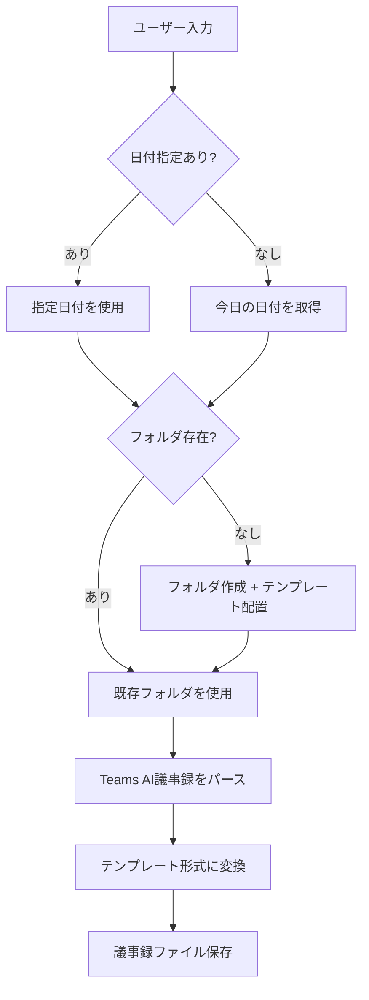

# Teams AI議事録 → 議事録変換

## 概要

Teams会議のAI生成議事録を、議事録テンプレートに沿ったMarkdownに変換します。
日付フォルダがない場合は自動作成します。

---

## 🔄 処理フロー



---

## 📋 実行手順

### Step 1: 日付の決定

1. ユーザーが日付を指定した場合 → その日付を使用
2. 日付指定がない場合 → 今日の日付 `Get-Date -Format "yyyyMMdd"` を使用

### Step 1.5: ファイル確認と連携判定

1. **現在開いているファイルを確認** (`editorContext`)
2. ファイル名から日付を抽出（例: `20260204_議事録.md` → `20260204`）
3. **入力データの日付と比較**：
   - **一致**: 通常の変換処理（Step 2 へ）
   - **不一致（入力が過去）**: 「前回持ち帰りを次回に反映」と判断
     - 入力データから「フォローアップ タスク」を抽出
     - 現在開いているファイルの「🔄 前回持ち帰り事項の確認」に反映
     - **ユーザーに確認**: 「入力は{入力日付}のメモですが、開いているファイルは{ファイル日付}です。前回持ち帰りとして反映しますか？」

### Step 2: フォルダ作成

日付フォルダがなければ作成:

```
{日付}/
├── {日付}_議事録.md       ← _templates/meeting-minutes.md からコピー
└── {日付}_内部メモ.md     ← _templates/internal-memo.md からコピー
```

### Step 3: 議事録変換

Teams AI議事録を以下のルールで変換：

| Teams AI形式               | テンプレート                 |
| -------------------------- | ---------------------------- |
| 会議のメモ: [トピック]     | 📝 議事内容 → トピックN      |
| トピック詳細（インデント） | ディスカッション             |
| フォローアップ タスク      | 🚀 今回の持ち帰り事項（NEW） |
| 担当者が自社名             | 自社 持ち帰り                |
| 担当者がお客様名           | お客様 持ち帰り              |

### Step 4: ファイル保存

変換結果を `{日付}/{日付}_議事録.md` に保存。

---

## 🎯 使用例

### 例1: 日付指定なし（今日の日付を使用）

```
# 以下をペースト:
AI によって生成されます。必ず精度を確認してください。
会議のメモ:
コストアセスメントの実施方針...
```

### 例2: 日付指定あり

```
日付: 20260204

# 以下をペースト:
AI によって生成されます。必ず精度を確認してください。
...
```

---

## 📝 変換ルール詳細

### 1. 基本情報

- **日時**: 日付フォルダから `2026/01/21` 形式に変換
- **出席者**: 議事録内の名前から推定

### 2. 議事内容

- Teams AIの「会議のメモ:」の各トピック（コロン前）を `### トピックN: [タイトル]` として展開
- トピック概要を `**概要:**` に
- 詳細項目を `**ディスカッション:**` に箇条書き
- 決定事項を推定して `**決定事項:**` に記載

### 3. 持ち帰り事項

「フォローアップ タスク:」を振り分け：

| 担当者キーワード | 分類            |
| ---------------- | --------------- |
| 自社メンバー名   | 自社 持ち帰り   |
| その他           | お客様 持ち帰り |
