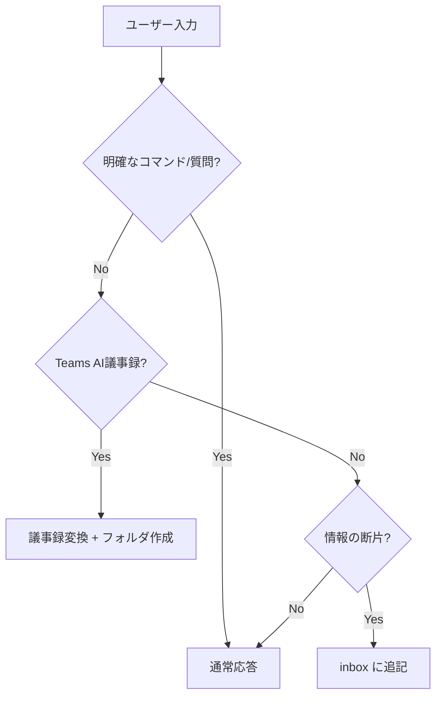

# Copilot Instructions

このワークスペースでの共通ルールです。

---

## 顧客情報

> ⚠️ セットアップ時に自動入力されます

| 項目           | 内容                |
| -------------- | ------------------- |
| **顧客名**     | {{CUSTOMER_NAME}}   |
| **契約形態**   | {{CONTRACT_TYPE}}   |
| **契約期間**   | {{CONTRACT_PERIOD}} |
| **主要連絡先** | {{KEY_CONTACTS}}    |

---

## 入力自動判定ルール

ユーザーの入力が明確なコマンドや質問でない場合、以下の順で判定し自動処理します。

### 判定フロー

### 判定基準

| パターン                                        | 判定           | 処理                      |
| ----------------------------------------------- | -------------- | ------------------------- |
| 「AI によって生成されます」で始まる             | Teams AI議事録 | `convert-meeting-minutes` |
| 「会議のメモ:」「フォローアップ タスク:」を含む | Teams AI議事録 | `convert-meeting-minutes` |
| 名前 + 日時 + 短文（Teamsチャット風）           | インボックス   | `inbox` に追記            |
| `From:` `Date:` を含む（メール風）              | インボックス   | `inbox` に追記            |
| `[#channel]` を含む（Slack風）                  | インボックス   | `inbox` に追記            |
| 箇条書きのみ（`-` で始まる行が主）              | インボックス   | `inbox` に追記            |
| 文脈なしの短文メモ                              | インボックス   | `inbox` に追記            |
| 質問形式（「?」「教えて」「どうすれば」等）     | 質問           | 通常応答                  |

### インボックス追記時の動作

1. `_inbox/{現在の年月}.md` を確認（なければ作成）
2. 日時・送信元・タグを自動付与
3. ファイル末尾に追記
4. **確認メッセージ**: 「📥 インボックスに追記しました: {タグ}」

### 議事録検出時の動作

1. 日付を抽出（入力から or 今日の日付）
2. 日付フォルダを作成（なければ）
   - `{日付}/`
   - `{日付}/{日付}_議事録.md`
   - `{日付}/{日付}_内部メモ.md`
3. Teams AI議事録をテンプレート形式に変換
4. **確認メッセージ**: 「📝 議事録を作成しました: {日付}」

### 顧客プロファイル更新の提案

以下を検出したら `_customer/profile.md` への追記を提案:

- 契約情報（期間、金額、形態の変更）
- 組織情報（担当者異動、新規連絡先）
- 技術スタック（新規導入、廃止）

### 確認が必要なケース

以下の場合はユーザーに確認:

- 長文で判定が曖昧
- 複数パターンに該当
- ファイルパスや日付の指定がある

---

## 関連プロンプト

- `inbox.prompt.md` - インボックス追記の詳細ルール
- `convert-meeting-minutes.prompt.md` - 議事録変換
