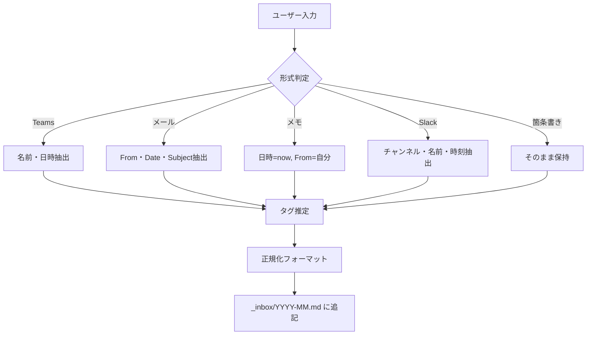

# インボックス詳細ルール

> このファイルはインボックス機能の詳細な処理ルールを記載しています。
> 概要は [SKILL.md](../SKILL.md) を参照してください。

## 対応パターン

### パターン1: Teamsチャット（コピペ）

```
山田 太郎
1月21日 14:32
VPN経由の通信が遅いんですけど...
```

### パターン2: メール転送

```
From: yamada@example.com
Date: 2026-01-15 10:15
Subject: コストアセスメントの件

4月のコストアセスメント、別担当に引き継ぐかも。
```

### パターン3: 自分のメモ（メタデータなし）

```
山田さんから電話あり。
FWの件、NAT Gateway試してみるとのこと。
```

### パターン4: Slack

```
[#proj-abc] 山田太郎 14:32
明日の定例、15分遅れます
```

### パターン5: 箇条書きメモ

```
- AI情報は分けて配布希望
- AKSは優先度低い
- 担当変更の可能性あり
```

---

## 処理フロー



---

## 実行手順

### Step 1: 月ファイルの確認

1. 現在の年月を取得: `Get-Date -Format "yyyy-MM"`
2. `_inbox/{年月}.md` が存在するか確認
3. なければ新規作成:

```markdown
# {年月} インボックス

> 💡 `/prompt inbox` で追記。タグで検索可能。

---
```

### Step 2: 入力の解析

| 判定条件                       | 形式         |
| ------------------------------ | ------------ |
| `From:` + `Date:` + `Subject:` | メール       |
| 名前 + 改行 + 日時パターン     | Teams        |
| `[#channel]` パターン          | Slack        |
| `-` で始まる行が複数           | 箇条書きメモ |
| 上記以外                       | 自由形式メモ |

### Step 3: 情報抽出

| 項目       | 抽出ルール                                                     |
| ---------- | -------------------------------------------------------------- |
| **日時**   | 入力から抽出 or 現在時刻 `Get-Date -Format "yyyy-MM-dd HH:mm"` |
| **From**   | 送信者名 or 「（自分メモ）」                                   |
| **Source** | Teams / メール / Slack / 口頭 / メモ                           |
| **タグ**   | 内容から自動推定                                               |

### Step 4: タグ推定

| キーワード                                            | タグ            |
| ----------------------------------------------------- | --------------- |
| Firewall, FW, NAT, VPN, ネットワーク, 通信, 遅延      | `#network`      |
| コスト, 費用, 予算, 消費                              | `#cost`         |
| 契約, リニューアル, 更新, EA, CSP, サブスクリプション | `#contract`     |
| 提案, 案件, 商談, 見積, PoC, パイロット               | `#proposal`     |
| AI, OpenAI, Copilot, GPT, 機械学習                    | `#ai`           |
| AKS, コンテナ, Kubernetes, Docker                     | `#container`    |
| 定例, ミーティング, 会議, MTG                         | `#meeting`      |
| SR, サポート, 問い合わせ, トラブル                    | `#support`      |
| 人事, 異動, 担当, 引き継ぎ                            | `#organization` |
| 期限, 締切, いつまで, 急ぎ                            | `#deadline`     |
| 社内, 内部, チーム, 上司, 部長                        | `#internal`     |

**タグ付与ルール:**

- 複数該当 → 全て付与
- 該当なし → 内容から適切なタグを推定して新規作成
- 新規タグは小文字英字、ハイフン区切り
- よく使われる新規タグは顧客プロファイルに追記を提案

### Step 5: 追記

`_inbox/{年月}.md` の末尾に追記:

```markdown
---

## {日時} {タグ}

**From**: {送信者}（{Source}）

{本文}
```

---

## 使用例

### 例1: Teamsチャット

**入力:**

```
山田 太郎
1月21日 14:32
VPN経由の通信が遅いんですけど、オンプレProxy経由だと速いんですよね
```

**出力:**

```markdown
## 2026-01-21 14:32 #network

**From**: 山田 太郎（Teams）

VPN経由の通信が遅いんですけど、オンプレProxy経由だと速いんですよね
```

---

## 検索方法

```powershell
Select-String -Path "_inbox/*.md" -Pattern "#network"
```
