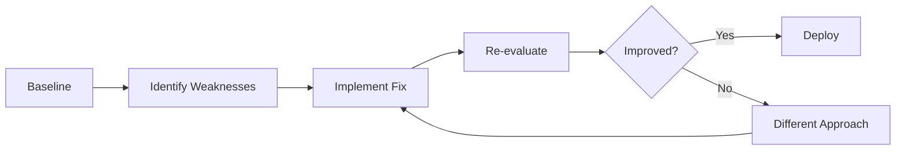

# Agent Evaluation

A framework for measuring agent workflow effectiveness based on vscode-ai-toolkit best practices.

## Table of Contents

- [Overview](#overview) - Why evaluation matters
- [Three Core Metrics](#three-core-metrics) - Intent Resolution, Tool Call Accuracy, Task Adherence
- [Evaluation Methodology](#evaluation-methodology) - How to evaluate
- [Evaluation Best Practices](#evaluation-best-practices) - Guidelines for effective evaluation
- [Common Evaluation Pitfalls](#common-evaluation-pitfalls) - Anti-patterns to avoid
- [Evaluation Checklist](#evaluation-checklist) - Quick check template

---

## Overview

Effective agent evaluation goes beyond simple success/fail metrics. It requires assessing the quality of reasoning, tool usage, and task adherence across diverse scenarios.

## Three Core Metrics

### 1. Intent Resolution

**Does the agent correctly understand and fulfill user intent?**

| Aspect               | Description                                          |
| -------------------- | ---------------------------------------------------- |
| **What to Measure**  | Accuracy of understanding user's goal                |
| **Success Criteria** | Agent addresses the actual need, not surface request |
| **Common Failures**  | Misinterpreting ambiguous requests, literal parsing  |

#### Evaluation Questions

- [ ] Did the agent clarify ambiguous requests?
- [ ] Did it address the underlying goal or just the explicit ask?
- [ ] Were edge cases and constraints considered?
- [ ] Did the output match user expectations?

#### Example Scenarios

| User Request         | Poor Intent Resolution               | Good Intent Resolution                    |
| -------------------- | ------------------------------------ | ----------------------------------------- |
| "Fix the bug"        | Changes random code without analysis | Reproduces bug, identifies root cause     |
| "Add authentication" | Implements basic login               | Asks about requirements (OAuth, JWT, etc) |
| "Make it faster"     | Random optimizations                 | Profiles code, targets bottlenecks        |

### 2. Tool Call Accuracy

**Does the agent use tools correctly and efficiently?**

| Aspect               | Description                                       |
| -------------------- | ------------------------------------------------- |
| **What to Measure**  | Correctness and appropriateness of tool selection |
| **Success Criteria** | Right tool, right parameters, right sequence      |
| **Common Failures**  | Wrong tool, hallucinated tools, inefficient usage |

#### Evaluation Questions

- [ ] Did the agent use available tools (not reimplementing)?
- [ ] Were tool parameters correct and complete?
- [ ] Was the tool sequence logical and efficient?
- [ ] Were errors handled gracefully?

#### Common Tool Usage Mistakes

| Mistake                    | Example                                           | Fix                                     |
| -------------------------- | ------------------------------------------------- | --------------------------------------- |
| **Hallucinated Tools**     | Calls `search_web()` when not defined             | Validate tool availability              |
| **Wrong Parameters**       | Passes string when tool expects array             | Strict parameter validation             |
| **Inefficient Chains**     | Reads same file 10 times                          | Cache results, batch operations         |
| **Missing Error Handling** | Continues after tool failure                      | Check return codes, implement fallbacks |
| **Tool Reimplementation**  | Writes grep-like logic instead of using grep tool | Document tool capabilities clearly      |

#### Tool Call Metrics

```markdown
**Accuracy:** (Correct Tool Calls) / (Total Tool Calls)
**Efficiency:** (Optimal Tool Count) / (Actual Tool Count)
**Coverage:** (Tools Used) / (Relevant Tools Available)
```

### 3. Task Adherence

**Does the agent follow instructions and constraints?**

| Aspect               | Description                                   |
| -------------------- | --------------------------------------------- |
| **What to Measure**  | Compliance with explicit and implicit rules   |
| **Success Criteria** | Respects boundaries, doesn't overstep or skip |
| **Common Failures**  | Scope creep, ignoring constraints, shortcuts  |

#### Evaluation Questions

- [ ] Did the agent respect scope boundaries?
- [ ] Were constraints (time, resources, safety) followed?
- [ ] Did it avoid making unauthorized changes?
- [ ] Were deliverables complete per specification?

#### Adherence Violations

| Violation Type        | Example                                     | Impact                    |
| --------------------- | ------------------------------------------- | ------------------------- |
| **Scope Creep**       | Asked to fix bug, refactors entire codebase | Wasted time, new risks    |
| **Constraint Bypass** | Ignores "don't delete files" rule           | Data loss, trust breach   |
| **Premature Action**  | Starts execution before plan approval       | Wasted work, misalignment |
| **Incomplete Output** | Returns half-finished documentation         | User must finish work     |

---

## Evaluation Methodology

### 1. Test Data Generation

**Create diverse, realistic test scenarios**

#### Scenario Categories

| Category             | Description                         | Example                             |
| -------------------- | ----------------------------------- | ----------------------------------- |
| **Happy Path**       | Clear, straightforward requests     | "List files in src/ directory"      |
| **Ambiguous**        | Requires clarification              | "Make it better" (what aspect?)     |
| **Edge Cases**       | Boundary conditions, unusual inputs | Empty repository, large file counts |
| **Error Handling**   | Simulated failures                  | File not found, API timeout         |
| **Multi-Step**       | Complex workflows                   | Analyze → Design → Implement → Test |
| **Constraint-Heavy** | Many restrictions                   | "Refactor but don't change API"     |

#### Test Data Generation Process

```
Step 1: Identify Agent's Domain
  - What tasks does it handle?
  - What tools does it use?

Step 2: Create Baseline Scenarios
  - 10-20 typical use cases
  - Cover main functionality

Step 3: Add Variation
  - Ambiguous phrasing
  - Missing information
  - Conflicting requirements

Step 4: Include Edge Cases
  - Boundary values (empty, max size)
  - Unusual file types or formats
  - Concurrent requests

Step 5: Simulate Failures
  - Tool unavailability
  - Partial results
  - Timeout scenarios
```

#### Example Test Set (Code Review Agent)

```yaml
test_cases:
  - id: "happy-001"
    input: "Review src/auth.py for security issues"
    expected_tools: ["read", "grep"]
    expected_output_type: "security_report"
    success_criteria:
      - Uses #tool:read to access file
      - Identifies security patterns (SQL injection, XSS, etc.)
      - Provides severity ratings

  - id: "ambiguous-001"
    input: "Check this"
    expected_behavior: "Request clarification"
    success_criteria:
      - Asks what to check
      - Offers options (code, tests, docs)
      - Doesn't make assumptions

  - id: "edge-001"
    input: "Review all Python files"
    context: "Repository has 1000+ .py files"
    expected_behavior: "Plan-First approach"
    success_criteria:
      - Creates plan before execution
      - Proposes batching or sampling
      - Estimates time required

  - id: "error-001"
    input: "Review src/nonexistent.py"
    expected_behavior: "Graceful error handling"
    success_criteria:
      - Detects file doesn't exist
      - Informs user clearly
      - Suggests alternatives (similar files, search)
```

### 2. Evaluation Rubric

**Score each dimension on a scale**

#### Intent Resolution Rubric

| Score | Description                                           |
| ----- | ----------------------------------------------------- |
| **5** | Perfect understanding, proactive clarification        |
| **4** | Correct interpretation, addresses need                |
| **3** | Mostly correct, minor misunderstanding                |
| **2** | Partially correct, significant gaps                   |
| **1** | Misunderstood intent, wrong direction                 |
| **0** | Complete failure to understand or engage with request |

#### Tool Call Accuracy Rubric

| Score | Description                                      |
| ----- | ------------------------------------------------ |
| **5** | Optimal tool selection and usage, error-free     |
| **4** | Correct tools, minor inefficiencies              |
| **3** | Mostly correct, some suboptimal choices          |
| **2** | Significant tool misuse, works but inefficient   |
| **1** | Wrong tools or hallucinations, barely functional |
| **0** | Tool calls fail, agent cannot proceed            |

#### Task Adherence Rubric

| Score | Description                                   |
| ----- | --------------------------------------------- |
| **5** | Perfect compliance, respects all constraints  |
| **4** | Minor deviations, core requirements met       |
| **3** | Some scope creep or missed constraints        |
| **2** | Significant violations, partial deliverables  |
| **1** | Major violations, ignores instructions        |
| **0** | Completely off-track, disregards requirements |

### 3. Automated Testing

**Implement programmatic evaluation where possible**

#### What Can Be Automated

| Aspect                    | Automation Approach                           |
| ------------------------- | --------------------------------------------- |
| **Tool Call Validation**  | Parse logs, check tool names and parameters   |
| **Output Format**         | Schema validation (JSON, YAML)                |
| **File Operations**       | Verify files created/modified as expected     |
| **Performance Metrics**   | Measure execution time, tool call count       |
| **Constraint Violations** | Check against rule list (deleted files, etc.) |

#### What Requires Human Review

| Aspect                   | Why Human Needed                              |
| ------------------------ | --------------------------------------------- |
| **Intent Understanding** | Nuanced interpretation of ambiguous requests  |
| **Output Quality**       | Subjective assessment (clarity, completeness) |
| **Creativity**           | Innovation and problem-solving approach       |
| **Edge Case Handling**   | Appropriateness of fallback strategies        |

#### Automation Example (Python)

```python
def evaluate_tool_calls(log_file, expected_tools):
    """
    Evaluate tool call accuracy from execution logs.
    """
    with open(log_file) as f:
        logs = json.load(f)

    tool_calls = [entry for entry in logs if entry["type"] == "tool_call"]

    metrics = {
        "total_calls": len(tool_calls),
        "unique_tools": len(set(call["tool_name"] for call in tool_calls)),
        "hallucinated": sum(1 for call in tool_calls
                           if call["tool_name"] not in expected_tools),
        "failed": sum(1 for call in tool_calls
                     if call["status"] == "error"),
    }

    metrics["accuracy"] = 1 - (metrics["hallucinated"] / metrics["total_calls"])

    return metrics
```

---

## Evaluation Best Practices

### 1. Establish Baselines

Before making changes, measure current performance:

```markdown
Baseline Evaluation (v1.0)

- Intent Resolution: 3.8/5.0
- Tool Call Accuracy: 4.2/5.0
- Task Adherence: 4.5/5.0

After Optimization (v1.1)

- Intent Resolution: 4.3/5.0 ✅ +13%
- Tool Call Accuracy: 4.6/5.0 ✅ +9.5%
- Task Adherence: 4.4/5.0 ⚠️ -2.2%
```

### 2. Diverse Test Set

| Principle             | Rationale                                        |
| --------------------- | ------------------------------------------------ |
| **Coverage**          | Test all major features and edge cases           |
| **Realism**           | Use real-world scenarios, not synthetic examples |
| **Difficulty Range**  | Include easy, medium, and hard tasks             |
| **Failure Scenarios** | Don't just test happy paths                      |
| **User Language**     | Use actual phrasing users would employ           |

### 3. Iterative Improvement



### 4. Log Everything

**Comprehensive logging enables debugging and improvement**

```json
{
  "test_id": "happy-001",
  "timestamp": "2024-01-15T10:30:00Z",
  "user_input": "Review src/auth.py",
  "agent_plan": "1. Read file 2. Scan for patterns 3. Report",
  "tool_calls": [
    {
      "tool": "read",
      "params": { "file": "src/auth.py" },
      "status": "success"
    },
    { "tool": "grep", "params": { "pattern": "eval\\(" }, "status": "success" }
  ],
  "output": "Found 2 security issues...",
  "scores": {
    "intent_resolution": 5,
    "tool_accuracy": 5,
    "task_adherence": 5
  },
  "evaluator_notes": "Excellent handling, proactive security scan"
}
```

### 5. Continuous Monitoring

**Evaluation isn't one-time; monitor in production**

| Metric                     | Frequency       | Action Threshold            |
| -------------------------- | --------------- | --------------------------- |
| **User Satisfaction**      | After each task | <80% positive → investigate |
| **Tool Call Failures**     | Real-time       | >5% failure rate → alert    |
| **Task Completion Rate**   | Daily           | <90% → review failures      |
| **Average Execution Time** | Weekly          | +20% vs baseline → profile  |

---

## Common Evaluation Pitfalls

### 1. Overfitting to Test Set

**Problem:** Agent performs well on tests but poorly on real tasks.

**Solution:**

- Use held-out test set
- Regularly refresh test scenarios
- Include user-reported issues

### 2. Ignoring User Feedback

**Problem:** Metrics look good, users are unhappy.

**Solution:**

- Collect qualitative feedback
- Review actual usage logs
- User interviews/surveys

### 3. Binary Pass/Fail

**Problem:** Doesn't capture nuance or areas for improvement.

**Solution:**

- Use rubrics with gradations
- Track multiple dimensions
- Identify specific failure modes

### 4. Testing Only Happy Paths

**Problem:** Agent fails when things go wrong.

**Solution:**

- Systematically test error conditions
- Simulate timeouts, missing resources
- Test with malformed inputs

### 5. Lack of Regression Testing

**Problem:** New features break existing functionality.

**Solution:**

- Maintain test suite
- Run before each release
- Automate where possible

---

## Evaluation Checklist

Before deploying an agent workflow:

```markdown
- [ ] Created diverse test set (happy, ambiguous, edge, error)
- [ ] Defined success criteria for each test
- [ ] Established baseline metrics
- [ ] Tested all major workflows
- [ ] Verified tool call accuracy
- [ ] Confirmed constraint adherence
- [ ] Logged evaluation results
- [ ] Identified improvement areas
- [ ] Documented known limitations
- [ ] Set up monitoring for production
```

---

## References

- [vscode-ai-toolkit Agent Evaluation](https://github.com/microsoft/vscode-ai-toolkit)
- [Building Effective Agents - Anthropic](https://www.anthropic.com/engineering/building-effective-agents)
- [Prompt Engineering Guide - OpenAI](https://platform.openai.com/docs/guides/prompt-engineering)
