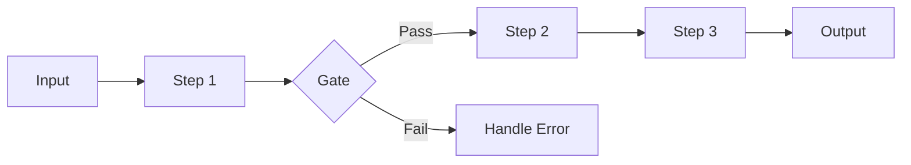

# Pattern 1: Prompt Chaining

**Sequential processing with validation at each step**

> Back to [overview.md](overview.md)

## Diagram



## Characteristics

| Aspect        | Description                                              |
| ------------- | -------------------------------------------------------- |
| **Structure** | Serial processing, output of each step is input for next |
| **Gate**      | Can set validation gates after each step                 |
| **Use Cases** | Document translation, code generation - review - fix     |

## When to Use

- Task can be decomposed into clear subtasks
- Each step output is needed for the next step
- Intermediate result validation is important

## Implementation Example

```
Step 1: Analyze requirements
    (Gate: Are requirements clear?)
Step 2: Create design
    (Gate: Is design valid?)
Step 3: Implement
    (Gate: Tests passing?)
Step 4: Create documentation
```
