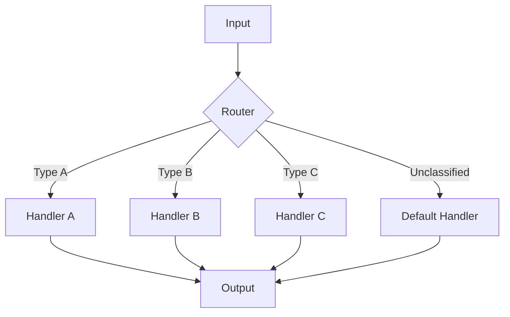
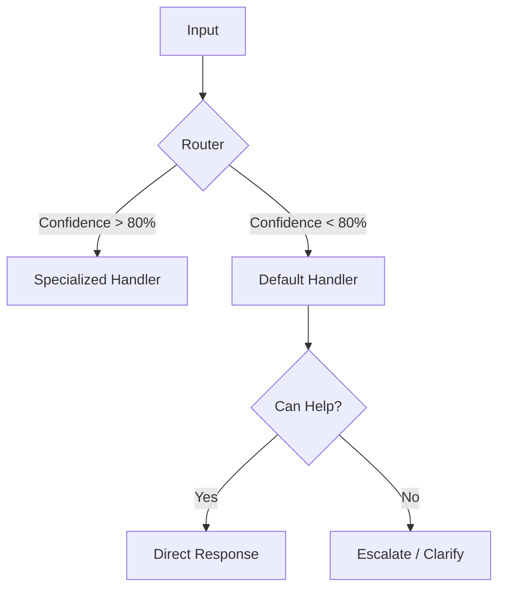

# Pattern 2: Routing

**Classify input → Route to specialized handlers**

> Back to [overview.md](overview.md)

## Diagram



## Characteristics

| Aspect        | Description                              |
| ------------- | ---------------------------------------- |
| **Structure** | Classifier + specialized handlers        |
| **Benefits**  | Each handler can be optimized            |
| **Use Cases** | Customer support, inquiry classification |

## When to Use

- Input has clear categories
- Different processing is optimal per category
- Classification accuracy is sufficiently high

## Implementation Example

```
Router: Determine inquiry type
├─ Technical question → Technical Support Agent
├─ Billing related → Billing Support Agent
├─ General question → FAQ Agent
└─ Unclassified → Default Handler
```

## Default Handler (Fallback Route)

Handle inputs that don't match any defined category:



**When to Route to Default:**

| Condition                     | Action                       |
| ----------------------------- | ---------------------------- |
| Low classification confidence | Route to Default Handler     |
| Unknown category              | Route to Default Handler     |
| Ambiguous input               | Ask clarifying question      |
| Out of scope                  | Politely decline or escalate |

**Implementation Example:**

```yaml
---
name: Support Router
tools: ["runSubagent"]
---

# Support Router

## Routing Rules

1. Technical keywords detected → Tech Support Agent
2. Billing/payment keywords → Billing Agent
3. FAQ match found → FAQ Agent
4. **Otherwise → Default Handler**

## Default Handler Behavior

- Attempt general assistance first
- If unable to help: "I'll connect you with a specialist"
- Log unclassified inputs for future category expansion
```

**⚠️ Important:** Default Handler should log unclassified inputs. Frequent patterns may indicate a missing specialized handler.
