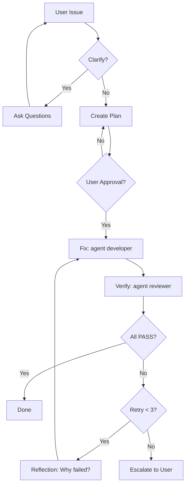

# Pattern 5: Evaluator-Optimizer

**Generate → Evaluate → Improve loop**

> Back to [overview.md](overview.md)

## Diagram


## Characteristics

| Aspect        | Description                                 |
| ------------- | ------------------------------------------- |
| **Structure** | Generator + evaluator + feedback loop       |
| **Benefits**  | Improves until quality criteria are met     |
| **Use Cases** | Translation, code review, text proofreading |

## When to Use

- Clear quality criteria exist
- Iterative improvement increases quality
- Want to mimic human feedback

## Implementation Example

```
Generator: Generate translation
    ↓
Evaluator:
  - Is the nuance accurate?
  - Is the grammar correct?
  - Does it reflect the original intent?
    ↓
  ├─ OK → Complete
  └─ NG → Regenerate with feedback
```

## Real-World Example: Error-Fixer Agent

A practical implementation combining Evaluator-Optimizer with Human-in-the-Loop:



### Key Design Patterns

| Pattern             | Implementation                                        |
| ------------------- | ----------------------------------------------------- |
| **Reflection Loop** | Analyze why previous fix failed before retrying       |
| **Error Context**   | Pass full stack trace + related files + past attempts |
| **No Repeat Fixes** | Track attempt history, try different approaches       |
| **Escalation**      | After 3 failures, report to user with recommendations |

### Stop Conditions (MANDATORY)

- ✅ All verification items PASS
- ⛔ Max 3 retries reached → Escalate
- ⛔ Same error 2x in a row → Change approach
