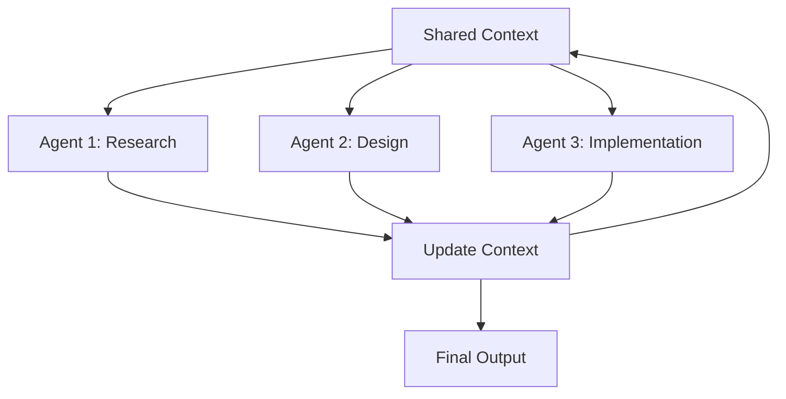

# Pattern 6: Connected Agents

**Multiple specialized agents collaborate and share context**

> Back to [overview.md](overview.md)

## Diagram



## Characteristics

| Aspect        | Description                                          |
| ------------- | ---------------------------------------------------- |
| **Structure** | Multiple agents with shared state/context            |
| **Benefits**  | Agents build on each other's work, emergent insights |
| **Use Cases** | Complex projects requiring diverse expertise         |

## When to Use

- Task requires multiple specialized capabilities
- Agents need to build on each other's outputs
- Collaboration yields better results than isolation
- Context sharing reduces redundant work

## Implementation Example

```
Shared Context (Memory/Database):
  ├─ Project goals
  ├─ Decisions made
  ├─ Resources created
  └─ Current state

Agent 1 (Research):
  - Reads context
  - Gathers information
  - Updates context with findings

Agent 2 (Design):
  - Reads research findings from context
  - Creates architecture
  - Updates context with design

Agent 3 (Implementation):
  - Reads design from context
  - Implements solution
  - Updates context with code
```

## Key Principles

| Principle                 | Description                                   |
| ------------------------- | --------------------------------------------- |
| **Shared State**          | Central repository for context and decisions  |
| **Read-Update Cycle**     | Each agent reads latest state, then updates   |
| **Specialization**        | Each agent has distinct expertise             |
| **Coordination Protocol** | Clear rules for context access and updates    |
| **Conflict Resolution**   | Handle concurrent updates or conflicting data |

## Coordination Strategies

### 1. Sequential (Turn-Taking)

```
Agent 1 completes → Agent 2 starts → Agent 3 starts
```

**Pros:** Simple, no conflicts  
**Cons:** Slower, no parallelism

### 2. Parallel with Merge

```
Agent 1, 2, 3 work simultaneously → Merge updates
```

**Pros:** Fast  
**Cons:** Merge conflicts possible

### 3. Leader-Follower

```
Leader Agent coordinates → Assigns tasks to followers
```

**Pros:** Clear control flow  
**Cons:** Leader bottleneck

## Context Format Example

```json
{
  "project_context": {
    "goal": "Build a web scraper",
    "constraints": ["Must handle rate limiting", "Store in database"],
    "decisions": [
      {
        "agent": "research",
        "timestamp": "2024-01-15T10:00:00Z",
        "decision": "Use Python with BeautifulSoup",
        "rationale": "Simple, well-documented, handles HTML parsing"
      }
    ],
    "artifacts": [
      {
        "type": "design_doc",
        "created_by": "design_agent",
        "path": "docs/architecture.md"
      }
    ],
    "state": "implementation_in_progress"
  }
}
```

## Benefits

| Benefit               | Description                                |
| --------------------- | ------------------------------------------ |
| **Knowledge Sharing** | Agents leverage each other's work          |
| **Consistency**       | Single source of truth prevents divergence |
| **Auditability**      | Shared context provides complete history   |
| **Flexibility**       | Add/remove agents without restructuring    |

## Challenges

| Challenge            | Mitigation                                  |
| -------------------- | ------------------------------------------- |
| **State Complexity** | Use structured context format (JSON/YAML)   |
| **Race Conditions**  | Implement locking or turn-taking protocol   |
| **Context Bloat**    | Prune old/irrelevant data periodically      |
| **Debugging**        | Log all context reads/writes with timestamp |

## When NOT to Use

- Single-domain task (use Orchestrator-Workers instead)
- Agents work independently (use Parallelization)
- No need for context sharing (use Routing)

## Implementation Checklist

```markdown
- [ ] Define shared context schema
- [ ] Establish read/write protocols
- [ ] Implement conflict resolution strategy
- [ ] Set up context persistence (file/database)
- [ ] Add logging for all context modifications
- [ ] Define agent responsibilities clearly
- [ ] Test concurrent access scenarios
```

## Real-World Example: Software Development

```
Context: GitHub Issue + PR + Discussion Thread

├─ Code Agent:
│    - Reads issue requirements
│    - Implements solution
│    - Updates PR with code

├─ Test Agent:
│    - Reads code changes from PR
│    - Generates test cases
│    - Updates PR with tests

├─ Review Agent:
│    - Reads code and tests
│    - Provides feedback
│    - Updates discussion thread

└─ Documentation Agent:
     - Reads final implementation
     - Updates README and docs
     - Commits to repo
```

Each agent operates on shared artifacts (code, PR, docs) and can see what others have contributed.
