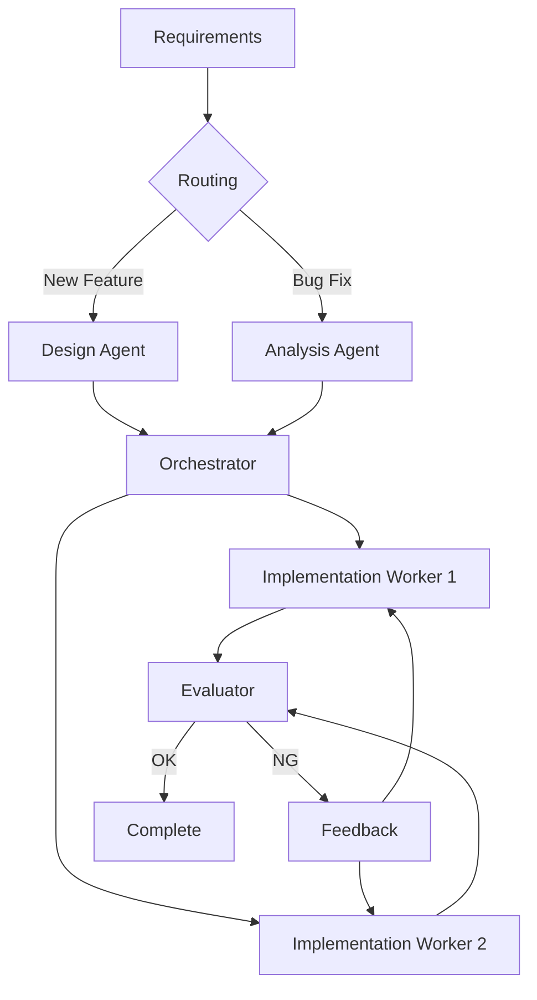

# Combining Patterns

**In real workflows, multiple patterns are often combined.**

> Back to [overview.md](overview.md)

## Example: Code Generation Workflow



## Patterns Used

| Pattern                  | Role in Workflow                         |
| ------------------------ | ---------------------------------------- |
| **Routing**              | Branch processing by requirement type    |
| **Orchestrator-Workers** | Implement changes per file               |
| **Evaluator-Optimizer**  | Review → fix loop until quality is met   |

## Combination Guidelines

### 1. Sequential Combination

Chain patterns where output of one becomes input for next:

```
Routing → Prompt Chaining → Evaluator-Optimizer
```

### 2. Nested Combination

Embed one pattern inside another:

```
Orchestrator
├─ Worker 1 (uses Prompt Chaining internally)
├─ Worker 2 (uses Evaluator-Optimizer internally)
└─ Worker 3 (uses Routing internally)
```

### 3. Parallel Combination

Run different patterns simultaneously on different inputs:

```
Input
├─ Path A: Routing → Handler A
└─ Path B: Parallelization → Aggregator
    ↓
    Merge results
```

## Common Combinations

| Combination                             | Use Case                              |
| --------------------------------------- | ------------------------------------- |
| Routing + Orchestrator-Workers          | Multi-type tasks with dynamic subtasks|
| Prompt Chaining + Evaluator-Optimizer   | Sequential with quality gates         |
| Parallelization + Evaluator-Optimizer   | Parallel execution with voting        |
| Connected Agents + IR Architecture      | Shared context with structured output |

## Anti-Patterns

❌ **Over-engineering:** Don't combine patterns unnecessarily

```
Simple translation task:
  ❌ Routing → Orchestrator → Workers → Evaluator
  ✅ Prompt Chaining (sufficient for linear task)
```

❌ **Pattern mismatch:** Don't force incompatible patterns

```
Independent tasks:
  ❌ Prompt Chaining (forces serial execution)
  ✅ Parallelization (allows concurrent execution)
```

## Decision Framework

| Question                               | Yes → Pattern              | No → Alternative           |
| -------------------------------------- | -------------------------- | -------------------------- |
| Tasks must be sequential?              | Prompt Chaining            | Parallelization            |
| Input needs classification?            | Routing                    | Direct processing          |
| Task count unknown until runtime?      | Orchestrator-Workers       | Static worker assignment   |
| Quality requires iteration?            | Evaluator-Optimizer        | Single-pass processing     |
| Agents need shared context?            | Connected Agents           | Independent agents         |
| Deterministic output required?         | IR Architecture            | Direct generation          |
